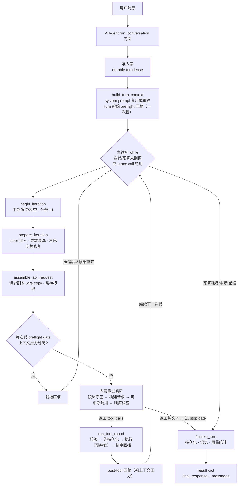

# Agent 主循环与编排 —— 模拟面试

> 源码基线：上游 main 分支 commit `8d30c4e`。核心入口：`run_agent.py`（`AIAgent` 门面）、
> `agent/conversation_loop.py`（主循环）、`agent/turn_*.py`（31 个阶段文件）。
> 通用概念（ReAct、function calling 协议）默认读者已了解，本文只讲 Hermes 怎么实现。

---

## Q1：agent 主循环是干什么的？核心机制主要流程是什么？

**主答：**

主循环解决的问题是：把「一次模型调用」变成「一个能自主完成的任务」——模型说要用工具就去执行工具，把结果喂回去再问模型，直到模型给出最终文本答复。这就是所有 agent 共有的闭环 (loop)，Hermes 的特点是**纯手写、纯同步的 while 循环**，不依赖 LangChain / LangGraph 这类框架。核心分三层：

1. **门面层**：`run_agent.py` 的 `AIAgent` 类，由 14 个 mixin 组装（`run_agent.py:241`，客户端生命周期、流式输出、中断控制、会话持久化等各占一个），构造逻辑全部转发给 `agent/agent_init.py::init_agent`。外部调用只有两个入口：`chat(message) -> str` 拿最终回复文本，`run_conversation(...) -> dict` 拿完整结果（`final_response` + `messages` + 用量统计 + 失败标记）。
2. **准入层**：`agent/turn_facade.py` 的 `run_conversation` 先拿会话级租约 (lease)——防止多进程同时操作同一会话——再做 relay 运行计量登记，然后转发给主循环。
3. **主循环层**：`agent/conversation_loop.py::run_conversation` 驱动一个 user turn——注意术语：**turn 是「一轮用户消息到最终答复」的完整过程**，turn 内部包含多次迭代 (iteration)，每次迭代是一次模型调用加可能的工具执行。

一个 turn 的数据流：



顺着图讲：用户消息进来，门面拿 lease，做一次性的 turn 准备（系统 prompt 尽量逐字节复用，这是 prompt cache 的命根子；必要时先压缩）；进入 while 循环后，每次迭代先做中断和预算检查、清洗消息、构建请求，上下文压力过高就先压缩然后**从循环顶部重来**；模型响应带 tool_calls 就执行工具、把结果作为 tool 消息按序追加后进入下一迭代，是纯文本就先过停止闸门 (stop gate) 再进收尾（持久化会话、flush 记忆、记用量）返回结果。退出原因分两大类——正常终结（模型作答，但可能被 stop gate 拒回，见 Q3）和异常终结（预算、中断、各类错误，明细见 Q3）。

这套实现里最值得记的是两条贯穿全局的不变量 (invariant)：**系统 prompt 在会话生命周期内字节稳定**（per-conversation prompt caching 不可破坏，唯一例外是压缩），和**消息角色严格交替**（user → assistant → tool → assistant，绝不连续两条同角色消息）。后面每个设计决定几乎都能追溯到这两条。

### 追问：为什么是纯同步 while 循环，而不是 asyncio？

同步模型里每个阻塞点（模型调用、工具执行）都显式包了「worker 线程跑 + 主线程轮询」的结构来做中断检测：模型调用走 `agent/chat_completion_helpers.py::interruptible_api_call`（HTTP 请求在 worker 线程，主线程等响应/中断/超时三选一），并发工具走 daemon 线程池加 5 秒轮询（`agent/tool_executor.py` 的 `await_completion`）。好处是整条控制流是直线，没有 async 的回调嵌套和任务取消语义要推演；代价是想要中断就得在多个层面埋检查点。子代理 (subagent) 也是同一个同步 while 循环的再入：顶层 delegate 默认异步派发、结果以消息回流；编排型子代理（深度大于 0）才在工具线程内同步嵌跑——同步实现让这两种嵌套都不需要 async 任务模型。

### 追问：不用 LangGraph 这类框架，什么时候值得自己手写循环？

框架给你的是现成的节点编排和状态传递，代价是它的抽象挡在你和 provider 协议之间。Hermes 需要字节级的控制——系统 prompt 逐字节复用、工具结果按序回插、中断检查点埋在指定位置、失败时保留半截流式文本——这些在框架抽象里都得绕道实现。自己写的代价也明摆着：状态机全靠自己维护（见 Q7 的批评）。经验法则：demo 和原型用框架快；当你的差异化在「循环本身的语义」上时，框架的抽象层就从资产变成了负债。Hermes 这个仓库本身也是佐证：曾经的 god-file 按主题拆成「门面 + sibling 文件」（上游 `agent/AGENTS.md` 称 facade + siblings 规则），31 个 `turn_*.py` 阶段文件各管一段，改动只碰一个几百行的文件。

---

## Q2：收到用户消息之后、第一次调用模型之前，主循环做了哪些准备？

**主答：**

入口是 `AIAgent.run_conversation`，准备分两段：

**第一段是 turn 准入**（`agent/turn_facade.py`）。先尝试获取这个会话的**跨进程持久 turn 租约 (durable turn lease)**（`agent/turn_facade_lease.py::admit_durable_turn_lease`）——落在会话数据库行上的租约。为什么需要它：Hermes 的同一个会话可能被 CLI、Desktop、gateway 多个进程打开，没有互斥的话两个进程同时对一个会话跑 turn 会把消息历史写坏。拿到租约后由 `DurableTurnLease` 启动两个定时器：续约器定期刷新租约，liveness watchdog 单独盯 turn 是否停滞——这两个必须分开，因为**续约成功只证明进程活着，不证明有进展**，一个卡死的 turn 也会按时续约（`DurableTurnLease.build_threads` 的 docstring 写明了这个理由）。

**第二段是 turn 上下文构建**（`agent/turn_context.py::build_turn_context`），按源码顺序做「一个 turn 只能做一次」的事：

- 用户消息追加进消息历史；
- **系统 prompt 的复用或重建**（`agent/conversation_loop.py::_restore_or_build_system_prompt`；prompt 里装的是人设、工具使用规范、记忆/技能注入，组装细节见上下文工程篇）：会话 DB 里存着上一个 turn 的系统 prompt，且身份字段没变，就**逐字节复用**；重建只发生在首 turn、model/provider/cwd 身份变化（`_stored_prompt_matches_runtime`）、以及 Bot Chat 能力配置变更的一次性迁移——每次重建都是一次显式的缓存破坏；
- 创建会话行（刻意排在系统 prompt 之后、压缩之前，源码注释写明这个顺序是为了压缩有行可写）；
- turn 起始的 preflight（发起模型调用前的预检）压缩检查：估算请求 token，默认超过有效输入预算（上下文窗口减去输出预留）的 50% 就先压缩再开始，小窗口模型另有下限修正（`agent/context_compressor.py` 的阈值计算）；
- `pre_llm_call` 插件钩子、持久化。

之后才进入 while 循环。

### 追问：租约的具体参数是什么？拿不到时会怎样？

TTL 300 秒、最多等 1800 秒（`turn_facade_lease.py` 的两个模块常量）、默认 60 秒续约一次（`DurableTurnLease` 构造时的 agent 配置默认值）。拿不到的早期返回分两种：等的过程中被中断，用户消息会随结果带回、下个 turn 持久化（`carry_unadmitted_user_message`）；等待超时，返回 `failed` + `failure_reason: "session_busy"`，消息**不消费**，提示用户等其他进程结束再重发。上层入口（CLI / gateway）拿这些结构化标记决定怎么呈现。

### 追问：为什么系统 prompt 必须逐字节复用，重建一个「内容一样」的不行吗？

Anthropic 的 prompt caching（以及 OpenAI 的自动前缀缓存）都按**前缀字节精确匹配**：请求前缀和缓存里完全一致才算命中，差一个字节就是 cache miss，整段前缀重新计费。所以 Hermes 把「复用还是重建」做成了显式协议：能复用就原样读回 DB 里存的字符串；必须中途注入的内容（预算警告、技能变更提示）一律不碰系统 prompt，改走用户消息或 tool result。工具列表同理——恢复会话时连 tools 数组的顺序都按会话里持久化的顺序钉住（tools freeze，`_restore_pinned_tools`），因为 tools 在请求里排在系统 prompt 前面，乱序同样炸缓存。

### 追问：工具列表会不会大到塞不下？

会，收敛方式不是每轮改工具列表，而是 tool_search 渐进式披露——模型先看到一个搜索工具，按需检索和启用具体工具，tools 数组本身保持稳定（`tools/tool_search.py`，细节见工具系统篇）。能改 tools 数组的时机只有会话开始或显式的重建点，因为任何改动都是一次缓存破坏。

---

## Q3：主循环单次迭代里每一步做什么？循环怎么退出？

**主答：**

主循环本体在 `agent/conversation_loop.py::_run_conversation_turn`，一个粗糙但准确的骨架：

```text
while (api_call_count < max_iterations and 预算还有剩余) or grace_call 待用:
    begin_iteration        # 中断/预算检查，计数 +1
    prepare_iteration      # 参数清洗、steer 注入、角色交替修复
    assemble_api_request   # 构建请求副本 + 缓存标记
    run_preflight_gate     # 上下文压力过高 → 压缩后从循环顶部重来
    内层重试循环            # 见 Q6
    apply_retry_restarts   # 处理重试循环留下的 restart 标志
    normalize_model_response
    有 tool_calls → run_tool_round（见 Q4）；纯文本 → finish_text_response
```

几个关键设计：

- **两层循环**：外层迭代负责「推进任务」，内层重试循环只负责「把这一次模型调用做成功」（网络错误、限流、fallback 都在内层消化）。内层失败不直接杀 turn，多数会转化成 restart 标志让外层重发。
- **预算按调用次数计**：`max_iterations` 上限加线程安全的 `IterationBudget`（`agent/iteration_budget.py`，consume/refund 计数）。`execute_code` 这种廉价 RPC 式调用会退还预算 (refund)。普通预算耗尽后，收尾阶段还会专门再调一次模型让它总结已做的工作（`chat_completion_helpers.py::handle_max_iterations`），而不是无声截断。另有一个极窄的一次性例外：Codex Responses 连续三次纯推理停滞、切到 fallback 时如果预算恰好耗尽，会授予一次宽限调用 (grace call) 保证 fallback 至少被问一次（`turn_truncation.py`），用完即止。
- **退出即收尾**：正常路径统一汇入 `agent/turn_finalizer.py::finalize_turn`——持久化、预算摘要、轨迹保存、记忆/技能复审、组装 result dict。少数终端失败路径（如 turn 起始压缩超时）自带持久化直接返回；外层 `run_conversation` 还会给失败的 turn 补一次收尾（`_close_durable_failed_turn`），保证消息历史不会停在一条悬空的 user 消息上。

退出原因接着 Q1 的两大类展开：正常终结只有一种——模型给出纯文本（还可能被 stop gate 拒回，见下面追问）；其余都是异常终结：预算或迭代上限、用户中断、guardrail（工具侧安全拦截）强停、会话持久化失败、重试或 restart 上限耗尽、压缩耗尽或超时、本地确定性错误与外层异常上限。完整取值看 `_turn_exit_reason`（每个阶段结束 turn 时都会设置它，诊断日志靠它定位），共十几种静态取值，另有若干带参数的模板。

### 追问：模型给出纯文本就一定是 turn 结束吗？

不一定，先过三道 stop gate（`agent/turn_stop_gates.py`）：改过代码后要求先验证再说完成（verify-on-stop）、`pre_verify` 插件钩子、kanban 工人的终态工具守卫。任何一道不通过，就把候选答案存起来（`pending_verification_response`，留作预算耗尽时的兜底答复）、注入一条合成 user 消息催模型继续干，turn 不结束。这是防「模型提前宣布完成」的机制——面试里常问的「怎么防止 agent 偷懒」在这里有个具体答案。

### 追问：为什么用 `_LoopState` + `_run_phase` 这种调度方式，而不是直接写成一个大函数？

这 31 个阶段文件就是从一个 god-function 里拆出来的。拆分的难点是阶段之间共享几十个局部变量（消息列表、重试计数、压缩尝试数……）。Hermes 的解法是：所有局部变量收进 `_LoopState` dataclass；`_run_phase` 用 `inspect.signature` 看每个阶段函数声明了哪些参数名，按名从 state 取值传入，阶段返回一个 verdict dataclass，字段再按名拷回 state（`agent/conversation_loop.py:1480`）。效果是每个阶段文件只声明自己读写的变量，互相解耦，加一个新阶段不用改调用点。verdict 里的 `action` 字段（`"continue"` / `"break"` / `"return"`）直接对应原循环里的控制流关键字。

### 追问：restart 标志是什么？为什么重启迭代还要退预算？

内层重试可能以四种方式要求外层重新发这一迭代（`turn_iteration_prep.py::apply_retry_restarts`）：用户中途纠偏 (redirect)、压缩改写了消息、fallback 换了 provider 需要重建请求、响应被截断需要续写。前三种模型调用都白跑了，所以退还预算和计数；截断续写不退——已有部分输出被保留，只是提升输出上限再问一次。但退款就可能被滥用——设想一个不断触发纠偏的循环可以把预算无限刷回来。所以有一个 turn 级的 `restart_count` 累计器，超过 `max_retries` 就强制结束 turn。这是整个循环里反复出现的模式：**每个能「续命」的机制都配一个独立的熔断**。

### 追问：迭代上限一般怎么定？为什么预算按调用次数，不按 token 或成本？

上限是分层的：直接编程构造 `AIAgent` 不传参，默认 `sys.maxsize`（无限制，`run_agent.py:268` 注释明确 unlimited）；走 CLI 启动路径默认 500（`hermes_cli/cli_config_load.py:201`），用 config 的 `agent.max_turns` 覆盖——官方 developer-guide 只写了 500 那一层。预算计数是 per-agent 的：父代理用 `max_iterations`，子代理走 `delegation.max_iterations`（默认 50，`agent/iteration_budget.py` 模块文档），各自的计数和上限独立，所以父子加起来可以超过父代理上限——delegation 的迭代不侵占主会话预算。CLI 里 `max_turns` 旁有一句「shared with subagents」的注释，指的是这个值是父子共用的配置入口，不是计数共享。至于为什么按次数不按 token：调用次数与 provider 无关、完全确定、不依赖用量上报；token 预算依赖 usage 的准确性，而流式响应、网关转发、代理场景下 usage 常缺失或延迟。代价是不同单价的模型下，同一次迭代烧的钱差很远——所以 Hermes 把 token/成本放在观测和统计侧（`finalize_turn` 里的用量汇总），不放在控制侧。设小了任务做不完（有 handle_max_iterations 摘要兜底），设大了靠真实时间预算 (wall-clock budget，`--run-budget`，80% 时注入收尾提示) 和各层熔断兜住。

---

## Q4：模型返回 tool_calls 之后，工具是怎么执行的？

**主答：**

工具轮次在 `agent/turn_tool_round.py::run_tool_round`，顺序是：**校验 → 先持久化 → 再执行 → 按序回插**：

1. **校验与整形**：`validate_tool_calls` 先做合法性校验，随后 `run_tool_round` 里接 `_deduplicate_tool_calls` 去重、`_cap_delegate_task_calls` 限制单批 delegate 数量；非法工具名不整批丢弃而是逐个回错误 result（混合批次里 assistant 消息保留全部 call，每个 call 必须有配对的 tool result，这是 OpenAI 协议的要求）。
2. **先持久化再执行**：把 assistant 的 tool_call 消息写进会话 DB，**然后**才执行工具。这是「先持久化、后执行」的不变量——为的是崩溃后的持久性 (durability)：工具可能有副作用（写文件、发消息），崩溃重启后 resume 必须能看到「已经执行了什么」，否则会重复执行。持久化失败直接结束 turn，绝不从内存状态跑工具。
3. **执行**：入口 `run_agent.py` 的 `_execute_tool_calls` 按调用数分流——单工具主线程顺序执行；多工具交给 `agent/tool_dispatch_helpers.py::_plan_tool_batch_segments` 分段，能并行的段进 daemon 线程池（`execute_tool_calls_concurrent`），不能并行的段做屏障 (barrier) 顺序执行，分段规则见下面追问。危险操作（命令执行类）在这一步挂起等人审批，见安全篇。工具失败的处置分两条路：注册表工具、memory/context-engine 插件工具以及整个并发路径，异常就地转成错误 result 回给模型，批次继续；内联 agent 级工具和 `delegate_task` 的异常会向上抛，由外层兜底（`turn_loop_errors.py`）给未应答的 tool_call 回填错误 result 并重试该迭代——排在后面的同批调用不再执行。
4. **回插与收尾**：结果按**原始调用顺序**追加为 tool 消息（并发完成的先后不影响顺序），然后视上下文压力做 post-tool 压缩，回到循环顶部开始下一迭代。

### 追问：一批工具调用里，哪些能并行、哪些必须串行？

分段规划器按调用逐个审核入场资格（`tool_dispatch_helpers.py::_plan_tool_batch_segments`）：并行安全工具（只读类）在白名单里直接进并行段；路径作用域工具（文件读写类）提取出涉及的路径做重叠检测——两个读者路径重叠仍然并行，只要涉及一个写者且路径有重叠就把当前段关掉，让这个调用在新段里等前面的落盘；明确不可并行的工具（交互式的 clarify 等）本身就是屏障，参数解析失败的一律按串行处理。段内调用顺序、段间顺序都和模型发出的原始顺序一致，所以副作用边界和纯顺序执行完全相同。不足两个调用的并行段降级为顺序执行。

### 追问：具体某个工具调用是怎么路由到实现的？

调度链在 `agent/tool_executor.py::_resolve_sequential_dispatch`，按优先级：agent 级内联工具（`agent/inline_tool_executors.py` 的 `INLINE_TOOL_EXECUTORS` 表，todo_list、memory、session_search、clarify 这些需要活的 `AIAgent` 状态的）→ `delegate_task` 特殊分发 → context-engine / memory-provider 插件工具 → 最后落到全局注册表 `model_tools.py::handle_function_call`（工具在 `tools/registry.py` 里各自 import 时自注册）。细节留给工具系统篇。

### 追问：并发工具怎么处理中断和超时？

`await_completion`（`agent/tool_executor.py:1411`）以 5 秒为周期轮询：每轮检查截止时间、中断标志，并每约 30 秒向 gateway 报告一次心跳（防止慢工具被网关的不活动超时误杀）。超时或中断时取消未开始的任务、给每个没有结果的槽位合成一条错误 result——**每个 tool_call 必须有配对 result**，这个协议约束比「尽力执行」优先级更高。线程池用 daemon 线程（`tools/daemon_pool.py::DaemonThreadPoolExecutor`），避免标准库线程池的 atexit join 被一个卡死的工具堵住整个进程退出。

### 追问：为什么结果必须按原始顺序回插，按完成顺序插不行吗？

先澄清一点：OpenAI 协议用 `tool_call_id` 配对，顺序本身不是协议要求；按序回插的真正原因是**确定性**——模型对同一批工具结果的顺序敏感，按完成顺序回插会让同样的一批调用在不同运行里产生不同的上下文，调试和评估都没法做。所以并发只是执行层加速，消息层保持和顺序执行完全一致。

### 追问：crash 后 resume、或 restart 重发请求，会不会重复执行有副作用的工具？

先说主循环保证什么：**执行前持久化让「执行过什么」可见，孤儿调用被剪掉保证不会自动重放**。崩溃时执行到一半的孤儿 tool_call（有 call 无 result）会在下次请求前被序列修复剪掉（`agent_runtime_helpers.py::repair_message_sequence` 的 prune pass），而不是重新执行——模型看到截断的历史，自己决定要不要重新发起调用。restart 重发的是模型请求，不重放工具（工具结果已在历史里）。所以「至多一次执行」不是主循环级别的保证：模型决定重发同一个写操作时，防重复靠的是工具层（审批门槛、文件写模式的原子性），不是循环。多数 agent 框架在这里也是同样的分层，把「哪层保证什么、哪层不保证」讲清楚，这个问题就算答到位了。

---

## Q5：用户中途发 /stop 或新消息，循环是怎么停下来的？

**主答：**

中断不是抛异常穿透，而是**协作式检查点**：设置 `agent._interrupt_requested` 标志，循环在下一处检查点停下来。检查点分布：

- **迭代边界**：`begin_iteration` 开头检查，break 出循环；
- **模型调用中**：`interruptible_api_call` 把 HTTP 调用放 worker 线程，主线程同时等「响应就绪 / 中断事件 / 超时」，中断时放弃该次调用；
- **工具执行中**：顺序执行在每个工具前检查；并发批次在 5 秒轮询里检查，未开始的工具直接合成跳过 result。

用户**发新消息**而不是 /stop 时走的是另一条路：turn 结束后由上层入口把新消息作为下一个 turn 送进来；如果新消息要在当前 turn 生效，用的是 **steer 机制**（用户不打断当前 turn 的插话）——文本排入队列，循环在 `prepare_iteration` 里把它作为**一条独立的 user 消息**插到最新 tool result 之后（`turn_iteration_prep.py::_inject_steer_after_newest_tool_result`）。绝不把 steer 文本拼接到已持久化的 tool 消息上：持久化是 append-only 的，改了内存里的 tool 行会导致持久化副本和实际请求分叉，还会破坏缓存前缀。

### 追问：中断时已经流式输出一半的回复怎么办？

看 `agent/turn_api_call.py::handle_api_interrupt`：有可见的半截文本就作为一条 assistant 消息保留进历史（下个 turn 模型能看到自己说到哪了），最终回复就是这段半截文本；没有任何可见文本则返回一条固定的「等待模型响应时被中断」状态串。特殊地，如果检测到半截文本是复读机式的重复循环，内容会被清掉只留一个隐藏占位行——重复内容进了历史会再次诱发复读。

### 追问：用户纠偏（redirect）和模型响应同时发生怎么办？

竞态显式处理了（`turn_api_call.py::perform_api_call` 末尾的 crossing check）：响应返回时如果发现有 pending redirect，这次响应作废、不进历史，改走 restart 流程用纠偏内容重建请求。原则是「响应让位于纠偏」——把一个基于已过期上下文的回复留下来，不如丢掉重算。

---

## Q6：模型调用失败了怎么办？重试和 fallback 是怎么组织的？

**主答：**

错误处理分**内层重试循环**（`conversation_loop.py::_run_api_retry_loop`：限流守卫 → 构建请求 → 调用 → 响应检查，异常进 `turn_api_error.py::handle_api_error`）和**外层异常兜底**（`turn_loop_errors.py::handle_outer_loop_error`）两级：

- 内层按错误类别处置，去留由错误分类器的 `should_rotate_credential` / `should_fallback` / `retryable` 标志决定（`agent/error_classifier.py`）：429/5xx 退避重试；401/403 和计费耗尽（402）先做凭证池轮换再走 fallback；内容政策拦截不轮换凭证、只试一次配置好的 fallback；上下文超限 (overflow) 触发就地压缩后重发。这些路都走完仍失败，以结构化的 `failure_reason` / `failure_retryable` 字段结束 turn，让 UI 决定要不要显示重试按钮。
- **fallback 链**：主模型反复失败后按配置切换备用 provider，成功后**会话继续在 fallback 上跑**。切换通过 `restart_with_rebuilt_messages` 标志走 Q3 说的 restart 流程——重建请求（含按新 provider 重打缓存标记）、退预算、清零重试计数。
- 外层兜底有硬上限：一个 turn 最多 8 次逃逸异常（`_MAX_OUTER_LOOP_ERRORS`）就放弃。还有一个聪明的细节：异常栈里只有本地处理模块、没有任何 API 调用模块的，判定为确定性本地 bug，不浪费重试（`_LOCAL_PROCESSING_MODULES`）。

压缩和重试的联动有一个防抖设计：`max_compression_attempts`（默认 3）限制本 turn 的连续压缩尝试，且只有 provider 的真实响应证明 token 数确实降下来了才重置计数——粗估 token 误差大，不能靠它反复触发压缩。

### 追问：调用成功了但响应不可用（空回复、被截断、复读）怎么办？

这类失败各有专门的恢复阶梯，共同模式是**有界恢复，每级带预算和熔断**：

- **空回复 / thinking-only**（`agent/turn_empty_response.py`）：阶梯从流式断流恢复、复用上一轮内容，到一次性 nudge、预填充续写（限两次）、有预算的空响应重试，最后 fallback、终态哨兵。确定性空回直接短路不再重试——每次空重试都全文重新计费。
- **输出截断**（`turn_truncation.py`，`finish_reason == "length"`）：续写 nudge 最多 4 次、逐次提升输出上限，到顶就把碎片轨迹回滚干净；截断的是 tool_call 时单独走 max_tokens 提升重试。
- **复读循环**（`agent/repetition_guard.py`）：续写前先做内容检测——长片段里 60 字符以上窗口重复覆盖过半即判定复读主导，直接中止而不是把复读缝进最终答案（这个 guard 的诞生事故：一次 6 万字符的复读被拆成 31 条消息发到了 Discord）。

### 追问：已经流式吐给用户一半了，还能重试或换 provider 吗？

这是流式和重试的根本冲突：**投递不可逆**。已经显示给用户的文本收不回来，所以「静默重试」的前提是零投递——已经投递了一半的情况只剩两条路：续写（截断恢复路径，把已有内容当前缀继续）或就地结束（中断保留半截文本，处置见 Q5 的追问）。这也解释了为什么流式 worker 的所有权是单写者设计（`agent/stream_single_writer.py`）——避免两个重试同时往用户屏幕上写。

### 追问：重试和 fallback 都用完了，这个 turn 就死了吗？

还没有——前提仍然是零投递。瞬时类故障（5xx、过载、超时）且没有任何回答文本到达用户时，进入等待恢复阶梯（`turn_recovery_autorecover.py`）：泊车式等待 (parking) 带可视倒计时，默认 5 个周期、抖动的 15/30/60 秒间隔（封顶 60），provider 给了 `Retry-After` 就听它的（上限 120 秒），然后重新进入正常重试循环。认证、格式、内容政策、计费类错误不进入阶梯——它们不是等一等就能好的，等了只浪费用户时间。等待期间随时可中断。设计哲学一句话：**能等的故障不急着报错，不能等的故障不浪费等待**。另一个相关问题是 provider 既不回包也不报错怎么发现——靠 liveness 层的 stall watchdog（`turn_liveness.py`，turn 级停滞看门狗，到阈值强杀）。

### 追问：为什么 401/403 要先刷新凭证而不是直接换 provider？

401/403 的最常见原因是 token 过期而不是 provider 挂了，换 provider 是大动作（重建请求、破坏缓存），刷新凭证是小动作。Hermes 还有更提前的一步：与其等 401 报错，不如在过期前主动换好——Nous 的 API key 在 `prepare_iteration` 里提前采纳即将过期的新 key（`_adopt_nous_key_before_expiry`），凭证池对 anthropic/codex/xai 也有到期前刷新。凭证池的刷新次数同 turn 内有限额，防止死循环刷新。provider 细节在 Provider 篇展开。

### 追问：上下文超限（overflow）的完整处理路径是什么样？

请求发出前有每迭代的 preflight gate 按估算预防，漏网的由 provider 的 overflow 报错触发响应式压缩：`handle_api_error` 分类出 overflow → 压缩（摘要化旧消息，详见上下文工程篇）→ 重建请求重发。压缩尝试计数超限、或压缩超时（有专门的 host 进度感知超时），turn 以 `compression_exhausted` 结束——返回结构化的恢复契约（transcript 完整保留，建议用户开新会话），而不是把用户历史默默截断。这里能看到整个循环的错误哲学：**宁可显式失败并保留状态，不做静默降级**。

---

## Q7（收尾）：这套设计的最大代价是什么？让你改你会改哪？

**主答：**

最大代价是**隐式状态机的复杂度**。代码里没有一张图能告诉你「turn 的全部合法状态转移」：它散布在 `_LoopState` 的几十个字段、4 种 restart 标志、十几个 `_*_retries` 计数器和 `_turn_exit_reason` 的十几种取值里。每个熔断器单看都合理（restart_count、max_compression_attempts、outer error 上限、redirect 上限……），但它们之间的组合行为只有跑过才知道。源码里大量引用 issue 编号的防御性注释（如 `#84733`、`#98722`）就是这个复杂度的化石记录——每个补丁都在给状态机再焊一道栅栏。

要改的话，两个方向，各带代价：

1. **把 turn 状态机显式化**。退出原因已经有 `_turn_exit_reason` 字符串了，再往前一步是把迭代的状态转移建模成显式状态机（枚举加合法转移表），阶段函数的 verdict 对着转移表校验。代价是给 31 个阶段再加一层间接——当前规模下收益主要是新人上手和回归防护，只有阶段数继续增长才真正划算。
2. **中断模型统一**。现在是三套机制并存：标志位轮询（迭代边界）、worker 线程加事件（API 调用）、daemon 池取消（并发工具），语义接近但实现各异。统一成一个可组合的 cancellation token（类似 Go 的 context，或 asyncio 的任务取消语义）能删掉不少重复检查点。代价是要动所有阶段文件的签名，回归面大，值得当成一次专门的重构项目做。

不值得改的是同步模型本身：对于「一个 turn 里的严格顺序依赖」（工具结果必须全部写进消息历史，才能发起下一次调用），同步直线代码仍然是最容易正确实现的方案，Hermes 里工具线程池、流式 worker、子代理嵌套全都建立在同步直线上，这个取舍在多处得到验证。

一句话收束：agent loop 的本质是**带熔断器的 while 循环**——所有人都会写 `while True: 调模型(); 跑工具()`，工程差距全在熔断器上：预算怎么管、失败怎么分层、不变量怎么保、并发怎么不破坏顺序语义。

### 追问：如果把这个循环搬到多租户高并发场景，第一个撑不住的是什么？

最先撑不住的是**进程内可变全局态**：`model_tools.py` 的 `_last_resolved_tool_names` 这类模块级变量，每次构建工具定义整体重写，同一进程里两个会话并发时会互相踩——现在靠子代理构造期的锁加保存/恢复兜着，水平扩容时这是第一块要搬进外部存储的东西。其次是 lease 的数据库行竞争：租约机制本身按 TTL 加续约设计成可跨进程，但租约数据库要扛住所有活跃会话的续约频率。会话级串行反而不是故障点——它是刻意设计：同一会话本来就该串行，多租户下的扩容单位是会话，不是进程。
