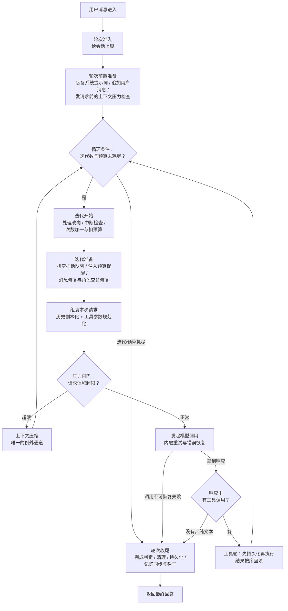

# Agent 主循环与编排

Hermes 的 agent 核心：一条用户消息进来，怎么变成「模型调用 → 工具执行 → 再调用 → …」的闭环，
直到模型给出最终回答。整篇按一轮对话的真实执行顺序推进；主答都是开口能讲完的长度，细节在追问。

## 重点地图

按面试出现频率分层，时间紧就先看三星：

- ⭐⭐⭐ **必考，要能脱口而出**：Q1 主循环全景、Q4 为什么纯同步与中断控制、Q6 工具轮、Q7 错误恢复
- ⭐⭐ **高频，要会讲**：Q3 迭代与预算、Q5 响应分支与完成判定
- ⭐ **了解思路即可**：Q2 轮次准入与前置（缓存细节在上下文工程篇展开）、Q8 收尾、Q9 开放题

## Q1：Agent 主循环是干什么的？核心机制主要流程是什么？ ⭐⭐⭐

> **一句话：** 纯同步 while 循环，把一次 LLM 调用变成「调用—工具—观察—再调用」的闭环；退出条件是模型给出纯文本、预算到顶、中断或强制终止。

**主答：**

它解决的问题是闭环：让模型能连续调工具、看结果、修正行为，直到给出最终回答，而不是说一段话就完。hermes 的答案是一个**纯同步的 while 循环**——不依赖任何编排框架，就是一个线程里的循环体。

流程看图：用户消息先过轮次准入（一个会话同时只允许一个轮次在跑），再做前置准备（从会话存储逐字节恢复系统提示词、检查上下文压力），然后进循环——每圈发一次模型调用，有工具调用就执行、结果贴回历史、再下一圈，纯文本就跳出循环收尾。另外两条全局约束记住：一是循环有明确的终止条件——模型调用的次数到顶、或预算用完就停，预算遇到不该算数的场合还能退回来；二是系统提示词和已经落库的历史，在一个会话里不能改（改了，提示词缓存 (prompt cache) 就全部作废），唯一的例外是压缩。

### 追问：turn 和 iteration 是什么关系？

迭代 = 一次模型调用加紧随的工具执行；轮次 = 一条用户消息的完整处理，可能一圈也可能几十圈。循环里数的是模型调用次数；纯代码执行的轮次只把预算退回去、调用次数照算，改向和降级的重启才是次数和预算都退。

### 追问：和 LangChain / LangGraph 的 executor 比呢？

三点：控制权——循环、重试、降级全是自己的代码，不穿透框架，代价是脏活全自己写；单线程同步——状态都在一个线程里，出了问题好推断（Q4 展开）；核心一份、处处复用——CLI、二十来个平台、定时任务、子代理跑的都是同一份循环，平台差异全挡在循环外。

### 追问：业界还有 plan-and-execute（先规划再执行），为什么不那么做？

显式规划不在循环里做，规划下放到工具层——待办、看板本身就是工具，由模型自己维护。收益是循环极简、随时改向；代价是没有全局计划、可能绕路，兜底靠迭代上限和护栏。

## Q2：一条用户消息进来，到模型第一次被调用之间，都发生了什么？ ⭐

**主答：**

三步。**准入**：先给这个会话上锁——锁是跨进程的，保证同一个会话同一时间只有一个轮次在处理；后来者排队等，最长半小时（等的时候用户插手了，这条还没处理的消息会跟着结果带回去，下次再投）。**恢复**：系统提示词从会话存储逐字节恢复而不是重建——缓存按前缀字节匹配，重建等于全量失效；工具列表同理冻结，只有换运行界面才允许尾部追加。**检查**：发请求前评估上下文压力，超限先压缩。

### 追问：为什么要上这道锁？

网关投递、定时任务、后台审查都会和前台轮次抢同一个会话；没有锁，两个轮次同时改同一段历史，持久化顺序、缓存前缀、消息格式全乱。锁带过期时间，拿着锁的进程崩溃后自动放开，会话不会被卡死。

## Q3：主循环的一圈迭代由哪些阶段组成？ ⭐⭐

**主答：**

循环条件：迭代没超上限、预算还有余额就再来一圈。四类退出：纯文本（正常完成）、到顶（迭代/预算耗尽）、中断、强制终止（护栏、落库失败）。

一圈六步：**迭代开始**（应用改向、做中断检查、次数加一、扣一次预算）→ **迭代准备**（排空插话、修复历史里的消息问题）→ **组装请求**（历史克隆成一次性副本、参数规范化）→ **压力闸门**（按真实体积复查一遍，超了就压缩后重来）→ **模型调用**（带内层重试，Q7）→ **响应分支**（工具走 Q6，文本走 Q8）。实现上拆成三十多个阶段文件，靠约定传状态——加一个阶段约等于写一个函数，代价是控制流不再肉眼可见。

### 追问：迭代上限和预算什么区别？默认多少？

上限是死的，到数就停；预算可以退，管的是「这次迭代不该算数」的情况。默认分层：库级不设限、CLI 层 500、子代理默认 250（官方文档写 50，已过时）。

### 追问：预算什么时候退？

原则：没到 provider、或不算真实模型轮次的都退——改向取消、发请求前压缩、降级重启、纯代码执行轮。改向和降级重启共用一个累计上限，防止不断重启的轮次无限退款、一直占着这个会话。

### 追问：宽限调用是什么？

触发条件很窄：Responses 通道连续三次只思考不产出、被迫降级、预算恰好耗尽——给备用 provider 额外一圈（普通迭代）。真正「预算耗尽让模型说完」的机制在收尾（Q8）。

## Q4：为什么选纯同步？异步的代价是什么？ ⭐⭐⭐

> **一句话：** 单线程循环，换来的是状态好推断；中断靠「请求在后台线程、主线程等三个事件」，工具并发靠受控线程池——同步的写法，不牺牲响应。

**主答：**

为了**好推断**：状态全在一个线程里，检查点就是循环体的每一行边界，恢复逻辑不用考虑「恢复到哪个协程的哪个 await」。异步的吞吐对「每圈等一次几秒的模型调用」没意义，复杂度却付不起。

同步不迟钝，靠三件事：**中断**——模型调用跑在后台线程，主线程等「响应就绪 / 中断 / 超时」三个信号，中断时只需要关掉这一个连接（每个请求用自己独立的连接）；**流式**——分片经回调直接给界面，无界面的场景也默认开，因为流式分片兼作连接健康信号；**工具并发**——受控线程池（Q6）。

### 追问：停止、插话、改向是三件不同的事吗？

是。**停止**=终止轮次，已流出的文本保留为记录。**插话 (steer)**=排队不打断，等工具结果落地后插一条独立用户消息。**改向 (redirect)**=取消在途的那次请求，把用户的修正作为一条新的用户消息加进去，循环从修正点重建（退预算）。工具执行中改向退化成插话——绝不杀正在跑的工具。

### 追问：模型响应和用户改向同时到达呢？

改向优先，响应作废、从修正重建——以用户为准。

### 追问：MCP 这种异步协议栈怎么接进同步循环？

圈在工具子系统里：专职后台线程跑事件循环，主循环这边拿着超时等结果，看它就是一次普通阻塞调用。又是那条原则——主循环核心保持极简，复杂的东西推到外围。

## Q5：模型返回之后，循环怎么决定「继续干活」还是「结束回答」？ ⭐⭐

**主答：**

只看一件事：响应里有没有工具调用。有→执行工具、结果贴回历史、下一圈；没有→纯文本就是最终回答，走收尾。这就是 ReAct 的骨架，循环本身极简，复杂度全在异常处理：

- **空响应**（工具调用后回了个空文本）：合成提示贴回去「处理上面的工具结果并继续」，不把空字符串交给用户；
- **截断**：文本截断不重发原请求（会原样再截），合成续写提示并逐次调高输出上限；工具参数截断反过来——调大上限把同一个调用重发几次，还不完整就拒绝执行；
- **只思考不说话**：Responses 通道有专用提示「别想了，直接答」；通用通道按固定顺序升级——回放推理续写→空响应重试→降级→最后才判失败。

### 追问：模型说完成了就算完成吗？

默认交给模型。可选的收尾检查（比如「代码改完还没验证就想收尾」的检查，默认关、需要时才开）会扣住答案，注入合成消息催模型先自查，扣住的候选答案留作预算耗尽时的兜底。代价也有两面：过早收笔靠这道检查兜，赖着不收笔靠迭代上限和护栏兜。

## Q6：工具调用在这个循环里是怎么执行、怎么回到循环的？ ⭐⭐⭐

> **一句话：** 先落库后执行（崩溃恢复的安全底线）；多调用按「并行安全段 + 顺序屏障」保守分段；工具失败变成一条普通的错误结果回给模型，只有落库失败和护栏才终止轮次。

**主答：**

按固定顺序做七件事：

1. **校验**：不存在的工具名直接回一条错误结果、不执行（但助手消息里这些调用全都留着——每个调用都必须有一条对应结果，这是消息协议的硬要求）；参数坏了就地修，修不了就回它一条错误结果，让模型重新发；
2. **裁剪**：去重、子代理委派设数量上限；
3. **落库**：**先持久化、后执行**——执行过的必留痕，进程崩溃后恢复会话能看到「已经调了这个工具」，不会重复删一次文件；落库失败宁可整轮失败，也不凭内存里的状态去执行；
4. **批次编排**：单调用直接执行；多调用保守分段——安全段并发、屏障串行，结果按模型给出的顺序回填；
5. **循环侧拦截**：待办、记忆、会话检索、子代理委派这类要读改 agent 自身状态的工具不走工具注册表 (tool registry)，循环侧直接执行；危险操作的人工审批也在这步，结果以工具结果回填（细节安全篇讲）；
6. **护栏**：模型反复发起完全相同的调用（卡死循环）→ 本轮直接结束，护栏说明附在工具结果上，另外给用户一段解释（为什么停、怎么继续）；
7. **压缩与心跳**：工具结果贴回后做压缩评估；报一次活跃心跳，防网关把「工具太快、模型太慢」的空窗误判成会话死了。

### 追问：一批多个调用，谁并行谁串行？

保守白名单制：已知只读、无共享状态的工具可并行；文件类按路径判定——读可以共享同一棵子树，写只要路径有重叠就冲突；向用户提问这类交互工具永远串行；不在安全域的一律串行。判定错了代价也只是少并行一点，因为规则本身存疑就串行。结果按模型给出的顺序回填，还有个理由：顺序稳定，重放和缓存前缀才稳定。

### 追问：工具自己抛异常、超时呢？

统统变成一条错误结果回给模型，模型看到失败原因自己换办法；错误文本有长度上限。只有落库失败和护栏触发才终止。把工具失败当观察而不是事故——这是 agent 和普通 RPC 编排的区别。

## Q7：模型调用出错怎么办？重试和降级是怎么组织的？ ⭐⭐⭐

> **一句话：** 先分类再行动——错误分类器给出「重试 / 压缩 / 换凭证 / 换 provider」四类处置，逐级升级；降级后必须重建消息、重新过前置检查；计费和内容政策类不重试，直接结束。

**主答：**

错误处理分两层，一层套一层：**内层**管单次调用，**外层**是主循环自己的异常兜底（每轮上限八次）。内层先分类再行动：分类器判定可否重试、是否该压缩、轮换凭证、切备用 provider，逐级升级，全都失败，这一轮才算失败。三个要点：

- **降级后重走前置检查**：切备用 provider 不是原地重发——重建消息、重新过压力闸门（备用模型的上下文窗口可能更小），并退回本次预算；
- **限流是跨会话共享的**（只有内置这套机制的 provider 有，比如 hermes 自家服务）：限流状态写在共享文件里，别的会话撞了限流，本会话发起前就知道、直接走降级，不把注定失败的请求发出去；
- **不可重试白名单**：计费耗尽、内容政策拦截——重试注定同样结果，直接带着明确的失败原因结束，原因里注明「值不值得重试」。

### 追问：重试几次、等多久？

单次调用默认重试三次，每次新的模型调用重新计数。间隔是带随机抖动的指数退避（防多会话同时撞限流叠成重试风暴）；provider 给了等待指示就优先遵从；等待可中断，用户按停止立刻生效。

### 追问：重试会把历史改乱吗？

不会。持久化历史和线上请求是两个副本，每次请求从历史克隆，请求侧的改写（参数规范化、缓存标记）只发生在克隆上。

## Q8：一个轮次是怎么收尾的？怎么判断「完成」？ ⭐

**主答：**

大多数情况（正常完成、到顶、中断）下，退出循环后走一条固定的收尾管线；少数不可恢复的失败（内容政策、重试耗尽）不走管线，直接带着结果返回。管线六步：

1. **预算耗尽兜底**：校验闸门扣住的候选答案，直接拿来当最终回答（不花新调用）；没有候选才补发总结请求；
2. **静默停止修复**：尾部停在工具结果上、没有助手文本（用户看到的是界面转圈然后无声无息）→ 标记失败并合成一句可见解释；
3. **完成判定**：回答存在、不失败、不中断、没超限，四条同时成立（纯文本自然收尾是超限的例外）；这一步在清理和落库之前就定好；
4. **清理**：标题升级、轨迹保存、资源回收，全部尽力而为；
5. **持久化**：清掉尾部残留的合成提示（用户自己发的消息不清）→ 捞回已流出的文本当最终回答（**用户看过的不许消失**）→ 补写历史尾部 → 可选增量压缩（默认关；开了以后每轮把最老的一段对话并进一条滚动摘要，代价是要重写历史、破坏一次缓存）→ 落库；
6. **记忆与钩子**：同步外部记忆、触发后台记忆/技能复盘、通知上下文引擎。

失败轮若把尾部留在用户消息上（模型一句话没说），补一条标记过的助手边界行——否则下条用户消息违反交替约定，部分 provider 直接拒收；上下文超限类除外。

### 追问：预算耗尽后，模型的话说一半断掉吗？

有兜底先用兜底（第 1 步），没有才补发一次总结请求。有意思的是：总结请求在通用通道上**仍带着工具清单**——工具清单是请求前缀的一部分，去掉它前缀就变了，这次调用命中不了任何缓存；带上、但模型真发的工具调用直接丢弃。这是缓存规则反过来影响设计的好例子。

## Q9：这套设计最大的代价是什么？让你改，你会改哪里？ ⭐

**主答：**

三个代价。**线程模型**：中断的实现是放弃线程而不是取消计算，单会话串行下够用，但一个进程跑大量并发会话时，一会话一线程在内存和调度上先撞墙——我会保住「单会话串行」这个不变量，把执行引擎换成少量事件循环加线程池：同步的语义、异步的执行。**阶段化状态传递的理解成本**：状态按约定在三十多个文件间流转，控制流是隐式的；但这个复杂度是问题域固有的，拆散至少每块能独立测试，我会先想办法让测试更好写，而不是动结构。**缓存不变量的滞后性**：中途换工具集要么等下个会话、要么付一次缓存破坏，用户感知是「为什么不灵」——值得给个显式提示而不是静默延迟。

三个代价同源：hermes 把「个人 agent 的长对话成本」放在了吞吐和代码直观前面。评价一个架构，先看它付出什么代价、为什么付，再看值不值。
