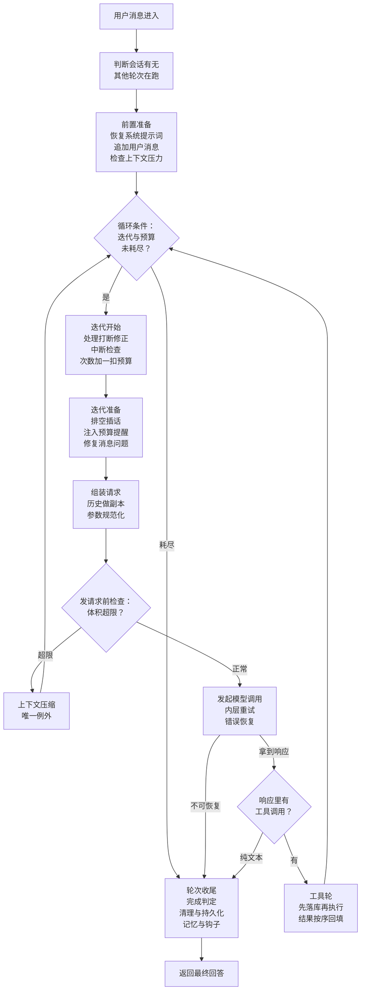

# Agent 主循环与编排

Hermes 的 agent 核心：一条用户消息进来，怎么变成「模型调用 → 工具执行 → 再调用 → …」的闭环，
直到模型给出最终回答。整篇按一轮对话的真实执行顺序推进；主答都是开口能讲完的长度，细节在追问。

## 重点地图

按面试出现频率分层，时间紧就先看三星：

- ⭐⭐⭐ **必考，要能脱口而出**：Q1 主循环全景、Q4 为什么纯同步与中断控制、Q6 工具轮、Q7 错误恢复
- ⭐⭐ **高频，要会讲**：Q3 迭代与预算、Q5 响应分支与完成判定
- ⭐ **了解思路即可**：Q2 轮次判断与前置（缓存细节在上下文工程篇展开）、Q8 收尾、Q9 开放题

## Q1：Agent 主循环是干什么的？核心机制主要流程是什么？ ⭐⭐⭐

> **一句话：** 纯同步 while 循环，把一次 LLM 调用变成「调用—工具—观察—再调用」的闭环；退出条件是模型给出纯文本、预算到顶、中断或强制终止。

**主答：**

它解决的问题是闭环：让模型能连续调工具、看结果、修正行为，直到给出最终回答，而不是说一段话就完。hermes 的答案是一个**纯同步的 while 循环**——不依赖任何编排框架，就是一个线程里的循环体。

流程看图：用户消息进来，先判断这个会话有没有别的轮次在跑（没有就锁住开跑，有就排队等），再做前置准备（从会话存储逐字节恢复系统提示词、检查上下文压力），然后进循环——每圈发一次模型调用，模型想用工具就在本地执行、结果贴回历史、再下一圈，纯文本就跳出循环收尾。另外两条全局约束记住：一是循环有明确的终止条件——模型调用的次数到顶、或预算用完就停，预算遇到不该算数的场合还能退回来；二是系统提示词和已经落库的历史，在一个会话里不能改（改了，提示词缓存 (prompt cache) 就全部作废），唯一的例外是压缩。

### 追问：turn 和 iteration 是什么关系？

迭代 = 一次模型调用加紧随的工具执行；轮次 = 一条用户消息的完整处理，可能一圈也可能几十圈。循环里数的是模型调用次数；纯代码执行的轮次只把预算退回去、调用次数照算，打断修正和降级的重启才是次数和预算都退。

### 追问：和 LangChain / LangGraph 的 executor 比，本质区别是什么？

两点。

**控制权**。框架的 executor 是「框架的代码跑你的配置」：循环、重试、工具分发都在框架里，你声明式地组装组件。好处是起步快；代价是出了奇怪的行为得去读框架源码定位——某次升级改了重试语义或组件顺序，agent 的行为就悄悄变了，修复还得等上游发版。hermes 的循环、重试、降级、中断全是自己的一手代码，出问题改自己的、当场生效；代价是所有脏活自己写——错误分类、上下文压缩、消息修复、各家 provider 的怪癖适配，这个库光循环的阶段文件就三十多个。

**同步模型**。LangChain / LangGraph 生态建立在异步上，agent 状态在协程间流转，调试要跟事件循环、取消传播打交道。hermes 是单线程同步循环，历史、预算、压缩进度全在一个线程里线性变化，打断点、看调用栈就是普通程序调试。个人 agent 的负载是「每圈等一次几秒到几十秒的模型调用」，异步的吞吐优势用不上（为什么敢同步，Q4 展开）。

### 追问：业界还有 plan-and-execute（先规划再执行），为什么不那么做？

规划工具是有的——待办、看板就是工具，模型想规划随时能用。差别在于循环不强制：plan-and-execute 是执行器要求模型先出一份计划、再按计划逐步走，计划驱动执行；hermes 的循环不要求模型先交计划，用不用、按不按计划走全凭模型自觉，循环只管一圈一圈转。收益是循环极简、随时能换方向；代价是没有一份执行器认可的计划兜着——模型可能不写计划就开干；写了也可能偏离，因为计划只是上下文里的一段文字，循环没有任何一步校验「这次调用是不是计划里的下一步」，模型每一步都是看着整个上下文重新生成的，最近的一堆工具结果比早先写的计划更有影响力，写着写着就被新发现带跑了。所以可能绕路，最后靠迭代上限和护栏收场。

## Q2：一条用户消息进来，到模型第一次被调用之间，都发生了什么？ ⭐

**主答：**

三步：

1. **判断**：看这个会话有没有别的轮次在跑——没有就锁住开跑，有就排队等；
2. **恢复**：从会话存储里把系统提示词和工具列表原样读出来接着用，不重新生成；
3. **检查**：发请求前评估上下文压力，超限先压缩再发。

### 追问：怎么判断有没有别的轮次在跑？

靠会话数据库里的一把跨进程的锁：会话库里存一条锁记录，尝试拿锁是「检查没人占用、写入持有者」一气呵成的原子操作——两个进程同时来，只有一个写得进去。拿不到就排队等：每秒重试一次、每 15 秒告诉用户一次「还在等」、最多等半小时，用户按停止可以立刻退出等待。为什么必须这么做：网关投递、定时任务、后台审查都会和前台轮次抢同一个会话，两个轮次同时改同一段历史，持久化顺序、缓存前缀、消息格式全乱；而单纯先判断再开跑有竞态（两边同时判断出「没人」），所以判断和占住必须合成一步。锁带过期时间，拿着锁的进程崩溃后自动放开，会话不会被卡死。

### 追问：系统提示词为什么要存起来读，重新生成一遍不行吗？

不行，重新生成会破坏缓存。提示词缓存 (prompt cache) 的匹配规则是逐字节的：这次请求的开头和上次一模一样，上次算过的部分才能直接复用。系统提示词正好在请求的最开头，而它不是写死的文本——是每次动态拼装的，里面嵌着环境信息、技能索引、记忆这些会变的内容，重新生成一遍，出来的字几乎必然和上次对不上；而前缀从第一个不同的字节起全部作废，后面整段对话历史的缓存一起报废。代价具体是两笔：**钱**——命中缓存的部分按折扣计费（各家不同，Anthropic 一折、OpenAI 五折这个量级），没命中就全价重算，系统提示词加历史动辄几万 token，每个轮次都全价重来，长对话的成本成倍涨；**延迟**——复用的部分不用重新计算，第一个字出来得快，全量重算就得干等。所以 hermes 在会话第一次生成提示词后把它存进会话库，之后每个轮次读的都是同一份字节。

### 追问：工具列表怎么冻结？

> **冻结的不是「不能变」，而是「只能尾部追加」——尾部追加对缓存最友好。**

工具列表不是系统提示词的一部分：请求由三块组成——工具列表、系统提示词、对话历史，缓存按这个顺序做前缀匹配。新工具加在**工具列表自己的末尾**，系统提示词一个字不动；从请求的字节流看，变化就发生在「工具列表末尾 ↔ 系统提示词」的交界处。追加的那一轮有一次性的重算代价，追加完前缀就重新稳定；真正要避免的是动中间、换顺序、反复增删——那会让缓存每一轮都失效。做法上：会话第一次发送的工具列表连同顺序存进会话库，之后每个轮次照这份顺序恢复。

MCP 工具也走这个机制，动态加载：每个**轮次开始**时刷新一遍 MCP 连接，这时已经连上的 server，工具就追加进本轮的工具列表；轮次中途才连上的，等下个轮次开始再加。挂掉的 server 也会反映到列表里：挂掉的 server 被停放、工具从注册表注销，下次轮次刷新时就被删掉了；server 恢复后自动重连，工具再追加到列表尾部。

> **例外：工具集配置的变更，普通会话要等下个会话生效，长期挂着的机器人会话例外**——用户中途启用/禁用某类工具、改工具集配置，会改变提示词里的能力描述，普通会话默认等下个会话。但挂在消息平台上长期服务的机器人会话（hermes 可当 Telegram 等平台的聊天机器人，一挂几天几周）等不起：这类会话给工具集配置记了个版本标记，配置一变、下一轮就直接重建提示词、主动付一次缓存破坏，立即生效。

### 追问：那会话中途装了新技能、写了新记忆，当前会话能用上吗？

> **提示词里的用不上：新技能、新记忆要下个会话才进提示词；新技能想当前会话就用，走消息通道。**

技能索引和记忆都嵌在系统提示词里，提示词不能动，这是字节稳定换来的直接代价。但技能有一条显式通道：用户用斜杠命令点名调用，技能内容就作为一条用户消息注入对话（追加在对话末尾，不碰提示词），当前会话立刻能用。中途写的新记忆同理：进库、提示词不动，整理它的是轮次收尾后的后台复盘任务。

## Q3：主循环的一圈迭代由哪些阶段组成？ ⭐⭐

**主答：**

> **循环条件：迭代没超上限、预算还有余额，就再来一圈。**

四类退出：纯文本（正常完成）、到顶（迭代/预算耗尽）、中断、强制终止（护栏、落库失败）。

一圈迭代用一句话说：**把当前对话打包成一次请求发给模型，再处理模型的回应**。按顺序做四件事：先做例行检查——有没有用户中途发来的打断修正要应用、有没有中断，没有就扣一次预算；接着把历史克隆成一次性的请求副本（持久化的历史和发出去的请求是两份，Q7 讲为什么）；发之前按真实体积查一遍会不会超上下文限制，超了先压缩再重查；最后带着重试机制发调用（Q7），拿到响应按内容分流——有工具调用就走工具轮（Q6），纯文本就走收尾（Q8）。

### 追问：迭代上限和预算什么区别？默认多少？

两个都是**轮次级**的，不是会话总量——每个轮次开始时计数归零、预算重新给一份，上一轮用了多少不影响下一轮。上限是死的，到数就停；预算可以退，管的是「这次迭代不该算数」的情况。默认值分三处：直接创建一个 agent 对象时不限制（hermes 的 agent 核心可以被别的程序嵌入用，上限由嵌入方自己定）；命令行应用创建 agent 时默认给 500；子代理默认 250（官方文档写 50，已过时）。

### 追问：预算什么时候退？

> **原则：没到 provider、或不算一次真实模型轮次的迭代，都退。**

典型场景：打断修正取消、发请求前压缩、降级重启、纯代码执行轮。打断修正和降级重启共用一个累计上限，防止不断重启的轮次无限退款、一直占着这个会话。

## Q4：为什么选纯同步而不是异步？ ⭐⭐⭐

> **一句话：** 场景不存在——agent 一圈只发一个请求，异步解决不了任何问题；单线程反而让状态好推断。

**主答：**

异步是为「一个线程同时处理大量请求」准备的。agent 一圈只发一个请求，时间全耗在等模型回复上——瓶颈在模型那边，程序这边再快也没用。没有需要异步解决的场景，没事搞什么异步，还白搭上协程调度、取消传播那一套复杂度。而且单线程还白赚一个好处：历史、预算这些状态只有一条时间线，出问题打断点、看调用栈，完整路径就在眼前。

### 追问：那同步不会把用户卡死吗？模型一调用就是几十秒。

不会，三件事兜着：

- **中断立刻生效**：模型调用放在后台线程跑，主线程只等三个信号——响应就绪、中断、超时。用户按停止，主线程马上就不用等了；那个请求自己被丢弃，每个请求用独立的连接，丢的时候只关自己这一条；
- **流式不等全程**：模型一边生成，文字分片一边经回调直接送到界面，用户看着字往外蹦，不用等整个响应结束；
- **工具并发用线程池**：多个工具调用要同时跑，靠受控的线程池（Q6），也不用把整个循环改成异步。

### 追问：停止、插话、打断修正是三件不同的事吗？

是。**停止**=终止轮次，已流出的文本保留为记录。**插话 (steer)**=排队不打断，等工具结果落地后插一条独立用户消息。**打断修正 (redirect)**=取消在途的那次请求，把用户的修正作为一条新的用户消息加进去，循环从修正点重建（退预算）。工具执行中打断修正退化成插话——绝不杀正在跑的工具。

### 追问：模型响应和用户的打断修正同时到达呢？

打断修正优先，响应作废、从修正重建——以用户为准。

### 追问：MCP 这种异步协议栈怎么接进同步循环？

圈在工具子系统里：专职后台线程跑事件循环，主循环这边拿着超时等结果，看它就是一次普通阻塞调用。又是那条原则——主循环核心保持极简，复杂的东西推到外围。

## Q5：模型返回之后，循环怎么决定「继续干活」还是「结束回答」？ ⭐⭐

**主答：**

> **只看一件事：模型这次是想用工具，还是直接给答案。模型不执行任何东西——它只发一段「想用哪个工具、参数是什么」的请求，执行永远在 agent 本地。**

这就是 function calling 的分工：模型生成请求，agent 解析后在本地执行，把结果贴回历史、进下一圈；响应里没有这种请求（纯文本），就是模型给出了最终回答，走收尾。这也是 ReAct 的骨架——循环本身极简，复杂度全在「响应不正常怎么办」：

- **空响应**：工具在本地执行完、结果也贴回历史了，模型的下一轮响应却是一段空文本。不把空字符串交给用户，发一条提示「处理上面的工具结果并继续」，模型下一圈接着干；
- **截断**：输出撞到长度上限被切断——每次请求都带一个上限，规定这次响应最多生成多少字。切的是正文还好：重发原请求是指望不上的——如果这个回答本身就需要比上限更多的字数，重发几次都还是被截（生成的随机波动救不了需求超限），而且每次重发都从头再写一遍，已经生成的前半段白白浪费。出路是发一条「接着刚才继续写」的提示——已写的部分留在历史里，新的额度接着用——同时把上限调大一档。切的是工具参数就麻烦些——参数必须是一段完整的 JSON，切一半既没法执行也没法接着写，只能调大上限、整个调用重发，几次还不完整就放弃这个调用；
- **只思考不说话**：推理模型把输出额度全花在思考上，一个字正文都没写。先把它的思考内容塞回上下文、让它接着写；不行就当空响应处理——重试、换备用模型，最后才判这轮失败。

### 追问：模型说完成了就算完成吗？

默认交给模型。可选的收尾检查（比如「代码改完还没验证就想收尾」的检查，默认关、需要时才开）会扣住答案，注入合成消息催模型先自查，扣住的候选答案留作预算耗尽时的兜底。代价也有两面：过早收笔靠这道检查兜，赖着不收笔靠迭代上限和护栏兜。

## Q6：工具调用在这个循环里是怎么执行、怎么回到循环的？ ⭐⭐⭐

> **一句话：** 先落库后执行（崩溃恢复的安全底线）；多调用按「并行安全段 + 顺序屏障」保守分段；工具失败变成一条普通的错误结果回给模型，只有落库失败和护栏才终止轮次。

**主答：**

按固定顺序做七件事：

1. **校验**：不存在的工具名直接回一条错误结果、不执行（但助手消息里这些调用全都留着——每个调用都必须有一条对应结果，这是消息协议的硬要求）；参数坏了就地修，修不了就回它一条错误结果，让模型重新发；
2. **裁剪**：去重、子代理委派设数量上限；
3. **落库**：**先持久化、后执行**——执行过的必留痕，进程崩溃后恢复会话能看到「已经调了这个工具」，不会重复删一次文件；落库失败宁可整轮失败，也不凭内存里的状态去执行；
4. **批次编排**：单调用直接执行；多调用保守分段——安全段并发、屏障串行，结果按模型给出的顺序回填；
5. **循环侧拦截**：待办、记忆、会话检索、子代理委派这类要读改 agent 自身状态的工具不走工具注册表 (tool registry)，循环侧直接执行；危险操作的人工审批也在这步，结果以工具结果回填（细节安全篇讲）；
6. **护栏**：模型反复发起完全相同的调用（卡死循环）→ 本轮直接结束，护栏说明附在工具结果上，另外给用户一段解释（为什么停、怎么继续）；
7. **压缩与心跳**：工具结果贴回后做压缩评估；报一次活跃心跳，防网关把「工具太快、模型太慢」的空窗误判成会话死了。

### 追问：一批多个调用，谁并行谁串行？

保守白名单制：已知只读、无共享状态的工具可并行；文件类按路径判定——读可以共享同一棵子树，写只要路径有重叠就冲突；向用户提问这类交互工具永远串行；不在安全域的一律串行。判定错了代价也只是少并行一点，因为规则本身存疑就串行。结果按模型给出的顺序回填，还有个理由：顺序稳定，重放和缓存前缀才稳定。

### 追问：工具自己抛异常、超时呢？

统统变成一条错误结果回给模型，模型看到失败原因自己换办法；错误文本有长度上限。只有落库失败和护栏触发才终止。把工具失败当观察而不是事故——这是 agent 和普通 RPC 编排的区别。

## Q7：模型调用出错怎么办？重试和降级是怎么组织的？ ⭐⭐⭐

> **一句话：** 先分类再行动——错误分类器给出「重试 / 压缩 / 换凭证 / 换 provider」四类处置，逐级升级；降级后必须重建消息、重新过前置检查；计费和内容政策类不重试，直接结束。

**主答：**

错误处理分两层，一层套一层：**内层**管单次调用，**外层**是主循环自己的异常兜底（每轮上限八次）。内层先分类再行动：分类器判定可否重试、是否该压缩、轮换凭证、切备用 provider，逐级升级，全都失败，这一轮才算失败。三个要点：

- **降级后重走前置检查**：切备用 provider 不是原地重发——重建消息、重新查一遍体积（备用模型的上下文窗口可能更小），并退回本次预算；
- **限流是跨会话共享的**（只有内置这套机制的 provider 有，比如 hermes 自家服务）：限流状态写在共享文件里，别的会话撞了限流，本会话发起前就知道、直接走降级，不把注定失败的请求发出去；
- **不可重试白名单**：计费耗尽、内容政策拦截——重试注定同样结果，直接带着明确的失败原因结束，原因里注明「值不值得重试」。

### 追问：重试几次、等多久？

单次调用默认重试三次，每次新的模型调用重新计数。间隔是带随机抖动的指数退避（防多会话同时撞限流叠成重试风暴）；provider 给了等待指示就优先遵从；等待可中断，用户按停止立刻生效。

### 追问：重试会把历史改乱吗？

不会。持久化历史和线上请求是两个副本，每次请求从历史克隆，请求侧的改写（参数规范化、缓存标记）只发生在克隆上。

## Q8：一个轮次是怎么收尾的？怎么判断「完成」？ ⭐

**主答：**

大多数情况（正常完成、到顶、中断）下，退出循环后走一条固定的收尾管线。管线六步：

1. **预算耗尽兜底**：收尾检查扣住的候选答案，直接拿来当最终回答（不花新调用）；没有候选才补发总结请求；
2. **静默停止修复**：尾部停在工具结果上、没有助手文本（用户看到的是界面转圈然后无声无息）→ 标记失败并合成一句可见解释；
3. **完成判定**：回答存在、不失败、不中断、没超限，四条同时成立（纯文本自然收尾是超限的例外）；这一步在清理和落库之前就定好；
4. **清理**：标题升级、轨迹保存、资源回收，全部尽力而为；
5. **持久化**：清掉尾部残留的合成提示（用户自己发的消息不清）→ 捞回已流出的文本当最终回答（**用户看过的不许消失**）→ 补写历史尾部 → 可选增量压缩（默认关；开了以后每轮把最老的一段对话并进一条滚动摘要，代价是要重写历史、破坏一次缓存）→ 落库；
6. **记忆与钩子**：同步外部记忆、触发后台记忆/技能复盘、通知上下文引擎。

失败轮若把尾部留在用户消息上（模型一句话没说），补一条标记过的助手边界行——否则下条用户消息违反交替约定，部分 provider 直接拒收。

> **例外一：少数不可恢复的失败（内容政策、重试耗尽）不走这条管线**，直接带着结果返回，只补失败边界行。
>
> **例外二：上下文超限类失败连边界行也不补**——往已超限的会话再追加只会更糟，靠轮换新会话解决。

### 追问：预算耗尽后，模型的话说一半断掉吗？

有兜底先用兜底（第 1 步），没有才补发一次总结请求。有意思的是：总结请求在通用通道上**仍带着工具清单**——工具清单是请求前缀的一部分，去掉它前缀就变了，这次调用命中不了任何缓存；带上、但模型真发的调用请求直接丢弃。这是缓存规则反过来影响设计的好例子。

## Q9：这套设计最大的代价是什么？让你改，你会改哪里？ ⭐

**主答：**

三个代价。**线程模型**：中断的实现是放弃线程而不是取消计算，单会话串行下够用，但一个进程跑大量并发会话时，一会话一线程在内存和调度上先撞墙——我会保住「单会话串行」这个不变量，把执行引擎换成少量事件循环加线程池：同步的语义、异步的执行。**阶段化状态传递的理解成本**：状态按约定在三十多个文件间流转，控制流是隐式的；但这个复杂度是问题域固有的，拆散至少每块能独立测试，我会先想办法让测试更好写，而不是动结构。**缓存不变量的滞后性**：中途换工具集要么等下个会话、要么付一次缓存破坏，用户感知是「为什么不灵」——值得给个显式提示而不是静默延迟。

三个代价同源：hermes 把「个人 agent 的长对话成本」放在了吞吐和代码直观前面。评价一个架构，先看它付出什么代价、为什么付，再看值不值。
