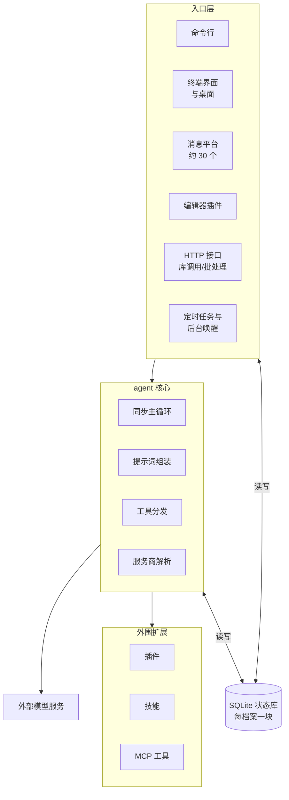

# Hermes 总体架构与设计思想

全系列第一篇，给后面所有篇章打底：hermes 整体怎么拆、组件怎么摆、哪些设计思想贯穿全局。
后面每篇深入一个子系统（主循环、工具、上下文、记忆……），那些篇的首问只给该模块的全局；
全系统的全局，在这一篇。

## 重点地图

按面试出现频率分层，时间紧就先看三星：

- ⭐⭐⭐ **必考，要能脱口而出**：Q1 架构全景、Q2 一份核心跑遍所有形态、Q5 两条设计约束
- ⭐⭐ **高频，要会讲**：Q3 为什么状态中心是 SQLite、Q4 多账号隔离
- ⭐ **了解思路即可**：Q6 大代码库怎么组织、Q7 收尾开放题

## Q1：Hermes 这套系统是干什么的？整体架构和核心流程是什么？ ⭐⭐⭐

> **一句话：** 三层一库——入口层把各种形态的输入都变成同一次 agent 调用；agent 核心是平台无关的同步循环，被每个入口在自己的进程里实例化；每个配置档案 (profile) 一块 SQLite 状态库，是所有进程共用的主状态库；新能力不进核心，靠插件 (plugin)、技能、MCP 工具挂在核心外面。

**主答：**

先定位：hermes 是一个**闭环**的个人 agent——模型能连续调工具、看结果、修正行为，直到给出答案，而不是调一次模型说一段话就完，这是它和直调模型接口的本质区别。两条卖点：一份核心跑遍所有形态（命令行到三十来个聊天平台）；技能 (skill) 和记忆让它跨会话越用越强（各有专篇）。整体架构是三层一库，看图：

一、**入口层**。三类：交互式——命令行、终端界面、桌面、约 30 个消息平台的适配器 (adapter)、编辑器插件；程序化——HTTP 接口、当成 Python 库直接调、批处理跑数据集；自主触发——定时任务、后台命令跑完的通知，没人发消息也能让 agent 转一圈。

二、**agent 核心**（一层）。一个类：纯同步的「调一次模型、执行工具、把结果贴回去、再调下一次」循环，配上提示词组装、工具分发、模型服务商解析这些配套（《Agent 主循环与编排》篇展开）。所有入口都不自己实现 agent，而是在各自进程里实例化这同一个类。

三、**状态库**（那一库）。每个配置档案一块 SQLite 库：会话历史、系统提示词、用量记账全在里面；命令行、网关、定时器，哪个进程来了读写的都是这一份。

四、**外围扩展**（又一层）。接模型服务商的插件有 38 家、记忆服务 7 家；技能是可安装的能力包；外部 MCP 服务器的工具按需挂载——模型服务商是外部服务，接谁、怎么接由插件决定。核心保持极小，为什么这么克制是 Q5 的主线。

顺着图走一遍：一条输入从入口层进来，入口在自己的进程里实例化核心、跑一轮——核心组装提示词、带上工具清单去调模型服务商，模型要用的工具在本地执行、结果贴回历史、再调下一次，直到给出回答；全程读写状态库；记忆、外部工具这些能力从外围按需挂上来。

### 追问：「个人 agent」的架构，和服务端 agent 平台差在哪？

单机单用户这个前提贯穿一切。状态全在本地一块库里，不拆库不分区；没有消息队列、缓存服务、容器编排这些多机设施——只有一个用户，加一个组件就多一份运维和故障面，换不来收益。代价是扩展有上限：一台机器、一个用户，往多租户平台化走要重做很多层（Q7 展开）。

### 追问：和 Claude Code 这类现成的 agent 工具比，为什么自己造一套？

定位不同。那些工具以一次终端会话为中心、交互式地用；hermes 的核心诉求是**常驻**——挂在聊天平台上一直在线、到点自己干活、跨会话积累记忆和技能。要撑这种形态，底座就得是「一个可嵌入的核心 + 承载多入口的网关」，而不是一个以终端为中心的工具。取舍：放弃开箱即用，换来全部控制权（不用框架的原因见 Q2）。

> **「可嵌入」的意思：** agent 核心不是一个自己独立运行的服务进程，而是一段现成的程序组件——谁要跑 agent，就把这个组件装进自己的进程里实例化一个。命令行、网关、桌面后端全都是这么用的，Q2 整问就在讲这件事。

### 追问：一条平台消息从进来到回答送出，完整路径是什么？

以 Telegram 为例：

1. 适配器把平台事件转成统一的消息事件；
2. 网关鉴权：发消息的人在不在允许名单、是不是配过对的私聊；
3. 算会话键：平台加聊天对应到一条会话，多档案部署时键里带档案名；
4. 取 agent：缓存里有这个会话的实例就复用，没有就带着历史新建一个；
5. 在网关进程里开一个线程跑完一整轮（中间可能多次调模型、执行工具），期间要审批、要澄清也经适配器发回平台；
6. 最终回答经适配器送回。消息、轮次和会话状态都落在状态库里。

### 追问：命令行和网关两种跑法，入口层各自多做点什么？

生命周期和展示。网关要管掉线重连、进程崩了恢复，命令行不用——坐在终端前的就是本人；展示上，流式输出、进度、审批提示各按自己的形态呈现，平台是发消息，命令行是刷终端。鉴权和会话路由上一问刚走过。

## Q2：一份 agent 核心，怎么做到跑遍命令行、三十个平台、桌面、编辑器？ ⭐⭐⭐

> **一句话：** 依赖方向单向——入口依赖核心，核心不实现任何平台的差异逻辑；交互差异通过回调接口注入；网关进程里一轮一线程，agent 实例按会话缓存。

**主答：**

关键在依赖方向：所有入口引用的都是同一个核心类，核心不为任何平台单独写一套执行逻辑。「跑遍所有形态」不是核心去适配平台，而是每个入口把核心拿进自己的进程用：

一、命令行进程里实例化它，一轮回答一条输入；
二、网关进程里，每条消息在专属线程里跑完整轮——不同会话并发，同一会话排队；
三、定时任务的调度线程到点新建一个 agent（不接聊天历史，任务可以自带技能）跑任务的提示词；
四、桌面、编辑器各通过自己的后端进程调同一个类。

交互差异（提问、报进度、要审批）不写死在核心里，走回调接口，由入口注入实现。

### 追问：核心真的完全不知道平台吗？

知道得很少，但不是零。构造时核心拿到一个平台标签，最实在的用处是提示词里那张按平台写的说明表——告诉模型「你在哪个平台、输出用什么格式、图片怎么发」，因为模型得按各平台的规矩说话；执行路径本身不按平台分叉，交互全走回调。另外核心里有约二十个文件反过来引用入口层的模块（拿会话上下文这类共用件），是方向上的例外尾巴——整体仍是入口依赖核心。

### 追问：为什么不把核心做成一个常驻服务，所有入口都来调它？

因为状态全在库里，agent 实例只是个可以随时丢弃重建的壳——回收前把记忆刷下去、下次带着历史重建，就恢复原样。既然实例放哪个进程都一样，做成独立服务只多出东西：一层远程调用协议、一个部署单元、一类「服务挂了怎么办」的问题。个人 agent 场景里这些全是纯开销。网关里 agent 实例也不是每条消息重建：按会话缓存复用，空闲太久回收、回收前把没落盘的记忆先刷下去（HTTP 接口那条路例外，按请求重建）。

### 追问：五十条消息同时进来会怎样？

分两种。五十个不同聊天来的：各开各的线程并发跑，互不影响——每个线程大部分时间在等模型响应，等的间隙不占计算资源。同一个聊天连发五条：同一个网关进程里，后四条先进这个聊天的待处理队列，第一条跑完再轮到它们；如果是**另一个进程**在用这个会话（比如命令行和网关同时跑一条会话），才轮到库里那把跨进程锁——排队等锁的重试和超时参数在《Agent 主循环与编排》篇。真正先到顶的是模型服务商的限流，不是网关。

### 追问：网关为什么是独立长驻进程？桌面和它什么关系？

网关承载的是「机器人一直在线」的职责——收消息、跑轮次、到点跑任务，这个生命周期不该绑在任何一个界面上。桌面 app 启动时会拉起自己的后端进程，app 退出它跟着退；桌面连的始终是这种后端——本机已经在跑的、自己拉起的、远端的都行。消息网关是另一条线：由后端的接口单独拉起，不随桌面退出。终端界面同理，走自己的后端进程。

### 追问：agent 都是等用户发消息才动吗？

不是，有两类自主触发：定时任务到点自己跑（《规划与任务管理》篇展开）；工具执行时模型可以标记「这条后台命令跑完通知我」，网关盯着它，跑完自动让该会话再跑一轮，把结果作为新输入带给模型。这也是 Q1 图里「自主触发」单独归一类的原因。

### 追问：为什么不基于 LangChain、LangGraph 这类框架搭？

主因：**编排本来就自己写了**，而且写得更细——压缩、中断、恢复都是一手代码；再套框架，等于在自己写的循环外面再套一层别人的循环，白付一层抽象的成本。配套两个理由：一是控制权，框架的执行器 (executor) 是「框架的代码跑你的配置」，出了怪行为要读框架源码定位、修复等上游发版，自己的代码改了当场生效；二是同步模型，那套生态建在异步上，而个人 agent 每圈等的是几秒到几十秒的模型调用，异步的吞吐优势用不上。更细的展开在《Agent 主循环与编排》篇。

### 追问：要接一个新平台、或换一个模型服务商，动哪里？

接一个新的消息平台，写一个入口层的适配器就够了——三十来个平台就是这么一个个接上的。模型：装对应的服务商插件，38 家都是插件。差异都长在外围，这正是 Q5 窄腰的正面例证。

## Q3：状态为什么放在一块 SQLite 库里？并发怎么办？ ⭐⭐

> **一句话：** 单机单用户用不着网络中间件：WAL 让读写不打架，所有进程并发用一块本地库够了；提示词缓存本来就要求只有一份权威存储；个人场景的写入量离 SQLite 的上限远得很。

**主答：**

先看谁在并发：命令行、网关、定时器、桌面后端，任何时刻可能有几个进程同时读写同一个档案的状态。选 SQLite 的理由有三层：

1. **场景不需要网络中间件**。Redis、服务化数据库这类外部组件解决的是多机、多服务的问题，个人 agent 单机单用户，没有多机——加进来只有运维成本，没有收益。
2. **并发够用**。SQLite 开 WAL（write-ahead logging，写前日志）模式：写先落到旁路文件、择机合并进主库，读不挡写、写不挡读。写入本身仍然一次只能有一个，撞多了要排队，但个人场景的写入量到不了那里——什么时候会到，Q7 算账。
3. **架构上反而需要一份唯一的权威存储**。提示词缓存 (prompt cache) 不可破坏（Q5），要求系统提示词和会话历史在会话内只有一份、字节不能变——一块库天然满足。

这块库承担的角色：会话历史、冻结的系统提示词、跨进程的会话锁、用量记账、全文检索的索引。

### 追问：WAL 什么时候出问题，怎么处理？

两条降级通道，都是启动时就定下来的，不是运行中随机坏。

一、文件系统不兼容：WAL 依赖共享内存和文件锁，网络文件系统和跨虚拟机的挂载撑不住——多数直接报错，少数（比如 ZFS、虚拟机共享目录那类）不报错但会在并发下写坏数据。建库时探测，不兼容就不开 WAL、用普通日志模式——读写互斥，牺牲并发保正确。已经开了 WAL 的老库不现场降级、只报警：现场降级会毁掉别的进程还没落盘的写入。

二、运行时自身带缺陷：自带的 SQLite 版本正好落在某个 WAL 重置缺陷影响的版本范围里时，**新建的库干脆不开 WAL**，直接用普通日志模式（老库同样保持不动），等修好的运行时再放开——保守换正确。

### 追问：并发写同一个会话怎么防？

锁存在库里，不在进程里：想跑一轮，先往库里占一条锁记录——判断没人占用和写入自己是同一步原子操作，两个进程同时来只有一个占得住。因为锁在库里，不管哪个进程来——网关、命令行、定时器——抢的都是同一把锁；锁带过期时间，持锁的进程崩了自动释放，会话不会卡死。排队等待的具体语义在《Agent 主循环与编排》篇。

### 追问：历史消息的全文检索怎么做？

SQLite 自带的全文检索扩展 FTS5，配一个自研的中文分词扩展——中文不按空格分词，原生 FTS5 切不了。这块在《记忆系统》篇展开。

## Q4：一个人有多个账号、多个身份，怎么隔离？ ⭐⭐

> **一句话：** 隔离单位是配置档案：一套家目录加两条作用域边界（能用哪些密钥、能在哪执行命令）；现在默认一个网关进程服务本机所有档案，隔离靠作用域绑定而不是进程边界——每条消息先判身份，之后的每次读写都得绑在正确的档案下。

**主答：**

隔离单位是配置档案：一个档案 = 一套独立的家目录 (home)——配置、密钥、记忆、会话、日志全在里面，加上两条看不见的边界：这套档案能用到哪些密钥（密钥域）、能在哪个终端环境里执行命令（终端执行域）。典型用法：工作号一个档案、生活号一个档案，记忆互相看不见。

部署形态现在默认是**一个网关进程服务本机所有档案**（多路复用 (multiplex) 是默认形态，一档案一网关只剩一个临时兼容开关）。所以隔离不是靠进程边界，而是靠作用域：每条进来的消息先判身份——哪个 bot 收的、在哪个档案里跑、由哪个 bot 送答案——之后配置、密钥、记忆的每次读写都得绑在正确的档案下。绑错不报错，这是最危险的地方，放追问讲。

### 追问：多路复用最容易踩什么坑？

环境变量。进程级环境变量里存的是启动档案的值，别的档案的密钥只存在于自己的作用域里——绑错作用域，就会把 A 档案的记忆写进 B 档案的库，而且不报错。所以 hermes 把「每次读写都绑在正确的档案作用域下」定为硬规则：不只轮次里，回调、回收、定时检查也都要绑。维护者给协作 AI 的规则文件里，防这类泄漏的规则占了整整一节——这份复杂度是真实存在的，Q7 回来算账。

### 追问：为什么隔离做成目录级的孤岛，不做配置继承？

有人提过「子档案继承默认档案配置」的改动，被维护者关掉了：档案之间一同步，就等于把 A 的配置漏给 B——这正是这个设计要防的。想要「从我的默认配置开始」，有克隆命令：复制一份当时的状态，之后各自演化，不留活链接。

### 追问：两个档案想用同一个 bot 凭证呢？

不行。连同一个 bot 时按凭证上锁，同一时间一份凭证只归一个档案用。防的是同一个 bot 被两个档案同时用：消息会重复收发，会话状态会串台。

### 追问：各档案的定时任务归谁跑？

本机网关进程统一跑：它把机器上所有档案的任务文件都轮询一遍，跟开没开多路复用无关。这个选择有来由——当年任务调度只跟着多路复用开关走，没开开关的部署里，其余档案的任务躺在任务文件里永远没人碰，真出过这个漏，后来才改成「本机网关全管」。

## Q5：这套设计里有哪些绕不开的约束？ ⭐⭐⭐

> **一句话：** 一、提示词缓存不可破坏：发出去的系统提示词和历史在会话内不动，改动默认延迟到下个会话生效，例外只有明确的几条。二、核心是窄腰 (narrow waist)：绝大多数核心工具的说明书随每次模型调用发送，进核心的门槛极高，新能力一律放外围。

**主答：**

hermes 内部把这两条叫不变量——破了就伤钱、伤稳定性，大量设计决策都从它们推出来。

第一条管钱和延迟。提示词缓存按前缀逐字节匹配，系统提示词和历史动一个字节，整个会话的缓存作废，之后每次调用全价重算、第一个字也更晚出来（两笔代价的具体账在《Agent 主循环与编排》篇算过）。落到架构上就是：凡是会影响系统提示词的东西——装技能、换工具、更新记忆——默认都延迟到下个会话生效。

> **会话内可以改写的例外就三条：** 上下文压缩（历史侧唯一被允许的改写，不压就超上下文上限）；用户主动选「立即生效」；Bot Mode 下和 bot 的那条常驻对话（桌面、终端界面里能一挂几个月的会话）——工具配置一变，下一轮直接重建提示词，它等不起下个会话。压缩是超限被迫，后两条是主动选择；共同点是明面上付一次缓存破坏，不是悄悄发生的。

第二条管核心的体积。函数调用 (function calling) 的机制是：工具清单（名字、参数说明）随每次请求发给模型，这是模型「会什么」的说明书。所以核心里每加一个工具，所有用户、每次调用都要付这份 token 和注意力——进核心的门槛因此极高。所谓窄腰，就是把中间的核心压到最细，能力都挂在核心外面：核心要维护的约定越少，改起来波及面越小。一个补充：绝大多数核心工具确实每次都随请求发送，少数冷门、事件触发的默认走**渐进式披露** (progressive disclosure)——完整说明书不随请求走，要用再查，怎么做到放在下一问——这本身也是窄腰思想在工具层的延伸。新能力按由轻到重的阶梯往外围放、进核心垫底，怎么判断级别也放在追问里。

### 追问：为什么工具清单必须随每个请求发，不能发一次让模型记住？

模型是无状态的：每次生成都是重新看整个上下文，不存在「上次告诉过它」。工具说明就是上下文的一部分，这次不发，这次就等于不会——各家模型接口也都是这么设计的。例外正是渐进式披露：被延迟的工具不是消失，能塞得下时进目录，给名字和一句简介；目录太大就逐档收缩，最后一档只报每组有几个工具。始终都在的是检索的入口，具体名字不保证看得见。

### 追问：给你一个新需求，你会怎么判断加在哪一级？

六级阶梯，从最轻到最重：

1. 扩现有的代码（不新增任何要发给模型的东西）；
2. 加一条命令行子命令 + 技能；
3. 服务门控工具（配置了对应服务才出现）；
4. 独立插件；
5. 发布成 hermes 官方 MCP 目录里的服务器；
6. 新核心工具（垫底）。

拿四个例子对号：**「让 bot 每天早上报天气」**是第 2 级——定时只是触发方式，不算阶梯里的一级，能力本身用命令加技能就够；**「控制家里的智能灯」**是第 3 级——配置了 Home Assistant 才出现的工具，没配置的用户不为它付一个 token；**「接公司内部的工单系统」**是第 4 级——独立插件仓库，不进主代码树；**「让 agent 能浏览网页」**才够得上第 6 级——几乎人人要、高频用，且没有能替代的通道（终端和文件都够不着）。第 1、5 级没出现在例子里：第 1 级是改现有代码的默认动作，第 5 级只有要把能力发布成 MCP 服务器给别人用时才走。判断标准一句话：越往下越要「几乎所有人都高频需要、且绕不过去」。

### 追问：插件是怎么挂进核心的？

插件从三个地方找：用户主目录下的插件文件夹、项目目录里的插件文件夹（要显式开启）、pip 装的包。启动时扫描装载，插件拿到一个受控的注册接口，把自己的工具、钩子、命令交进来——不许碰核心文件。要深度接入的（记忆、上下文引擎）走专门定义好的扩展接口，同一类只让一个插件生效。

### 追问：MCP 为什么被排在那么轻的位置？

MCP 工具是运行时按需挂载的：用户不配置就完全不存在，配置了才进那个用户的会话，不占核心那份固定清单的位置，正合窄腰。hermes 在 MCP 两个方向都在场：作为客户端连外部服务器拿工具；也能自己当 MCP 服务器，把会话本身（列表、读历史、发消息、处理审批）暴露成工具给别的 agent 用——等于把「和 hermes 对话」做成了一项外部能力。《MCP》篇展开。

## Q6：这么大一个自研代码库，怎么保持可维护？ ⭐

**主答：**

三件事：

一、**拆分纪律**。曾经的巨型文件被拆成「门面 + 一组按主题的小文件」，并定了阈值：文件约两千行、函数约三百行，到了就按主题拆。现在状态库门面带三十个主题文件、主循环带三十多个阶段文件。找代码按主题搜小文件，不读门面。

二、**树内自述**。每个子系统有一份维护者写的架构说明（目标控制在八千字符左右）加一张总表指路——动哪块先读哪份。这些文件同时写给人和写给协作的 AI，等于把架构知识当代码一样维护在仓库里。

三、**测试纪律**。测试断言行为契约（断言输入和输出之间该是什么关系），禁止快照式断言（把当前值冻结成期望）；涉及配置传递、安全边界的改动必须走真实路径端到端——不 mock 模块导入、在隔离的临时环境里跑，动到多档案作用域的还要双档案来回切换实测。另有近 70 项离线评测守着关键行为。

## Q7：这套架构最大的代价是什么？让你改你会改哪？ ⭐

**主答：**

代价三个，按疼的程度排：

一、**单网关进程既是并发上限，也是故障半径**。所有会话的轮次、所有平台的适配器挤在一个进程里，进程级的任何污染全员中招——多路复用那一长串防作用域泄漏的规则，就是这份复杂度的账单。

二、**同步模型封死了横向扩展**。单用户场景换不来什么，但「加机器」这条路从架构上就不存在。

三、**SQLite 的写入是单点**。单机单用户绰绰有余，真往多用户平台走，第一个要换的就是它。

要改我先动网关和核心的进程边界：把轮次执行从网关进程里拆出去，网关只留投递和路由。这样适配器故障和轮次故障互相隔离，单个会话跑飞也带不翻整个网关。但代价是引入进程间通信和状态归属问题——所以「不改」也是个合理答案：在单用户前提下，现在的简单是值钱的，我会先确认真有故障压过来再动手，而不是为了架构审美动手。
