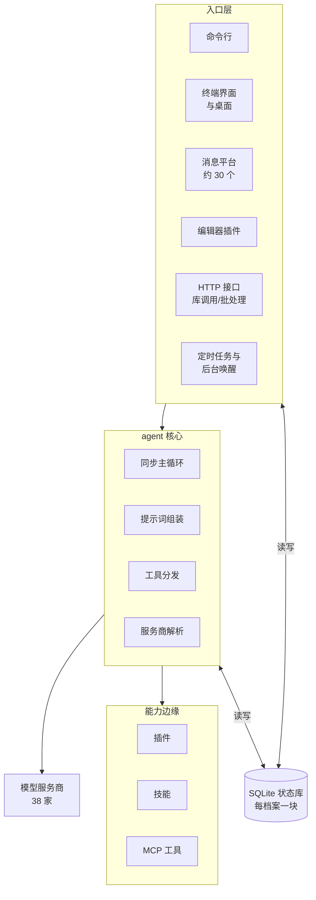

# Hermes 总体架构与设计思想

全系列第一篇，给后面所有篇章打底：hermes 整体怎么拆、组件怎么摆、哪些设计思想贯穿全局。
后面每篇深入一个子系统（主循环、工具、上下文、记忆……），那些篇的首问只给该模块的全局；
全系统的全局，在这一篇。

## 重点地图

按面试出现频率分层，时间紧就先看三星：

- ⭐⭐⭐ **必考，要能脱口而出**：Q1 架构全景、Q2 一份核心跑遍所有形态、Q5 两条设计不变量
- ⭐⭐ **高频，要会讲**：Q3 为什么状态中心是 SQLite、Q4 多账号隔离
- ⭐ **了解思路即可**：Q6 大代码库怎么组织、Q7 收尾开放题

## Q1：Hermes 整体是个什么架构？有哪些组成部分？ ⭐⭐⭐

> **一句话：** 三层一库——入口层把各种形态的输入都变成同一次 agent 调用；agent 核心是平台无关的同步循环，被每个入口在自己的进程里实例化；每个配置档案一块 SQLite 状态库，是所有进程共享的唯一事实源；新能力不进核心，靠插件、技能、MCP 工具挂在边缘。

**主答：**

它要解决的问题是「一份 agent 核心，跑在所有形态里」：命令行、三十来个聊天平台、终端界面、桌面应用、编辑器插件，还得能定时自己干活。hermes 的答案分四块，看图：

一、**入口层**。三类：交互式——命令行、终端界面、桌面、约 30 个消息平台的适配器 (adapter)、编辑器插件；程序化——HTTP 接口、当成 Python 库直接调、批处理跑数据集；自主触发——定时任务、后台命令跑完的通知，没人发消息也能让 agent 转一圈。

二、**agent 核心**。一个类：纯同步的「调一次模型、执行工具、把结果贴回去、再调下一次」循环，配上提示词组装、工具分发、模型服务商解析这些配套（《Agent 主循环与编排》篇展开）。所有入口都不自己实现 agent，而是在各自进程里实例化这同一个类。

三、**状态层**。每个配置档案 (profile) 一块 SQLite 库：会话历史、系统提示词、用量记账全在里面；命令行、网关、定时器，哪个进程来了读写的是同一份。定时任务是另一回事，存在档案目录下的普通文件里。

四、**能力边缘**。模型服务商 38 家、记忆服务 7 家，全是插件 (plugin)；技能 (skill) 是可安装的能力包；外部 MCP 服务器的工具按需挂载。核心保持极小——为什么这么克制，是 Q5 的主线。

### 追问：「个人 agent」的架构，和服务端 agent 平台差在哪？

单机单用户这个前提贯穿一切。状态全在本地一块库里，不拆库不分区；没有消息队列、缓存服务、容器编排这些多机设施——只有一个用户，加一个组件就多一份运维和故障面，换不来收益。代价是扩展上限：一台机器、一个用户，往多租户平台化走要重做很多层（Q7 展开）。

### 追问：一条平台消息从进来到回答送出，完整路径是什么？

以 Telegram 为例：

1. 适配器把平台事件转成统一的消息事件；
2. 网关鉴权：发消息的人在不在允许名单、是不是配过对的私聊；
3. 算会话键：平台加聊天对应到一条会话，多档案部署时键里带档案名；
4. 取 agent：缓存里有这个会话的实例就复用，没有就带着历史新建一个；
5. 在网关进程里开一个线程跑完一整轮（中间可能多次调模型、执行工具），期间要审批、要澄清也经适配器发回平台；
6. 最终回答经适配器送回。全程每一步都落在状态库里。

### 追问：直接用命令行和挂在网关下，agent 核心有区别吗？

没有。区别全在入口层：怎么显示、怎么交互、怎么鉴权。核心对平台唯一的感知是一个回调接口——怎么向用户提问（命令行是输入框，平台是发消息）、怎么报进度。这是刻意的设计原则：平台差异留在入口，核心对平台无感知，一份代码才跑得遍所有形态。

## Q2：一份 agent 核心，怎么做到跑遍命令行、三十个平台、桌面、编辑器？ ⭐⭐⭐

> **一句话：** 依赖方向单向——入口依赖核心，核心不知道任何入口的存在；交互差异通过回调接口注入；网关进程里一轮一线程，agent 实例按会话缓存。

**主答：**

关键在依赖方向：所有入口引用的都是同一个核心类，而核心不引用任何入口。「跑遍所有形态」不是核心去适配平台，而是每个入口把核心拿进自己的进程用：

一、命令行进程里实例化它，一轮回答一条输入；
二、网关进程里，每条消息在专属线程里跑完整轮——不同会话并发，同一会话由锁串行；
三、定时任务的调度线程到点新建一个 agent（不接聊天历史，任务可以自带技能）跑任务的提示词；
四、桌面、编辑器各通过自己的后端进程调同一个类。

交互差异（提问、报进度、要审批）不写死在核心里，走回调接口，由入口注入实现。网关里 agent 也不是每条消息重建：按会话缓存复用，空闲太久回收，回收前把没落盘的记忆先刷下去。

### 追问：为什么不把核心做成一个常驻服务，所有入口都来调它？

因为状态全在库里，agent 实例只是个可以随时丢弃重建的壳——回收前把记忆刷下去、下次带历史重建，就恢复原样。既然实例放哪个进程都一样，做成独立服务只多出东西：一层远程调用协议、一个部署单元、一类「服务挂了怎么办」的问题。个人 agent 场景里这些全是纯开销。而会话级缓存已经消掉了大部分重复初始化（系统提示词、工具清单不用每条消息重建）。

### 追问：五十条消息同时进来会怎样？

分两种。五十个不同聊天来的：各开各的线程并发跑，互不影响——每条线程大部分时间在等模型响应，等的间隙不占计算资源。同一个聊天连发五条：第一条拿到会话锁开跑，后面四条排队等，每秒重试一次、最多等半小时，用户按停可以立刻退出（锁的机制《Agent 主循环与编排》篇讲过）。真正先到顶的是模型服务商的限流，不是网关。

### 追问：桌面应用、终端界面和网关是什么关系？

桌面 app 启动时会拉起一个自己的后端进程，app 退出它跟着退；但消息网关是独立的长驻进程，不随桌面退出——桌面只是网关的又一个客户端形态。终端界面同理，走自己的后端进程。这么分是因为网关承载的是「机器人一直在线」的职责，生命周期不该绑在任何一个界面上。

### 追问：agent 都是等用户发消息才动吗？

不是，有两类自主触发：定时任务到点自己跑（《规划与任务管理》篇展开）；工具执行时模型可以标记「这条后台命令跑完通知我」，网关盯着它，跑完自动让该会话再跑一轮，把结果作为新输入带给模型。这也是 Q1 图里「自主触发」单独归一类的原因。

## Q3：多个进程共用状态，为什么中心是一块 SQLite 库，不是 Redis 或消息队列？ ⭐⭐

**主答：**

先看谁在并发：命令行、网关、定时器、桌面后端，任何时刻可能有几个进程同时读写同一个档案的状态。选 SQLite 的理由有三层：

1. **场景不需要网络中间件**。Redis 和消息队列解决的是多机、多服务的问题，个人 agent 单机单用户，没有多机——加进来只有运维成本，没有收益。
2. **并发够用**。SQLite 开 WAL（write-ahead logging，写前日志）模式：写先落到旁路文件、择机合并进主库，读写不互斥，多进程并发读写一块本地库没有性能问题。
3. **架构上反而需要一份唯一的权威存储**。提示词缓存不可破坏（Q5）要求系统提示词和会话历史只有一份字节，不允许两个副本各自演化——一块库天然满足。

这块库承担的角色：会话历史、冻结的系统提示词、跨进程的会话锁、用量记账、全文检索的索引。

### 追问：WAL 模式在什么情况下会出问题，怎么处理？

WAL 依赖内存映射共享内存和文件锁，网络文件系统（NFS、SMB 共享盘、部分 FUSE 挂载）撑不住，硬开会数据损坏。它怎么出现是部署环境决定的，不是运行中随机坏：库放在了共享盘或网络挂载上，启动时就注定。处理是建库时探测：文件系统不兼容就自动降级回普通日志模式，读写重新互斥（读要等写），牺牲并发保正确。

### 追问：并发写同一个会话怎么防？

锁存在库里，不在进程里：想跑一轮，先往库里原子地写一条锁记录——检查没人占用、写入持有者一气呵成，写进去才算拿到；别的进程看到锁就排队。因为锁在库里，任何入口进程抢的都是同一把锁；持锁进程崩了，锁带过期时间自动释放，会话不会卡死。排队等待的具体语义（重试频率、等待上限、按停退出）在《Agent 主循环与编排》篇。

### 追问：历史消息的全文检索怎么做？

SQLite 自带的全文检索 FTS5，配一个自研的中文分词扩展——中文不按空格分词，原生 FTS5 切不了。这块在《记忆系统》篇展开。

## Q4：一个人有多个账号、多个身份，怎么隔离？ ⭐⭐

**主答：**

隔离单位是配置档案：一个档案 = 一套独立的家目录 (home)——配置、密钥、记忆、会话、日志全在里面，加上两条看不见的边界：这套档案能用到哪些密钥（密钥域）、能在哪个终端环境里执行命令（终端执行域）。典型用法：工作号一个档案、生活号一个档案，记忆互相看不见。

部署上默认一个档案一个网关进程，进程级天然隔离；也支持多路复用 (multiplex)——一个网关进程同时服务多个档案，省机器。多路复用的代价是所有资源都得「认档案」：每条进来的消息先路由出身份（哪个 bot 收的、在哪个档案跑、由哪个 bot 送答案），跑的过程中配置、密钥、记忆的每次读取都要绑在正确的档案作用域下。

最大的坑在环境变量：进程级环境变量里存的是启动档案的值，多路复用时另一个档案的密钥只存在于自己的作用域——绑错作用域，就会把 A 档案的记忆写进 B 档案的库，而且不报错。所以上游把「作用域按活动绑定」定成硬规则：不只轮次内，回调、回收、定时检查全都要绑。维护者给协作 AI 的规则文件里，防这类泄漏的条目占了一整节——这复杂度是真实存在的，Q7 会回到这点。

### 追问：为什么隔离做成目录级的孤岛，不做配置继承？

有人提过「子档案继承默认档案配置」的改动，被官方关了：档案之间耦合正是这个设计要防的——隔离语义里，「同步」和「泄漏」只差一个视角。想要「从我的默认配置开始」，有克隆命令：复制一份当时的状态，之后各自演化，不留活链接。

### 追问：两个档案想用同一个 bot 凭证呢？

不行。用独占凭证（bot 令牌、API key）连接时按凭证拿作用域锁，一个凭证同一时间只归一个档案用。防的是同一个 bot 被两边同时消费：消息重复收发、会话状态交叉。

### 追问：各档案的定时任务归谁跑？

宿主网关进程统一跑：它把机器上所有档案的任务库都轮询一遍，跟开没开多路复用无关。这个选择有来由——如果只有开了多路复用的网关才跑多档案任务，没开的部署里那些档案的任务就永远没人执行，历史上真出过这个漏：非启动档案的任务躺在库里没有调度器去看。

## Q5：这套架构有哪两条贯穿一切的设计不变量？ ⭐⭐⭐

> **一句话：** 一、每个会话的提示词缓存不可破坏：系统提示词和历史在会话内字节冻结，改动默认延迟到下个会话生效，唯一例外是上下文压缩。二、核心是窄腰 (narrow waist)：每个核心工具的说明书都随每次模型调用发送，所以进核心的门槛极高，新能力一律放边缘。

**主答：**

第一条管钱和延迟。提示词缓存按前缀逐字节匹配，系统提示词和历史动一个字节，整个会话的缓存作废，之后每次调用全价重算、第一个字也更晚出来（两笔代价的具体账在《Agent 主循环与编排》篇算过）。落到架构上就是：凡是会影响系统提示词的东西——装技能、换工具、更新记忆——默认都延迟到下个会话生效；用户等不及可以选「立即生效」，代价是当场作废缓存。

> **唯一例外：上下文压缩。** 不压就要超上下文上限，两害取其轻——这是全库唯一被允许的会话内改写。

第二条管核心的体积。函数调用 (function calling) 的机制是：工具清单（名字、参数说明）随每次请求发给模型，这是模型「会什么」的说明书，不发它就永远不知道有这个工具。所以核心里每加一个工具，所有用户、每次调用都要付这份 token 和注意力。所谓窄腰，就是把中间的核心压到最细、能力都挂在边缘——腰越细，穿过核心的东西越少、越稳定。落到执行是六级阶梯，从最轻到最重：

1. 扩现有的代码（零新增面积）；
2. 命令行命令 + 技能；
3. 服务门控工具（配置了对应服务才出现）；
4. 独立插件；
5. MCP server 进官方目录；
6. 新核心工具（垫底）。

### 追问：为什么工具清单必须随每个请求发，不能发一次让模型记住？

模型是无状态的：每次生成都是重新看整个上下文，不存在「上次告诉过它」。工具说明就是上下文的一部分，这次不发，这次就等于不会。各家模型接口也都是这么设计的——工具清单是请求的一部分，不是会话的一部分。这也顺便解释了为什么「工具变更延迟到下个会话生效」不损失什么：反正每个新会话都要重新发一遍冻结好的清单。

### 追问：给你一个新需求，你会怎么判断加在哪一级？

拿四个真实例子走一遍：

- 「让 bot 每天早上报天气」——定时任务，命令行命令加技能就够，不碰核心；
- 「控制家里的智能灯」——服务门控工具：配置了 Home Assistant 才会出现，没配置的用户不为它付一个 token；
- 「接公司内部的工单系统」——独立插件仓库，不进主代码树；
- 「让 agent 能浏览网页」——这才够得上核心工具：几乎人人要、高频用，且没有能替代的通道（终端和文件都够不着）。

判断标准一句话：越往下越要「几乎所有人都高频需要、且绕不过去」。

### 追问：MCP 为什么被排在那么轻的位置？

MCP 工具是运行时按需挂载的：不占核心的固定清单，用户不配置就完全不存在，配置了才进那个用户的会话。对核心来说零永久面积，正合窄腰。hermes 在 MCP 两个方向都在场：作为客户端连外部服务器拿工具；也能自己当 MCP 服务器，把会话本身（列表、读历史、发消息、处理审批）暴露成工具给别的 agent 用——等于把「和 hermes 对话」做成了一项外部能力。《MCP》篇展开。

## Q6：几十万行代码、不依赖框架，怎么保持可维护？ ⭐

**主答：**

三件事：

一、**拆分纪律**。曾经的巨型文件被拆成「门面 + 一组按主题的小文件」，并定了阈值：文件约两千行、函数约三百行，到了就按主题拆。现在状态库门面带三十个主题文件、主循环带三十多个阶段文件。找代码按主题搜小文件，不读门面。

二、**树内自述**。每个子系统有一份维护者写的架构说明（约八千字上限）加一张根路由表，动哪块先读哪份。这些文件同时写给人和写给协作的 AI——等于把架构知识当代码一样维护在仓库里。

三、**测试纪律**。测试断言行为契约（两份数据该是什么关系），禁止快照式断言（把当前值冻结成期望）；涉及配置传递、安全边界的改动必须走真实路径端到端——真进程、真导入、隔离的临时环境，动到多档案作用域的还要双档案来回切换实测。另有近 70 项离线评测守着关键行为。

### 追问：为什么不用框架？

《Agent 主循环与编排》篇答过两点：控制权（出了问题改自己的代码当场生效）和同步模型（调试就是普通程序调试）。架构层再补一句：框架的核心价值是编排，而 hermes 的编排已经自己写了，还写得更细——压缩、中断、恢复都是自己的。再套框架，等于在自己写的循环外面再套一层别人的循环，白付一层抽象的成本。

## Q7：这套架构最大的代价是什么？让你改你会改哪？ ⭐

**主答：**

代价三个，按疼的程度排：

一、**单网关进程既是并发上限，也是故障半径**。所有会话的轮次、所有平台的适配器挤在一个进程里，进程级的任何污染全员中招——多路复用那一长串防作用域泄漏的规则，就是这份复杂度的账单。

二、**同步模型封死了横向扩展**。单用户场景换不来什么，但「加机器」这条路从架构上就不存在。

三、**SQLite 的写上限**。单机单用户绰绰有余，真往多用户平台走，第一个要换的就是它。

要改我先动网关和核心的进程边界：把轮次执行从网关进程里拆出去，网关只留投递和路由。这样适配器故障和轮次故障互相隔离，单个会话跑飞也带不翻整个网关。但代价是引入进程间通信和状态归属问题——所以「不改」也是个合理答案：在单用户前提下，现在的简单是值钱的，我会先确认真有故障压过来再动手，而不是为了架构审美动手。
