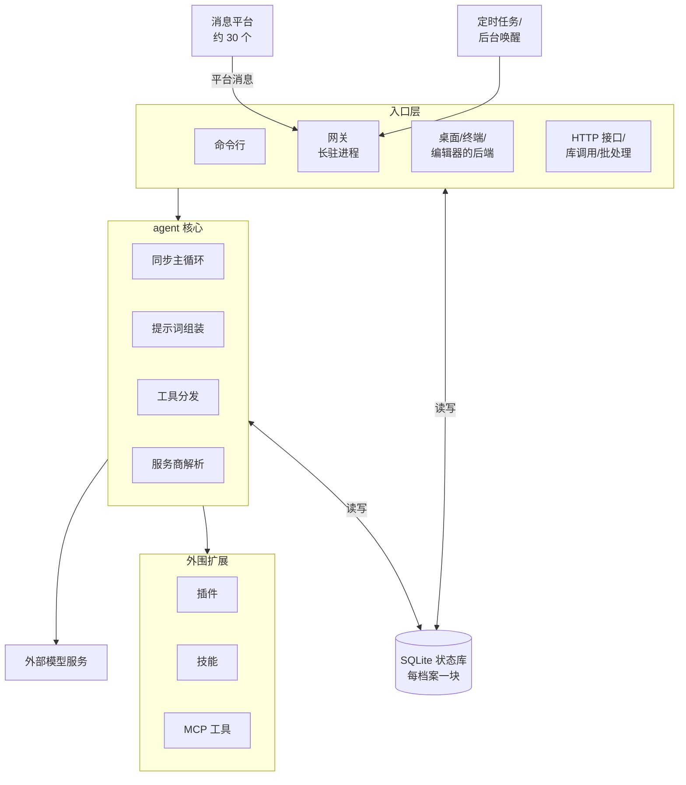

# Hermes 总体架构与设计思想

全系列第一篇，给后面所有篇章打底：hermes 整体怎么拆、组件怎么摆、哪些设计思想贯穿全局。
后面每篇深入一个子系统（主循环、工具、上下文、记忆……），那些篇的首问只给该模块的全局；
全系统的全局，在这一篇。

## 重点地图

按面试出现频率分层，时间紧就先看三星：

- ⭐⭐⭐ **必考，要能脱口而出**：Q1 架构全景、Q2 一份核心跑遍所有形态、Q5 新能力怎么加
- ⭐⭐ **高频，要会讲**：Q3 为什么状态中心是 SQLite、Q4 多账号隔离
- ⭐ **了解思路即可**：Q6 大代码库怎么组织、Q7 收尾开放题

## Q1：Hermes 这套系统是干什么的？整体架构和核心流程是什么？ ⭐⭐⭐

> **一句话：** 三层一库——入口层把各种形态的输入都变成同一次 agent 调用；agent 核心是平台无关的同步循环，被每个入口在自己的进程里实例化；每个配置档案 (profile) 一块 SQLite 状态库，是所有进程共用的主状态库；新能力不进核心，靠插件 (plugin)、技能、MCP 工具挂在核心外面。

**主答：**

先定位：hermes 是一个**闭环**的个人 agent——模型能连续调工具、看结果、修正行为，直到给出答案，而不是调一次模型说一段话就完，这是它和直调模型接口的本质区别。两条卖点：一份核心跑遍所有形态（命令行到三十来个聊天平台）；技能 (skill) 和记忆让它跨会话越用越强（各有专篇）。整体架构是三层一库，看图：

一、**入口层**，一批各自独立的进程。命令行是一个进程，桌面、终端界面、编辑器各有自己的后端进程，最重的是**网关**——一个长驻进程，约 30 个消息平台的适配器 (adapter) 都住在里面；平台消息、到点的定时任务、后台命令跑完的通知全汇到网关，没人发消息它也能自己触发一轮。程序化的调用（HTTP 接口、当成库直接调、批处理跑数据集）是另外几个入口。

二、**agent 核心**（一层）。一个类：纯同步的「调一次模型、执行工具、把结果贴回去、再调下一次」循环，配上提示词组装、工具分发、模型服务商解析这些配套（《Agent 主循环与编排》篇展开）。所有入口都不自己实现 agent，而是在各自进程里实例化这同一个类。

三、**状态库**（那一库）。每个配置档案一块 SQLite 库：会话历史、系统提示词、用量记账全在里面；命令行、网关、定时器，哪个进程来了读写的都是这一份。

四、**外围扩展**（又一层）。接模型服务商的插件有 38 家、记忆服务 7 家；技能是可安装的能力包；外部 MCP 服务器的工具按需挂载——模型服务商是外部服务，接谁、怎么接由插件决定。核心保持极小，为什么这么克制是 Q5 的主线。

顺着图走一遍：一条输入从入口层进来，入口在自己的进程里实例化核心、跑一轮——核心组装提示词、带上工具清单去调模型服务商，模型要用的工具在本地执行、结果贴回历史、再调下一次，直到给出回答；全程读写状态库；记忆、外部工具这些能力从外围按需挂上来。

### 追问：「个人 agent」的架构，和服务端 agent 平台差在哪？

单机单用户这个前提贯穿一切。状态全在本地一块库里，不拆库不分区；没有消息队列、缓存服务、容器编排这些多机设施——只有一个用户，加一个组件就多一份运维和故障面，换不来收益。代价是扩展有上限：一台机器、一个用户，往多租户平台化走要重做很多层（Q7 展开）。

### 追问：和 Claude Code 这类现成的 agent 工具比，为什么自己造一套？

定位不同。那些工具以一次终端会话为中心、交互式地用；hermes 的核心诉求是**常驻**——挂在聊天平台上一直在线、到点自己干活、跨会话积累记忆和技能。要撑这种形态，底座就得是「一个可嵌入的核心 + 承载多入口的网关」，而不是一个以终端为中心的工具。取舍：放弃开箱即用，换来全部控制权（不用框架的原因见 Q2）。

> **「可嵌入」的意思：** agent 核心不是一个自己独立运行的服务进程，而是一段现成的程序组件——谁要跑 agent，就把这个组件装进自己的进程里实例化一个。命令行、网关、桌面后端全都是这么用的，Q2 整问就在讲这件事。

### 追问：一条平台消息从进来到回答送出，完整路径是什么？

以 Telegram 为例：

1. 适配器把平台事件转成统一的消息事件；
2. 网关鉴权：发消息的人在不在允许名单、是不是配过对的私聊；
3. 算会话键：给这条消息找到它属于哪条会话——平台上的一个对话（私聊或群）对应一条；群聊默认按人各开一条，bot（hermes 在平台上注册的机器人账号，比如你在 Telegram 建的那个 bot）跟每个群成员的上下文互相独立；多档案部署时键里还带档案名；
4. 取 agent：缓存里有这个会话的实例就复用，没有就带着历史新建一个；
5. 在网关进程里开一个线程跑完一整轮（中间可能多次调模型、执行工具），期间要审批、要澄清也经适配器发回平台；
6. 最终回答经适配器送回。消息、轮次和会话状态都落在状态库里。

### 追问：命令行和网关两种跑法，入口层各自多做点什么？

生命周期和展示。网关要管掉线重连、进程崩了恢复，命令行不用——坐在终端前的就是本人；展示上，流式输出、进度、审批提示各按自己的形态呈现，平台是发消息，命令行是刷终端。鉴权和会话路由上一问刚走过。

## Q2：一份 agent 核心，怎么做到跑遍命令行、三十个平台、桌面、编辑器？ ⭐⭐⭐

> **一句话：** 依赖方向单向——入口依赖核心，核心不实现任何平台的差异逻辑；交互差异通过回调接口注入；网关进程里一轮一线程，agent 实例按会话缓存。

**主答：**

关键在依赖方向：所有入口引用的都是同一个核心类，核心不为任何平台单独写一套执行逻辑。「跑遍所有形态」不是核心去适配平台，而是每个入口把核心拿进自己的进程用：

一、命令行进程里实例化它，一轮回答一条输入；
二、网关进程里，每条消息在专属线程里跑完整轮——不同会话并发，同一会话排队；定时任务到点、后台命令跑完，也是网关里的调度线程新建一个 agent（不接对话历史，任务可以自带技能）跑任务的提示词；
三、桌面、编辑器各通过自己的后端进程调同一个类。

交互差异（提问、报进度、要审批）不写死在核心里，走回调接口，由入口注入实现。

### 追问：核心真的完全不知道平台吗？

知道得很少，但不是零。构造时核心拿到一个平台标签，最实在的用处是提示词里那张按平台写的说明表——告诉模型「你在哪个平台、输出用什么格式、图片怎么发」，因为模型得按各平台的规矩说话；执行路径本身不按平台分叉，交互全走回调。另外核心里有约二十个文件反过来引用入口层的模块（拿会话上下文这类共用件），是方向上的例外尾巴——整体仍是入口依赖核心。

### 追问：为什么不把核心做成一个常驻服务，所有入口都来调它？

常驻服务解决的是「调用方在远处」的场景：调用这个能力的程序跑在别的机器上、用别的语言写、归别的团队管——公司里好几个产品共用一个 agent 服务就是这种。隔着网络，共享一份实例、统一升级扩容，就是把它做成服务的全部价值。

hermes 的调用方全在「近处」：所有入口是同一台机器上、同一份代码拉起的进程，调核心就是进程内的普通调用，中间没有网络边界。而且 hermes 里真正需要跨进程共享的不是核心这段代码，是状态——会话历史、系统提示词、会话锁——这些本来就在 SQLite 库里共享着；核心实例很薄，丢了随时重建，每个进程各带一份几乎不花钱。

剩下的只有一个真需求：同一个会话别每条消息都重复初始化（提示词、工具清单是按会话拼好的）——这块由网关的会话级缓存补上，空闲太久回收、回收前先把记忆落库。到这里，服务化能给的 hermes 都已经有了——没必要服务化。

### 追问：五十条消息同时进来会怎样？

分两种。五十个不同对话来的：各开各的线程并发跑，互不影响——每个线程大部分时间在等模型响应，等的间隙不占计算资源。同一个对话里连发五条：同一个网关进程里，后四条先进这个对话的待处理队列，第一条跑完再轮到它们；如果是**另一个进程**在用这个会话（比如命令行和网关同时跑一条会话），才轮到库里那把跨进程锁——排队等锁的重试和超时参数在《Agent 主循环与编排》篇。真正先到顶的是模型服务商的限流，不是网关。

### 追问：网关为什么是独立长驻进程？桌面和它什么关系？

从各入口的后端怎么管理来看就清楚了。桌面、终端这类入口有显式的启动和关闭——打开 app，后端跟着起；关掉 app，后端跟着退，生命周期挂在界面上正合适。聊天平台这类入口没有这种时机：消息什么时候来不可预知，半夜也可能来，没有哪个界面替它守着——网关要是非常驻，消息来了没人接。所以网关必须一直活着；到点的定时任务、跑完要报告的后台命令，也都指望这个常驻进程。

桌面和网关的关系也就清楚了：桌面 app 的后端跟着 app 起、跟着 app 退；网关是独立的一条线，不随桌面退出。终端界面同理，走自己的后端。

### 追问：agent 都是等用户发消息才动吗？

不是，有两类自主触发：定时任务到点自己跑（《规划与任务管理》篇展开）；还有后台命令——模型发起终端工具调用、在参数里要求「后台跑、跑完通知」，agent 核心照此把命令放到后台执行，网关盯着它；命令跑完，自动让该会话再跑一轮，把结果作为新输入带给模型。这也是 Q1 的图里定时任务和后台唤醒单独画成网关输入的原因。

### 追问：为什么不基于 LangChain、LangGraph 这类框架搭？

框架的好处是起步快：循环、重试、现成组件声明式拼一下就能跑，生态里要什么都有。

但对 hermes 这笔账算下来弊大于利，主因：**编排本来就自己写了**，而且写得更细——压缩、中断、恢复都是一手代码；再套框架，等于在自己写的循环外面再套一层别人的循环，白付一层抽象的成本。

配套两个理由：

1. **控制权**。框架的执行器 (executor) 是「框架的代码跑你的配置」，出了怪行为要读框架源码定位、修复等上游发版；自己的代码改了当场生效。
2. **同步模型**。那套生态建在异步上，而个人 agent 每圈等的是几秒到几十秒的模型调用，异步的吞吐优势用不上。

更细的展开在《Agent 主循环与编排》篇。

### 追问：要接一个新平台、或换一个模型服务商，动哪里？

接一个新的消息平台，写一个入口层的适配器就够了——三十来个平台就是这么一个个接上的。模型：装对应的服务商插件，38 家都是插件。两条路都没碰核心——核心刻意保持小、新能力一律往外挂，为什么这么设计 Q5 专门讲。

## Q3：状态为什么放在一块 SQLite 库里？并发怎么办？ ⭐⭐

> **一句话：** 单机单用户用不着网络中间件：WAL 让读写不打架，所有进程并发用一块本地库够了；提示词缓存本来就要求只有一份权威存储；个人场景的写入量离 SQLite 的上限远得很。

**主答：**

先看谁在并发：命令行、网关、定时器、桌面后端，任何时刻可能有几个进程同时读写同一个档案的状态。选 SQLite 的理由有三层：

1. **场景不需要网络中间件**。Redis、服务化数据库这类外部组件解决的是多机、多服务的问题，个人 agent 单机单用户，没有多机——加进来只有运维成本，没有收益。
2. **并发够用**。SQLite 开 WAL（write-ahead logging，写前日志）模式：写先落到旁路文件、择机合并进主库，读不挡写、写不挡读。写入本身仍然一次只能有一个，撞多了要排队，但个人场景的写入量到不了那里——什么时候会到，Q7 算账。
3. **架构上反而需要一份唯一的权威存储**。提示词缓存 (prompt cache) 不可破坏（Q5），要求系统提示词和会话历史在会话内只有一份、字节不能变——一块库天然满足。

这块库承担的角色：会话历史、冻结的系统提示词、跨进程的会话锁、用量记账、全文检索的索引。

### 追问：不同入口并发写同一个会话怎么防？

锁存在库里，不在进程里：想跑一轮，先往库里占一条锁记录——判断没人占用和写入自己是同一步原子操作，两个进程同时来只有一个占得住。因为锁在库里，不管哪个进程来——网关、命令行、定时器——抢的都是同一把锁；锁带过期时间，持锁的进程崩了自动释放，会话不会卡死。排队等待的具体语义在《Agent 主循环与编排》篇。

### 追问：历史消息的全文检索怎么做？

SQLite 自带的全文检索扩展 FTS5，配一个自研的中文分词扩展——中文不按空格分词，原生 FTS5 切不了。这块在《记忆系统》篇展开。

## Q4：一个人有多个账号、多个身份，怎么隔离？ ⭐⭐

> **一句话：** 隔离单位是配置档案：一套家目录加两条作用域边界（能用哪些密钥、能在哪执行命令）；现在默认一个网关进程服务本机所有档案，隔离靠作用域绑定而不是进程边界——每条消息先判身份，之后的每次读写都得绑在正确的档案下。

**主答：**

隔离单位是配置档案：一个档案 = 一套独立的家目录 (home)——配置、密钥、记忆、会话、日志全在里面，加上两条看不见的边界：这套档案能用到哪些密钥（密钥域）、能在哪个终端环境里执行命令（终端执行域）。典型用法：工作号一个档案、生活号一个档案——在平台上就是两个 bot，一个 bot 拿一份平台凭证，记忆互相看不见。

部署形态现在默认是**一个网关进程服务本机所有档案**（多路复用 (multiplex) 是默认形态，一档案一网关只剩一个临时兼容开关）。所以隔离不是靠进程边界，而是靠作用域：每条进来的消息先判身份——哪个 bot 收的、在哪个档案里跑、由哪个 bot 送答案——之后配置、密钥、记忆的每次读写都得绑在正确的档案下。绑错不报错，这是最危险的地方，放追问讲。

### 追问：多个用户同时发消息，怎么保证不串档案？

进程里有些东西只有一份（最典型的是环境变量，存的是启动档案的值），不能各线程直接拿来用。解法是每个轮次线程开跑前，按这条消息路由出的身份把所属档案的作用域装上，线程里的配置、密钥、记忆都从这个作用域读，而不是直接用进程级的那份。

轮次线程里这层是开跑前自动装上的；但轮次之外的路径——回调、回收、定时检查——不在轮次线程里，作用域不会自己跟过去，得显式再装。漏装的地方（或哪段代码绕过读取函数、直接读了进程级的环境变量），拿到的就是启动档案的值：把 A 档案的记忆写进 B 档案的库，而且不报错。所以 hermes 把「每次读写都绑在正确的档案作用域下」定为硬规则：不只轮次里，回调、回收、定时检查也都要绑。维护者给协作 AI 的规则文件里，防这类泄漏的规则占了整整一节——这份复杂度是真实存在的，Q7 回来算账。

### 追问：为什么隔离做成目录级的孤岛，不做配置继承？

有人提过「子档案继承默认档案配置」的改动，被维护者关掉了：档案之间一同步，就等于把 A 的配置漏给 B——这正是这个设计要防的。想要「从我的默认配置开始」，有克隆命令：复制一份当时的状态，之后各自演化，不留活链接。

### 追问：各档案的定时任务归谁跑？

本机网关进程统一跑：它把机器上所有档案的任务文件都轮询一遍，跟开没开多路复用无关。这个选择有来由——当年任务调度只跟着多路复用开关走，没开开关的部署里，其余档案的任务躺在任务文件里永远没人碰，真出过这个漏，后来才改成「本机网关全管」。

## Q5：要加一个新能力，这套架构怎么接？ ⭐⭐⭐

> **一句话：** 新能力不进核心，往外围挂——插件、技能、MCP 都可以，加新核心工具是最后的手段；挂上的东西要变更，默认等下个会话生效。

**主答：**

直接说答案：**不进核心，往外围挂**——插件、技能、MCP 服务器都行，往核心里加新工具永远是最后的手段。挂的位置按由轻到重的阶梯选，从改现有代码、加条命令加个技能，到独立插件、发布 MCP 服务器（完整阶梯怎么选、为什么不进核心，都放追问）。

挂上之后要变更——装新技能、换工具、更新记忆——默认都等下个会话才生效：提示词缓存按字节匹配，系统提示词动一个字，整个会话的缓存作废，所以变更攒到下个会话一起进（代价的两笔账在《Agent 主循环与编排》篇算过）。

> **会话内可以改写的例外就三条：** 上下文压缩（历史侧唯一被允许的改写，不压就超上下文上限）；用户主动选「立即生效」；Bot Mode 下和 bot 的那条常驻对话（桌面、终端界面里能一挂几个月的会话）——工具配置一变，下一轮直接重建提示词，它等不起下个会话。压缩是超限被迫，后两条是主动选择；共同点是明面上付一次缓存破坏，不是悄悄发生的。

### 追问：为什么新增能力一般不进 agent 核心？

agent 核心是所有入口共用的代码。进到它里面的每样东西，所有装 hermes 的人、所有会话都无条件跟着付成本、担风险，坏一处影响全体；挂在外围则谁装谁付、坏了只影响装它的人。最贵的一类是工具——工具清单（名字、参数说明）随每次请求发给模型，核心里加一个工具，每次调用都付这份 token 和注意力。所以 agent 核心只收几乎人人、高频要用的东西，其余一律往外围挂。

### 追问：为什么工具清单必须随每个请求发，不能发一次让模型记住？

模型是无状态的：每次生成都是重新看整个上下文，不存在「上次告诉过它」。工具说明就是上下文的一部分，这次不发，这次就等于不会——各家模型接口也都是这么设计的。一个省钱的补充是**渐进式披露** (progressive disclosure)：少数冷门、事件触发的工具默认不随请求发完整说明书，能塞得下时进目录，给名字和一句简介；目录太大就逐档收缩，最后一档只报每组有几个工具——始终都在的是检索的入口，具体名字不保证看得见。

### 追问：给你一个新需求，你会怎么判断加在哪一级？

六级阶梯，从最轻到最重：

1. 扩现有的代码（不新增任何要发给模型的东西）；
2. 加一条命令行子命令 + 技能；
3. 服务门控工具（配置了对应服务才出现）；
4. 独立插件；
5. 发布成 hermes 官方 MCP 目录里的服务器；
6. 新 agent 核心工具（垫底）。

拿四个例子对号：**「让 bot 每天早上报天气」**是第 2 级——定时只是触发方式，不算阶梯里的一级，能力本身用命令加技能就够；**「控制家里的智能灯」**是第 3 级——配置了 Home Assistant 才出现的工具，没配置的用户不为它付一个 token；**「接公司内部的工单系统」**是第 4 级——独立插件仓库，不进主代码树；**「让 agent 能浏览网页」**才够得上第 6 级——几乎人人要、高频用，且没有能替代的通道（终端和文件都够不着）。第 1、5 级没出现在例子里：第 1 级是改现有代码的默认动作，第 5 级只有要把能力发布成 MCP 服务器给别人用时才走。判断标准一句话：越往下越要「几乎所有人都高频需要、且绕不过去」。

### 追问：插件是怎么挂上来的？

插件从三个地方找：用户主目录下的插件文件夹、项目目录里的插件文件夹（要显式开启）、pip 装的包。启动时扫描装载，插件拿到一个受控的注册接口，把自己的工具、钩子、命令登记进系统——不许碰 agent 核心文件。要深度接入的（记忆、上下文引擎）走专门定义好的扩展接口，同一类只让一个插件生效。

### 追问：MCP 为什么被排在那么轻的位置？

MCP 工具是运行时按需挂载的：用户不配置就完全不存在，配置了才进那个用户的会话，不占核心那份固定清单的位置，符合这条约束。hermes 两头都用 MCP：一头当客户端，连外部服务器把工具拿进来；另一头自己也能作为 MCP 服务器跑起来，让别的 agent 把「操作 hermes」当工具调——列出会话、读历史、发消息、处理审批都行，等于别的 agent 也能驱动你的 hermes。《MCP》篇展开。

## Q6：这么大一个自研代码库，怎么保持可维护？ ⭐

**主答：**

三件事：

一、**拆分纪律**。曾经的巨型文件被拆成「门面 + 一组按主题的小文件」，并定了阈值：文件约两千行、函数约三百行，到了就按主题拆。现在状态库门面带三十个主题文件、主循环带三十多个阶段文件。找代码按主题搜小文件，不读门面。

二、**树内自述**。每个子系统有一份维护者写的架构说明（目标控制在八千字符左右）加一张总表指路——动哪块先读哪份。这些文件同时写给人和写给协作的 AI，等于把架构知识当代码一样维护在仓库里。

三、**测试纪律**。测试断言行为契约（断言输入和输出之间该是什么关系），禁止快照式断言（把当前值冻结成期望）；涉及配置传递、安全边界的改动必须走真实路径端到端——不 mock 模块导入、在隔离的临时环境里跑，动到多档案作用域的还要双档案来回切换实测。另有近 70 项离线评测守着关键行为。

## Q7：你觉得这套架构有哪些地方可以优化的？ ⭐

**主答：**

最重要的一点：**把「跑轮次」从网关进程里拆出去**。

目前的问题：网关一个进程装了两类活——三十来个平台的适配器管收发消息，所有会话的轮次也在里面跑。挤在一起，故障半径就是整个网关：一个适配器出毛病、一个会话的轮次跑飞，进程级的污染全员中招；多路复用那一长串防作用域泄漏的规则（Q4 说这份复杂度真实存在），就是所有活同住一个进程的账单。

方案：网关只留收消息、把消息归到对应会话、把回答送回平台；所有轮次——平台消息来的、定时任务到点的、后台命令收尾的——都挪去专门跑轮次的进程。网关算好会话归属再把消息转交过去，轮次在那边跑完把回答交回来，中途要审批、要澄清的往来也走这条通道。状态不用搬：会话历史、跨进程的锁本来就在状态库里，哪个进程来读写都是同一份；真正要新建的是这条进程间的通道，外加想清楚会话级缓存归谁管。

为什么更好：适配器故障和轮次故障隔开了——适配器出毛病连累的是消息收发，会话跑飞出事也是在轮次那边的进程，单个会话大概率带不翻网关；网关活着，就还能收消息、还能报告哪条会话出了问题。代价也要认：进程内递消息是零成本的，拆开就多一条会堵、会断的通道要养，会话级缓存也要重新归属。所以不会现在就动：单用户前提下，现在的简单是值钱的；等适配器或轮次的故障真把网关反复拖垮，再按这个方案拆——先确认真有故障压过来，不为架构审美动手。至于同步模型封死横向扩展、SQLite 写入单点这两条，单机单用户碰不到上限；真往多用户平台走，要重做的是一整批，不是这一处的事。
