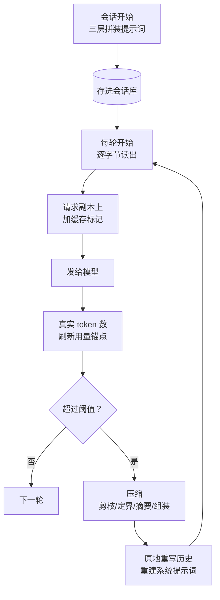

# 上下文工程

hermes 的上下文子系统：系统提示词怎么组装、怎么靠提示词缓存便宜地反复发、装不下时怎么压缩。
本篇的主线对象是**发给模型的那份请求上下文**（系统提示词＋对话历史）。请求里第三块——工具清单——的冻结与滚动归
《Agent 主循环与编排》篇 Q2；跨会话的记忆怎么存取归《记忆系统》篇，本篇只讲记忆快照怎么嵌进提示词。

## 重点地图

按面试出现频率分层，时间紧就先看三星：

- ⭐⭐⭐ **必考，要能脱口而出**：Q1 全景、Q2 提示词组装、Q3 缓存、Q4 压缩触发与 token 计量、Q5 压缩算法
- ⭐⭐ **高频，要会讲**：Q6 压缩的失败处理、Q7 可插拔上下文引擎
- ⭐ **了解思路即可**：Q8 微压缩、Q9 开放题

## Q1：上下文工程是干什么的？核心机制主要流程是什么？ ⭐⭐⭐

> **一句话：** 管一份请求的三件事——上下文装什么（组装）、怎么便宜地反复发（缓存）、装不下怎么办（压缩）；贯穿全局的约束是已发送的内容字节稳定，唯一例外是压缩。

**主答：**

模型是无状态的，每次调用都要把整个上下文重新发一遍：工具清单、系统提示词、完整对话历史。上下文工程就是管这份请求的三个问题——装什么、怎么便宜地反复发、装不下怎么办。

hermes 的答案看图：会话开始时，系统提示词按「稳定→易变」三层拼一次、存进会话库，之后每轮逐字节读出来用；发请求时在请求副本上做缓存标记，让前缀命中的部分按一折计费；每轮拿模型返回的真实 token 数更新用量锚点，超过阈值（默认一半窗口）就压缩——中段摘要掉、头尾保住，然后重建提示词。

一条全局约束贯穿三件事：会话中途不改已发送的内容——改一个字节，缓存前缀就从那里开始全部作废。压缩是唯一例外的改写点，所以它也承担了另一个副作用：提示词只在压缩后重建一次（顺带把本会话新写的记忆折进来）。

### 追问：这里的「上下文」和「记忆」是什么关系？

上下文是**当前这份请求里模型看得见的全部**，会话结束就没了；记忆是**跨会话的库**。记忆是上下文的原料：会话开始时，记忆快照作为一层嵌进系统提示词。反过来，会话中途写的新记忆不进当前提示词（字节不能动），要等压缩重建或下个会话才生效——存取机制的完整展开在《记忆系统》篇。

## Q2：系统提示词是怎么组装的？ ⭐⭐⭐

> **一句话：** 三层拼装——稳定层（身份、行为指引）→ 上下文层（项目上下文、工作区快照）→ 易变层（技能索引、记忆、时间、环境），越容易变的越靠后；每会话拼一次存库，之后字节不动。

**主答：**

会话开始时拼一次，三层按「变化频率从低到高」排：

1. **稳定层**：身份（用户自定义的 SOUL.md，没有就用内置默认）、工具相关的行为指引、编码操作纲要。这些换会话都未必变；
2. **上下文层**：项目上下文文件（AGENTS.md 这类）、git 工作区快照、平台提示（「你在终端上，别用 Markdown」这类）；
3. **易变层**：技能索引、记忆快照、时间戳、运行环境（主机、当前目录）——这些每次重建都可能变。

排序的目的是缓存：提示词缓存按最长前缀匹配，前缀里的字节越稳、越长，能复用的部分就越大。拼完存进会话库，之后每轮读同一份字节——为什么必须存库读库、不能重新生成，展开在《Agent 主循环与编排》篇 Q2。

### 追问：上下文层里，为什么工作区快照排在项目上下文文件后面？

因为 git 快照依赖当前 worktree，项目上下文文件只依赖仓库。同一个项目开多个 worktree 的会话，两份提示词在「项目上下文文件」这段是逐字节相同的——前缀匹配到这里才断。要是快照排前面，每份提示词从快照起就分叉，这段共享前缀就没了。

### 追问：项目上下文文件是怎么发现的？

按优先级找，**第一个有内容的类型胜出**，后面的不再看：

1. `.hermes.md` / `HERMES.md`——从当前目录往上走到 git 根，找到最近的一份；
2. `AGENTS.md`——沿着「git 根 → 当前目录」的每一级目录收集，各级合并注入（每级里 override 文件优先于正式文件）；子代理这类跳过上下文文件的会话不加载；
3. `CLAUDE.md`——只看当前目录（兼容 Claude Code）；
4. `.cursorrules`——只看当前目录（兼容 Cursor）。

一个值得讲的细节：官方文档说 AGENTS.md 只看当前目录，代码实际已经演进成目录链合并——子目录里的规则和仓库根的规则会一起进提示词。这是文档滞后的例子，也说明这块还在活跃改动。

### 追问：这些文件直接进提示词，不怕提示词注入吗？

进场前过一遍威胁模式扫描（看不见的 Unicode 字符、「无视之前的指令」这类模式）：

- **项目目录里的文件**命中模式：整块替换成「已阻断」的占位说明——它随仓库一起来，不可信；
- **用户自己主目录下的 SOUL.md** 命中：警告一声、照常加载——它和配置文件同一个信任级别（用户自己写的身份文档里出现「ignore previous instructions」这个词本身不奇怪），因为扫描把它整个扔掉，用户会莫名其妙丢了身份。

### 追问：文件太长怎么办？

头尾截断：保留前七成、后两成，中间换成省略标记，标记里告诉模型「要完整内容就用读文件工具去读原文件」。上限默认两万字符，随模型的上下文窗口放宽（大窗口给更大额度，五十万字符封顶），配置里显式指定则一律优先。

### 追问：哪些内容天然会变，怎么钉住？

这是个「为字节稳定把能钉的都钉住」的清单：

- **git 工作区快照**：会话第一次探测后把字节钉在会话上，压缩重建时直接重放旧字节，不重新探测——仓库中途动了也不影响当前会话；
- **时间戳**：只写到「天」，一天内字节不变；「会话开始时间」从会话链根上的 id 里嵌的时间戳取，跨多次压缩也稳定。跨天的会话在重建时补一行「今天是几号」——重建点缓存反正已经失效，这行不额外付缓存代价；
- **插件注入的段落**：渲染一次冻结；恢复会话时从存下来的提示词字节里解析回来，不重跑插件代码；
- **平台切换**（桌面↔终端）：不重建提示词——平台不是提示词的身份字段，当前平台的提示走一条一次性的用户消息。这样换了界面，缓存前缀还活着。

## Q3：提示词缓存具体是怎么做的？ ⭐⭐⭐

> **一句话：** OpenAI / Gemini 系什么都不用做（隐式缓存全自动，字节相同自动打折）；Anthropic 系要管断点——hermes 把四个断点预算花在「系统提示词两处＋最后两条消息」上，标记只加在请求副本。

**主答：**

业界分两种世界。**OpenAI 和 Gemini 是隐式缓存**：什么都不用配，请求前缀够长（OpenAI 是 1024 token 起）且和上次相同时，自动按折扣计费（OpenAI 一折、Gemini 一折这个量级）。**Anthropic 是显式缓存**：必须在内容块上标缓存断点 (cache_control)，一个请求最多四个，不标就没有缓存；写入要加价（5 分钟档 1.25 倍基础价、1 小时档 2 倍），命中按一折读。

hermes 对 Anthropic 系（原生接口或经 OpenRouter 转发）摆四个断点：系统提示词的**静态前缀**（就是 Q2 的稳定层）一个、**系统提示词末尾**一个、**最后两条**能带标记的消息各一个。前两个把系统提示词整个锁进缓存；后两个是滚动窗口——最新的对话尾巴尽快变成可复用前缀。所有标记只加在发出去的请求副本上，存库的消息还是纯文本；重复加标记是幂等的（先剥旧的再放新的）。

### 追问：消息上的断点为什么选「最后两条」，怎么选的？

选的是**完成的轮次边界**：一条模型回复连同它的工具结果齐了，才算一个可缓存的完整事务。切在工具组中间（调用和结果分家）既不合法也浪费。断点给最后两条而不是更多，是因为总共只有四个预算，系统提示词已经花掉两个——剩下的给最可能马上被下一轮复用的对话尾巴。

### 追问：TTL 怎么选？

分 5 分钟和 1 小时两档（也可配 auto）。经济账：1 小时档写入是 2 倍基础价、5 分钟档 1.25 倍，只有轮次间隔超过五分钟才回本。所以 auto 按会话来源分：人坐在前面打的会话（命令行、桌面、消息平台）用 1 小时——人会离开几分钟再回来；机器节奏的会话（子代理、定时任务、webhook）用 5 分钟——它们几秒一轮连着跑完，永远收不回 1 小时档的写入加价。维护者实测过：交互式会话里六成以上的缓存写入是空闲五到六十分钟后的冷重写，1 小时档在这种场景省下的钱最多。

### 追问：哪些操作会白白破坏缓存？

缓存键包含模型和账号，所以除了改内容，还有这些：

- **中途换模型或换 API key**（用户手动切、降级、key 池轮换）：下次请求零命中，整个对话全价重读——这是 provider 侧的机制，agent 避免不了，只能少做；
- **改历史中间**：插话、修正都只追加在末尾，不打进历史中间；
- **换系统提示词或工具清单**：所以技能、工具集的变更默认推迟到下个会话生效（例外通道是《Agent 主循环与编排》篇 Q2 讲过的 Bot Mode 能力指纹）。

### 追问：业界主流做法是什么？hermes 为什么不一样？

三家服务商的答案不同，agent 要做的事也不同。OpenAI：全自动隐式，≥1024 token 的前缀自动缓存，读取一折（新模型最低到半折），TTL 只能选档不能选时长。Anthropic：显式断点为主（也新出了单字段自动模式），四个上限、两档 TTL、写入加价。Gemini：隐式之外还有**显式缓存对象**——把一段内容建成一个缓存资源、按小时另收存储费，适合「一份大系统提示词服务海量请求」的场景。

hermes 的差异：**不自建缓存层，全部用 provider 原生能力**；自己的活只有两件——把字节稳定管住（这对隐式缓存同样生死攸关，OpenAI 的自动缓存同样要求前缀逐字节相同），以及在 Anthropic 系上把断点预算花对位置。服务化一个本地缓存（自己做 KV 存储）理论上能跨 provider 复用，但省的是 provider 已经打折的部分，还要自己扛存储和失效——不划算，所以没人这么做。

## Q4：上下文什么时候压缩？怎么知道现在多大？ ⭐⭐⭐

> **一句话：** 两层触发——agent 循环里的主压缩器（默认 50% 窗口，真实 token 计量）加网关安全网（85%，进 agent 前兜底）；token 数靠用量锚点：provider 上报的真实数＋此后追加消息的估算增量。

**主答：**

主压缩器跑在 agent 循环里，在历史会变长的每个时机检查：轮次开始、发请求前、工具结果贴回后，外加一个可选的「空闲恢复时先压一把」。默认阈值是窗口的 50%，可配、可按模型覆盖；小窗口模型（不到 512K）有 75% 的下限——小窗口本来就没多少余量，压太早反而把正常会话压着玩。

网关在把消息交给 agent 之前还有一道 85% 安全网，接住从主压缩器手里漏掉的会话——典型是消息平台上过夜堆积的会话，上一轮结束时还好好的，第二天消息进来时已经超了。阈值故意比 agent 高：要是也设 50%，同一个会话会被两边抢着压。

「现在多大」靠**用量锚点**：模型每次响应都带真实 token 数（这次请求实际算了多少），锚点把它记下来，之后只对「这一刻之后新追加的消息」做粗略估算加回去。锚点按内容指纹绑在那段已计费的历史上、持久化在会话行里——网关每轮从库里重读历史、进程随时会重启，内存里的计数靠不住，锚点能对上指纹才生效。

### 追问：为什么要搞这么绕，直接估算不行吗？

估算偏差大（普遍偏高三四成），三个消费方对精度的要求不同：压缩触发宁可早不可晚（偏高只是提前压，安全）；账单和展示要准；溢出恢复要「确认真的超了」。锚点把真实数留在基准点上、只估算增量，增量小估错也有限。另一个方向的问题同样存在：无锚点时（首次请求、倒回重发）整段粗估超了阈值，hermes 会**等一次真实证据**再动手——估算数字大不代表请求一定会失败，白压一把的代价（一次摘要调用＋缓存报废）不比等一下小。

### 追问：估算和现实冲突了怎么办？

两边的失败方向都有兜底：粗估偏高只会在网关安全网提前触发——安全方向的错。反过来，请求真发出去被 provider 以「上下文超限」拒了（413），恢复逻辑会**无视冷却立即压一次**——provider 已经证明装不下，这时候再等冷却就是让会话每轮都撞一次墙。

### 追问：图片怎么算 token？

按**从 provider 的用量里学到的单图成本**计价：某次响应比上次多进了 N 张图，真实 token 数和纯文本投影的差额除以 N，就是这个模型一张图的价钱，按模型＋服务商存下来。第一张图进上下文之前没有数据，用 1500 的默认值。触发器、尾部预算、网关安全网用同一个数字，不会各算各的。

## Q5：压缩算法本身是怎么做的？ ⭐⭐⭐

> **一句话：** 四阶段——先免费剪掉旧工具结果、再定头尾边界（不拆工具组）、中段发给辅助模型生成结构化摘要、最后组装并清理悬空的工具对；重复压缩时更新旧摘要而不是从头重写。

**主答：**

1. **剪旧工具结果**：保护区之外、超过 200 字符的旧工具结果整块换成一行占位符。不调模型、零成本，工具输出（读文件、命令回显）是上下文的大头，这一步往往就省出大量空间；
2. **定边界**：头部保住（系统提示词＋第一轮交流），尾部按 token 预算从最后往前圈，并且保证最后几条**真实用户消息**逐字留在尾部（条数可配，这条保证优先于预算）。边界对齐到工具组——模型的调用和它的结果要么都在压缩区、要么都在尾部，不拆开；
3. **生成摘要**：中段整体发给辅助压缩模型（和主模型分开配，可以用便宜模型），产出一份结构化摘要；有上一次的旧摘要就**更新**它而不是从头重写。摘要预算随内容量缩放：约两成，下限两千、上限一万 token；
4. **组装**：头＋摘要＋尾拼回去，清掉悬空的工具对（调用被摘要掉了的补占位结果），**在同一个会话 id 上原地重写**——被压掉的轮次软归档，还能搜到、能恢复。

### 追问：摘要为什么要用结构化模板？

模板字段是给「恢复之后」设计的，不是给摘要模型看的：目标、约束、进展（完成/进行中/阻塞）、关键决定、相关文件、下一步、关键值。两个字段值得单独讲：

- **未竟任务**单列且标成最重要的字段——用户最近一个没被满足的输入（待办、待答的问题、等确认的选项）。压缩最容易出的事故就是模型忘了自己欠着什么，恢复后对着摘要问「所以用户要什么来着」；
- **安全约束必须逐字引用、禁止改写**——用户说过「不许动那个文件」「凭据不许落盘」，转述成大意就可能丢掉约束的力度。改写丢细节对一般内容可接受，对约束不可接受。

模板之外还有三道确定性后处理：摘要里出现密钥一律打码替换；模型复述的思考块剥掉（否则每次迭代更新都会滚雪球）；被剪掉的技能内容打上「内容已在压缩中丢失，用技能查看工具重载」的标记——不标的话模型还以为技能在上下文里，照着不存在的指令干活。

### 追问：压缩会丢什么？丢了怎么找回？

当前默认是**精简尾部 (lean tail) 模式**：尾部只保窗口的 2.5%（一到两万五千 token 封顶），连续性折进摘要里一起带走——被压区间**每条真实用户消息逐字引用**、一个机械抽取的锚点索引（PR 号、提交号、文件路径、报错原文——正则抽的原文，不是模型的转述）、外加一句「用会话检索工具可以找回被摘要的内容」。旧模式（保留约两成窗口的逐字尾部）在 50 万 token 的真实会话上要留 16 万 token，精简模式留 4.9 万，配上恢复指针召回反而更高——逐字用户消息和锚点索引保住了「知道发生过什么」，细节要用了再检索。

被压掉的轮次软归档在会话库里（标记为已压缩但没删），会话检索能查到原文——压缩是有损，但损的不是不可逆的。

### 追问：多次压缩怎么办？

迭代更新：摘要模型拿到「旧摘要＋新轮次」，被要求在旧摘要的结构上合并——条目从「进行中」挪到「完成」、新决定加进来、过时的删掉。从头重写的问题在于信息在多次压缩之间累积丢失：每次都只看最近一段，最早的信息第二轮就被丢了。

### 追问：业界主流做法是什么？hermes 为什么不一样？

主流是「到线触发、摘要中段、保头尾」这一类（Claude Code 的自动压缩就是这个思路），差别在细节取向。hermes 的两个不同点：

- **确定性阶段和模型阶段分开**：剪枝、定界、组装全是确定性代码，只有摘要一步用模型——摘要模型挂了可以降级成确定性摘要照样走完整提交管线（Q6），而不是「压缩失败＝什么都没做」；
- **原地压缩、会话 id 不变**：不少实现每次压缩轮换出一个新会话串成链。轮换的问题是一圈下游都要跟着理解「会话换 id 了」——定时任务状态丢失、检索跨边界断档。原地重写让一个对话终身一个 id，归档和检索天然连续。

## Q6：压缩失败怎么办？ ⭐⭐

> **一句话：** 失败进冷却梯（60 秒→5 分钟→15 分钟，持久化），冷却期间自动压缩让路；摘要模型反复停摆就降级成确定性摘要；转录任何时候都不丢。

**主答：**

摘要调用失败（超时、停顿、解析不了）后，这个会话进入冷却梯：60 秒、5 分钟、15 分钟逐级拉长，冷却期间阈值触发的自动压缩让路——不然一个坏掉的摘要后端会被每轮重烧一遍。三条通道不受冷却挡：用户手动压缩（清掉冷却立即重试）、provider 拒了 413（Q4 讲过）、同一轮的备用摘要路由。

冷却救不了的是**反复停摆**：同一个会话里摘要模型停摆两次，就走确定性降级——跳过摘要模型，用固定格式的静态摘要（「这轮干了什么」的骨架＋关键锚点）走同一条提交管线。摘要是降了级，但压缩照常发生。防抖断路器再兜一层：连续两次压缩没效果、或连续两次靠降级摘要，自动压缩整个停掉，隔一个恢复窗口放一次探测出来试——真不可压缩的会话最坏也是「每个恢复窗口试一次」，不会每轮空转。

整套跑在工作线程上，带进度感知超时（一段时间没产出就放弃）和总时间天花板；提交要过围栏——超时之后迟到的结果想写库会被拦下。转录在任何失败路径上都不丢：放弃压缩的路径原样返回未动的历史。

### 追问：为什么「降级摘要」比「跳过压缩」好？

跳过 = 这次不压了，会话继续涨，涨到硬上限，网关的终极处理是自动重置——整个会话丢掉。降级 = 压缩照常发生，损失的是一段有界的摘要质量（中间窗口的信息变粗）。两害相权：摘要质量换会话存活。同理，摘要模型连续三次过载（服务商满载）也切到降级——等它恢复是无限的，会话撑不到那时候。

### 追问：超时防护为什么要做到「迟到的 worker 改不了历史」这个程度？

压缩跑在独立线程上，超时放弃后那个线程可能还在跑。如果它和主循环共享同一个历史列表，迟到的写回会在主循环已经继续前进之后把历史改掉——角色顺序、持久化状态全乱。所以工作线程拿到的是深拷贝，结果只能通过被围栏接纳的提交发布回主循环；超时的尝试就算跑完了，结果也只是被丢弃。

## Q7：上下文引擎为什么做成可插拔的？ ⭐⭐

> **一句话：** 内置的摘要压缩器只是默认实现——「什么时候压、怎么压」被抽象成一个可替换的策略位，配置里写名字就换引擎；接口上还留了「每次请求选什么进上下文」和「轮后观察」两个正交钩子。

**主答：**

上下文引擎是一个抽象接口：报用量（每次模型响应后）、判阈值（该不该压）、执行压缩三个核心动作。内置的摘要压缩器是默认实现，插件可以整体替换——比如无损上下文管理的方案（外部存储＋检索代替有损摘要）。配置里显式写引擎名才激活，装了插件不会自动切换。

接口上还有两个默认为空的钩子，把「变短」之外的另一根轴让出来：**请求级上下文选择**——每次发请求前，引擎可以换掉这次请求实际发出的内容（检索增强、话题路由），只影响这一次请求、不改落库的历史；**轮后观察**——每轮结束后拿到转录的只读副本，给下一次选择积累状态。两个钩子出错都自动放行原请求（fail-open），没实现的引擎一个字节都不多花。

### 追问：为什么压缩策略值得做成插件位？

有损摘要是默认答案，不是唯一答案。长会话上摘要会累积损失（迭代更新缓解但不消除），无损方案（原文全存外部、按需检索回来）保真更好、但要自己管存储和检索的成本。两种方案各有适用场景，接哪套不该要求改核心代码——这是「核心保持极小、能力挂在外围」那条全局设计原则（《总体架构与设计思想》篇）在上下文子系统上的落点。每个 agent 实例克隆一份引擎（子代理、网关会话各一份），防止一个会话换模型的预算计算污染别人。

### 追问：和记忆插件怎么分工？

引擎**拥有**这个会话的压缩策略（它决定历史怎么变形）；记忆插件只**观察**轮次、不拥有任何东西。想「每轮结束后把内容索引进外部库」，应该写记忆插件而不是引擎——拿观察的需求去实现引擎，等于为了一个钩子接管了整个压缩策略。分界线就是「要不要为压缩负责」。

## Q8：微压缩是什么？为什么默认关？ ⭐

**主答：**

默认的批量压缩是一次性付账：跨过阈值那一刻，会话停下来、一段大摘要、再继续。**微压缩**把账单摊平：每轮结束后，把最老的一个还没吸收的「交换」（一条模型回复＋它的工具结果，到下一条用户消息为止）折进一份滚动摘要。占用曲线从「锯齿爬到阈值再砸下来」变成「低位平稳」，批量压缩基本不再触发。

两个设计点：**用户消息永不压缩**——交换从模型的消息开始数，用户原话全程逐字保留。不对称是有意的：模型的输出是「干了什么的叙述」，摘要损失小；用户的指令是一切的源头，改写它就是「六轮之后自信地做了你说过不许做的事」的成因。滚动摘要超两千 token 就重摘要一次自己（防膨胀），同一交换连续三次摘要失败就跳过它。

默认关的原因是缓存：微压缩每轮改写已发送的历史，等于**每轮把缓存前缀作废一次**——批量压缩才一次付这个代价。缓存折扣深的 provider 上，每轮的缓存损失可能超过摊平停顿的收益，所以这必须是用户算过账之后的显式选择（有个频率旋钮：每 N 轮吸收一次，折中破坏频率和回收速度）。

## Q9：你觉得这套上下文子系统有哪些地方可以优化的？ ⭐

**主答：**

最重要的一点：**压缩的决策过程对模型完全不可见，可以让它可见**。

目前的问题：什么时候压、压多少全是系统侧的决策，模型全程不知情。它不知道上下文还剩多少，也就不能主动省着用——比如预感要长输出时先把中间结论落盘、大任务主动收个尾再继续。hermes 曾经有过中间压力警告，后来移除了，理由是模型看到「上下文快满了」会**过早放弃**复杂任务。但「警告会吓退模型」和「模型不该知道水位」是两回事——问题出在警告的语义（「快不行了」），不在知情权。

方案：在每轮的用户消息通道上带一行**事实性水位**——「当前上下文占用约 N%」，不带任何催促语气；同时在提示词里给一条行动指引：占用高时先把中间产物写进文件、大输出前先收个尾，而不是硬撑。数据从哪来：用量锚点每轮都在更新，百分比现成的，挂在现有的一次性用户消息通道上，不碰系统提示词、不破坏缓存。想再进一步，可以把压缩做成模型可调的工具——上下文引擎的接口本来就支持引擎暴露自己的工具（Q7），只是内置压缩器没这么做。

为什么更好：把「什么时候压」从纯系统侧决策变成模型可参与的决策——系统侧的阈值是全局静态的，而模型知道自己接下来要干什么（要读大文件还是要长篇输出），它是最有资格做「现在省一点」判断的一方。代价要认：每轮多几十个 token 的固定开销；指引要写得克制，防止换个形式又把「快放弃」的语义带回来——所以只给数字和「可以做什么」，绝不给「快满了」的判断。
