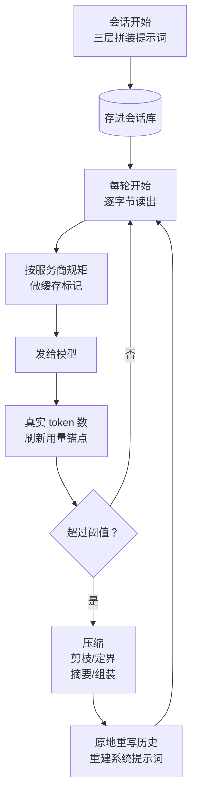

# 上下文工程

hermes 的上下文子系统：系统提示词怎么组装、怎么靠提示词缓存便宜地反复发、装不下时怎么压缩。
发给模型的请求由工具清单、系统提示词、对话历史三块组成，本篇的主线对象是后两块。工具清单的冻结与滚动归
《Agent 主循环与编排》篇 Q2；跨会话的记忆怎么存取归《记忆系统》篇，本篇只讲记忆快照怎么嵌进提示词。

## 重点地图

按面试出现频率分层，时间紧就先看三星：

- ⭐⭐⭐ **必考，要能脱口而出**：Q1 全景、Q2 提示词组装、Q3 缓存、Q4 压缩触发与 token 计量、Q5 压缩算法
- ⭐⭐ **高频，要会讲**：Q6 压缩的失败处理
- ⭐ **了解思路即可**：Q7 可插拔上下文引擎、Q8 微压缩、Q9 开放题

## Q1：上下文工程是干什么的？核心机制主要流程是什么？ ⭐⭐⭐

> **一句话：** 管一份请求的三件事——上下文装什么（组装）、怎么便宜地反复发（缓存）、装不下怎么办（压缩）；贯穿全局的约束是对话历史一经发送就不改写，唯一例外是压缩。

**主答：**

模型是无状态的，每次调用都要把整个上下文重新发一遍：工具清单、系统提示词、完整对话历史。上下文工程就是管这份请求的三个问题——装什么、怎么便宜地反复发、装不下怎么办。

hermes 的答案看图：会话开始时，系统提示词按「稳定→易变」三层拼一次、存进会话库，之后每轮逐字节读出来用；发请求时按服务商的规矩做缓存标记（要显式标断点的就标，隐式缓存的什么都不用加）；每轮拿模型返回的真实 token 数刷新用量锚点（锚点＝记下的最近一次真实用量，之后只对新增内容做估算，Q4 展开），超过阈值（默认一半窗口）就压缩——中段摘要掉、头尾保住，然后原地重写历史、重建提示词。

一条全局约束贯穿三件事：**对话历史一经发送就不改写**——改一个字节，缓存前缀就从那里开始全部作废，压缩是这条禁令唯一的例外。另外两块的变与不变各有安排：系统提示词字节稳定，只在压缩时顺带重建（把本会话新写的记忆折进去）；工具清单不是完全不动，但顺序钉住、变化只发生在列表末尾、按轮次滚动（滚动机制在《Agent 主循环与编排》篇 Q2）。

### 追问：这里的「上下文」和「记忆」是什么关系？

上下文是**当前这份请求里模型看得见的全部**，会话结束就没了；记忆是**跨会话的库**。记忆是上下文的原料：会话开始时，记忆快照作为一层嵌进系统提示词。反过来，会话中途写的新记忆不进当前提示词（字节不能动），要等压缩重建或下个会话才生效——存取机制的完整展开在《记忆系统》篇。

### 追问：这和常说的 RAG 是什么关系？

一句话分清：**上下文工程管的是发给模型的有限窗口里装什么**——强调对内容的管理；**RAG（检索增强生成）是从外部知识里检索出相关内容补进请求**——强调检索。hermes 里检索形态的东西也有：会话检索工具（找回被压缩掉的内容，Q5）、Q7 留给插件做请求级检索的口子——但默认的上下文管理不靠检索，靠组装、缓存、压缩三件套。

## Q2：系统提示词是怎么组装的？ ⭐⭐⭐

> **一句话：** 三层拼装——稳定层（身份、行为指引）→ 上下文层（项目上下文、工作区快照）→ 易变层（技能索引、记忆、时间、环境），越容易变的越靠后；每会话拼一次存库，之后字节不动。

**主答：**

会话开始时拼一次，三层按「变化频率从低到高」排：

1. **稳定层**：身份（用户自定义的 SOUL.md，没有就用内置默认）、工具相关的行为指引、编码操作纲要。这些换会话都未必变；
2. **上下文层**：项目上下文文件（AGENTS.md 这类）、git 工作区快照（仓库根、分支、改动概况这几行状态）、平台提示（「你在终端上，别用 Markdown」这类）；
3. **易变层**：技能索引（技能＝按需加载的指令包，教 agent 干某类活的操作手册）、记忆快照、时间戳、运行环境（主机、当前目录）——这些每次重建都可能变。

排序的目的是缓存：提示词缓存按最长前缀匹配，前缀里的字节越稳、越长，能复用的部分就越大。拼完存进会话库，之后每轮读同一份字节——存库而不是放内存，是因为网关每轮从库里重读历史、进程随时会重启，内存里的副本活不过这些边界；为什么必须逐字节一致、不能重新生成，展开在《Agent 主循环与编排》篇 Q2。

### 追问：每一层内部的顺序又是怎么定的？

同一条原则在层内继续用：越可能在别的会话里重复出现的越靠前。一个典型例子是上下文层里 git 工作区快照和项目上下文文件的先后：快照依赖当前工作区（worktree），项目上下文文件只依赖仓库。同一个项目开多个工作区的会话，两份提示词在「项目上下文文件」这段是逐字节相同的——前缀匹配到这里才断。要是快照排前面，每份提示词从快照起就分叉，这段共享前缀就没了。

### 追问：项目上下文文件是怎么发现的？

按优先级找，**第一个有内容的类型胜出**，后面的不再看：

1. `.hermes.md` / `HERMES.md`——从当前目录往上走到 git 根，找到最近的一份；
2. `AGENTS.md`——沿着「git 根 → 当前目录」的每一级目录收集，各级合并注入（每级目录里若有 override 覆盖文件——本地另存的一版——优先于正式文件）；子代理这类跳过上下文文件的会话不加载；
3. `CLAUDE.md`——只看当前目录（兼容 Claude Code）；
4. `.cursorrules` 和 `.cursor/rules/` 下的规则文件——只看当前目录，多份按序合并（兼容 Cursor）。

一个值得讲的细节：官方文档说 AGENTS.md 只看当前目录，代码实际已经演进成目录链合并——子目录里的规则和仓库根的规则会一起进提示词。这是文档滞后的例子，也说明这块还在活跃改动。

### 追问：这些文件直接进提示词，不怕提示词注入吗？

进场前过一遍威胁模式扫描（看不见的 Unicode 字符、「无视之前的指令」这类模式）：

- **项目目录里的文件**命中模式：整块替换成「已阻断」的占位说明——它随仓库一起来，不可信；
- **用户自己主目录下的 SOUL.md** 命中：警告一声、照常加载——它和配置文件同一个信任级别（用户自己写的身份文档里出现「ignore previous instructions」这个词本身不奇怪）；扫描要是把它整个扔掉，用户的身份就莫名其妙没了。

扫描用哪些模式、怎么分级，完整展开在《安全与审批》篇。

### 追问：文件太长怎么办？

头尾截断：保留前七成、后两成，中间换成省略标记，标记里告诉模型「要完整内容就用读文件工具去读原文件」。上限默认两万字符，随模型的上下文窗口放宽（大窗口给更大额度，五十万字符封顶），配置里显式指定则一律优先。

### 追问：哪些内容天然会变，怎么钉住？

这是个「为字节稳定把能钉的都钉住」的清单：

- **git 工作区快照**：会话第一次探测后把字节钉在会话上，压缩重建时直接重放旧字节，不重新探测——仓库中途动了也不影响当前会话；
- **时间戳**：只写到「天」，一天内字节不变；「会话开始时间」取的是这条会话最初创建时的 id——id 本身按「日期_时间」的格式生成、嵌着创建时刻，所以跨多次压缩也稳定。跨天的会话在重建时补一行「今天是几号」——重建点缓存反正已经失效，这行不额外付缓存代价；
- **插件注入的段落**：渲染一次冻结；恢复会话时从存下来的提示词字节里解析回来，不重跑插件代码；
- **平台切换**（桌面↔终端）：不重建提示词——提示词里那层平台说明是会话开始时定下的，不跟着换界面重写；当前平台的提示改走一条一次性的用户消息。这样换了界面，缓存前缀还活着。

### 追问：业界主流做法是什么？hermes 为什么不一样？

共同前提：大家都想保住系统提示词的缓存，所以共识是**系统提示词尽量静态、动态内容走消息通道**（每轮把变化的内容拼进用户消息发过去，提示词一个字不动）。hermes 的取舍分两类内容：真正一次性的东西同主流——走消息通道（平台切换提示、中途的技能注入）；但**每轮都要当背景参照的动态内容反其道而行——不注入、钉进提示词**：工作区快照钉住重放、时间钉到「天」、记忆快照留到压缩点才换。差别在成本模型：消息通道不走缓存，同样的内容每轮重发一遍；钉进提示词付一次重建成本，换来它在整个会话里都躺在被缓存的前缀里。

## Q3：提示词缓存具体是怎么做的？ ⭐⭐⭐

> **一句话：** OpenAI / Gemini 系什么都不用做（隐式缓存全自动）；Anthropic 系要管断点——hermes 按路由摆：直连时稳定层、工具清单末尾、最后两个完成的轮次；转发时稳定层、系统提示词末尾、最后两条消息。

**主答：**

业界分两种世界：OpenAI 和 Gemini 是隐式缓存——什么都不用配，请求前缀够长且和上次相同时自动按折扣计费；Anthropic 是显式缓存——必须在请求里的特定位置标缓存断点 (cache_control)，一个请求最多四个，不标就没有。hermes 对前者零操作，对后者摆断点，而且按路由分两套摆法：

- **直连 Anthropic 官方接口**：系统提示词的**稳定层**（就是 Q2 三层里最稳的那层）一个、**工具清单的末尾**一个、最后两个**完成的轮次**（一条模型回复连同它的工具结果）各一个——工具清单是每个请求里仅次于系统提示词的稳定大头，单独锁住；
- **经 OpenRouter 这类转发**：稳定层一个、**系统提示词末尾**一个、最后两条能带标记的消息各一个。

所有标记只加在发出去的请求副本上，存库的消息还是纯文本；重复加标记是幂等的（先剥旧的再放新的）。

### 追问：缓存到底为什么能省钱？为什么只能按前缀复用？

模型生成每个 token 时要对前面所有 token 做注意力计算，算出来的中间结果（KV 缓存）只依赖前缀内容——前缀相同，中间结果就相同。服务商把这些中间结果留在自己那边的显卡上，下一个请求前缀逐字节相同，就直接接着算，不用从头重算。这也解释了两件事：为什么匹配必须**逐字节**（差一个 token，从那以后所有中间结果全变）；为什么**只能前缀**（中间那段的结果掺着更前面的内容，跳过前缀就没有能对上的中间结果）。所以「字节稳定」不是工程洁癖，是这套复用机制的前提。

### 追问：缓存坏了，损失到底多大？

两笔账。**钱**：命中的部分按折扣计费（各家一折这个量级），没命中全价重算——系统提示词加历史动辄几万 token，每轮全价重来，长对话成本成倍涨。**延迟**：复用的部分不用重算，第一个字出来得快；全量重算就得多等一段。《Agent 主循环与编排》篇 Q2 从「为什么提示词要存库」的角度把这笔账展开过。

### 追问：断点为什么这么摆？

四个断点里，前两个给稳定大头：直连时给稳定层和工具清单末尾（工具清单排在请求最前面、又几乎不变）；转发时给稳定层和系统提示词末尾——转发路径在工具清单上没有合法的标记位（转发走 OpenAI 风格的消息格式，Anthropic 的标记字段在工具条目上挂不住，部分代理见到直接报错），只能省下来花在系统提示词末尾。剩下两个是滚动窗口，给最新的对话尾巴，让它们尽快变成下一轮可复用的前缀。消息断点只落在完成的轮次的末尾——一条模型回复连同它的工具结果齐了，这个位置才不再变，是稳定的前缀边界；还没凑齐的轮次不落标记。直连时严格按这个选；转发路径没法挑（空内容的消息和纯工具结果在转发格式下挂不上标记，能带的本来就少），就是最后能带标记的消息。

### 追问：TTL 怎么选？

分 5 分钟和 1 小时两档（也可配 auto）。经济账：1 小时档写入是 2 倍基础价、5 分钟档 1.25 倍，只有轮次间隔经常超过五分钟，1 小时档多付的写入费才回得了本。所以 auto 按会话来源分：人坐在前面打的会话（命令行、桌面、消息平台）用 1 小时——人会离开几分钟再回来；机器节奏的会话（子代理、定时任务、webhook）用 5 分钟——它们几秒一轮连着跑完，永远收不回 1 小时档的写入加价。维护者实测过：交互式会话里六成以上的缓存写入是空闲五到六十分钟后缓存过期产生的重新写入，1 小时档在这种场景省下的钱最多。

### 追问：哪些操作会白白破坏缓存？

改内容会作废缓存是明摆着的（从第一个不同的字节起后面全失效），另有两类要么躲不开、要么要靠纪律避开：

- **服务商侧的隔离，躲不开**：缓存按组织隔离，模型也是缓存身份的一部分——**中途换模型**，或**跨账号轮换凭证**（不同组织的 key，比如降级时换到了别家账号），下次请求零命中，整个对话全价重读。agent 避免不了，只能少做；
- **内容类操作，hermes 靠纪律避开**：**改历史中间**（插话、修正都只追加在末尾，不打进历史中间）、**换系统提示词或工具清单**（所以技能、工具集的变更默认推迟到下个会话生效；MCP 工具上下线引起的清单滚动不算这类——它只动列表末尾，付一次性的重算代价，Q1 提过；例外是 Bot Mode——挂在消息平台上长期不关的常驻对话，它的提示词里嵌着一小段「当前开了哪些能力」的指纹，配置一变指纹对不上，下一轮直接重建提示词、主动付一次缓存代价换立即生效，展开在《Agent 主循环与编排》篇 Q2）。

### 追问：业界主流做法是什么？hermes 为什么不一样？

三家的缓存都是服务商侧按前缀匹配的，分歧只在要不要由应用侧主动管。OpenAI：全自动隐式，1024 token 以上的前缀自动缓存，读取一折上下（新模型更低）。Anthropic：显式断点为主（也新出了单字段自动模式），四个上限、两档 TTL、写入加价。Gemini：隐式之外还有**显式缓存对象**——把一段内容建成一个缓存资源、按小时另收存储费，适合「一份大系统提示词服务海量请求」的场景。

hermes 的差异：**不自建缓存层，全部用服务商原生能力**；自己的活只有两件——把字节稳定管住（这对隐式缓存同样生死攸关，OpenAI 的自动缓存同样要求前缀逐字节相同），以及在 Anthropic 系上把断点预算花对位置。服务化一个本地缓存（自己做 KV 存储）理论上能跨服务商复用，但省的是服务商已经打折的部分，还要自己扛存储和失效——不划算，所以没人这么做。

## Q4：上下文什么时候压缩？怎么知道现在有多大？ ⭐⭐⭐

> **一句话：** 两层触发——agent 循环里的主压缩器（默认 50% 窗口，真实 token 计量）加网关安全网（85%，进 agent 前兜底）；token 数靠用量锚点：服务商上报的真实数＋此后追加消息的估算增量。

**主答：**

主压缩器跑在 agent 循环里，在历史会变长的每个时机检查：轮次开始、发请求前、工具结果贴回后（Q1 的图把检查画在收到回复之后那一个点，是简化——实际这几个时机都查），外加一个可选项——会话空闲一阵子之后被再次唤醒时先压一把，趁没有人等回复，把压缩的停顿提前消化掉。默认阈值是窗口的 50%，可配、可按模型覆盖；小窗口模型（不到 512K——在这套系统面向的超长会话场景里，五十万 token 以下就算小窗）的阈值另有一条下限：配置值和 75% 谁高用谁——默认 50% 配上去实际按 75% 生效。下限存在的原因：窗口小，一半就动手会把正常会话压个没完。

网关在把消息交给 agent 之前还有一道 85% 安全网，接住从主压缩器手里漏掉的会话——典型是消息平台上过夜堆积的会话，上一轮结束时还好好的，第二天消息进来时已经超了。阈值故意比 agent 高：要是也设 50%，同一个会话会被两边抢着压。

「现在多大」靠**用量锚点**：模型每次响应都带真实 token 数（这次请求实际算了多少），锚点把它记下来，之后只对「这一刻之后新追加的消息」做粗略估算加回去。锚点按内容指纹绑在那段已计费的历史上、持久化在会话行里——网关每轮从库里重读历史、进程随时会重启，内存里的计数靠不住，锚点能对上指纹才生效。

### 追问：为什么 50% 就动手，不等窗口快用满？

因为压缩本身是贵操作，而且等不起。贵在它一次要做三件事：调一次摘要模型、整个缓存前缀作废、重建系统提示词——这笔账不管什么时候压都要付，但压得晚不等于压得便宜。等不起在两点：一条大工具结果（读个大文件、跑个长命令）就能把占用一次性顶过线，逼近上限才动手就没什么余量接住这种突刺；压完还要给尾部保留预算、给摘要输出留空间，这些余量都得在触发线以上留出来。所以宁可早不可晚，一半窗口是个「正常会话不受打扰、突刺来了接得住」的折中。

### 追问：token 数靠估不行吗？估错了怎么办？

估不准是常态——维护者注释里说这套字符折算的粗估普遍偏高三到五成。偏高只会让网关安全网提前触发，是安全方向的错；但光靠粗估满足不了另外两个消费方：账单和展示要准、溢出恢复要「确认真的超了」。所以锚点把真实数留在基准点上、只估算增量——增量小，估错也有限。估错的两个反方向也都有兜底：无锚点时（首次请求，或者用户把会话倒回去重发——倒回之后指纹对不上，就当无锚点处理）整段粗估超了阈值，hermes 会**等一次真实证据**再动手——估算数字大不代表请求一定会失败，白压一把的代价（一次摘要调用＋缓存报废）不比等一下小；反过来，请求真发出去被服务商以「上下文超限」拒了（413），恢复逻辑会**无视冷却立即压一次**——服务商已经证明装不下，这时候再等冷却就是让会话每轮都撞一次墙。

### 追问：图片怎么算 token？

按**从服务商的用量里学到的单图成本**计价：某次响应比上次多进了 N 张图，真实 token 数和「把图换成纯文本估出来的那份 token 数」的差额除以 N，就是这个模型一张图的价钱，按模型＋服务商存下来。第一张图进上下文之前没有数据，用 1500 的默认值。压缩触发、圈尾部的预算、网关安全网用的是同一个数字，不会各算各的。

## Q5：压缩算法本身是怎么做的？ ⭐⭐⭐

> **一句话：** 四阶段——先免费剪掉旧工具结果、再定头尾边界（切割点不落在工具组中间）、中段发给摘要模型生成结构化摘要、最后组装并清掉漏网的悬空工具对；重复压缩时更新旧摘要而不是从头重写。

**主答：**

1. **剪旧工具结果**：超过 200 字符的旧工具结果整块换成一行占位符。不调模型、零成本，工具输出（读文件、命令回显）是上下文的大头，这一步往往就省出大量空间。它自带着一套粗略的头尾保护——按条数和预算画个大圈，不依赖下一步的精确切点；圈外的反正要被摘要，先剪掉不心疼；
2. **定边界**：历史开头的第一轮交流保住（这层保护只到第一次压缩为止——之后的压缩会把早期轮次也放进要摘要的中段，免得开头永远僵住；系统提示词不在这个列表里，它是压缩点单独重建的，见 Q1），尾部按 token 预算从最后往前圈，并且保证最后几条**真实用户消息**（用户自己打的，不含系统合成的）逐字留在尾部——条数可配，这条保证优先于预算。切割点落在工具组的缝隙上：模型的调用和它的结果要么都进压缩区、要么都留尾部，不拆开；
3. **生成摘要**：中段整体发给摘要模型（和主模型分开配，可以用便宜模型），产出一份结构化摘要；有上一次的旧摘要就**更新**它而不是从头重写。摘要预算随内容量缩放：约两成，下限两千、上限一万 token；
4. **组装**：头＋摘要＋尾拼回去，清掉漏网的悬空工具对——孤儿的调用从模型那条消息上剥掉、孤儿的结果整条删掉，不补占位（发请求前本来有一道自动的历史修复，按调用和结果的配对关系清理——《Agent 主循环与编排》篇 Q6 展开过；压缩这边补的占位到了那道修复手里配不上对、照样被丢，干脆不做）；唯一例外是压缩发生时还没等到结果的调用，视为还在跑、保留原文。最后**在同一个会话 id 上原地重写**——被压掉的轮次软归档，还能搜到、能恢复。

### 追问：摘要为什么要用结构化模板？

模板字段是为「恢复之后要用」设计的——摘要模型照着填，真正读它的是恢复后的主模型：目标、约束、进展（完成/进行中/阻塞）、关键决定、相关文件、下一步、关键值。两个字段值得单独讲：

- **未竟任务**单列且标成最重要的字段——用户最近一个没被满足的输入（待办、待答的问题、等确认的选项）。压缩最容易出的事故就是模型忘了自己欠着什么，恢复后对着摘要问「所以用户要什么来着」；
- **安全约束必须逐字引用、禁止改写**——用户说过「不许动那个文件」「凭据不许落盘」，转述成大意就可能丢掉约束的力度。改写丢细节对一般内容可接受，对约束不可接受。

模板之外还有三道确定性后处理：摘要里出现密钥一律打码替换；模型复述的思考块剥掉（否则每次迭代更新都会滚雪球）；被剪掉的技能内容打上「内容已在压缩中丢失，用技能查看工具重载」的标记——不标的话模型还以为技能在上下文里，照着不存在的指令干活。

### 追问：压缩会丢什么？丢了怎么找回？

当前默认是**精简尾部 (lean tail) 模式**：尾部预算按窗口的 2.5% 算，算出来不足一万按一万、超过两万五按两万五；连续性折进摘要里一起带走——被压区间**每条真实用户消息逐字引用**、一份机械抽取的索引（PR 号、提交号、文件路径、报错原文——正则抽的原文，不是模型的转述，留给后续检索用）、外加一句「用会话检索工具可以找回被摘要的内容」。旧模式（保留约两成窗口的逐字尾部）在五十万 token 的真实会话上要留十六万 token，精简模式留不到五万，配上「用会话检索找回原文」这个入口，找得回的东西反而更多——逐字保留的真实用户消息和那份索引保住了「知道发生过什么」，细节要用了再检索。

被压掉的轮次软归档在会话库里（标记为已压缩但没删），会话检索能查到原文——压缩有损，但丢掉的内容找得回来。

### 追问：多次压缩怎么办？

迭代更新：摘要模型拿到「旧摘要＋新轮次」，被要求在旧摘要的结构上合并——条目从「进行中」挪到「完成」、新决定加进来、过时的删掉。从头重写的问题在于信息在多次压缩之间累积丢失：每次都只看最近一段，最早的信息第二轮就被丢了。

### 追问：业界主流做法是什么？hermes 为什么不一样？

主流是「到线触发、摘要中段、保头尾」这一类（Claude Code 的自动压缩就是这个思路），差别在细节取向。hermes 的两个不同点：

- **确定性阶段和模型阶段分开**：剪枝、定界、组装全是确定性代码，只有摘要一步用模型——摘要模型挂了可以降级成固定格式的降级摘要照样走完整提交管线（Q6），而不是「压缩失败＝什么都没做」；
- **原地压缩、会话 id 不变**：不少实现每次压缩轮换出一个新会话串成链。轮换的问题是下游所有环节都要跟着理解「会话换 id 了」——定时任务状态丢失、检索跨边界断档。原地重写让一个对话终身一个 id，归档和检索天然连续。

## Q6：压缩失败怎么办？ ⭐⭐

**主答：**

失败有冷却梯：60 秒、5 分钟、15 分钟逐级拉长，冷却状态记在库里、进程重启也还在；冷却期间阈值触发的自动压缩让路——不然一个坏掉的摘要模型会被每轮重烧一遍。有两条通道能绕开冷却动手：用户手动压缩（清掉冷却立即重试）、服务商拒了 413（无视冷却立即压一次，Q4 讲过）。另外摘要模型刚失败时，同一轮里可以先换备用的摘要模型再试一次——这次重试不因刚发生的失败止步，但失败计数照记，连续失败照样走下面的降级。

冷却救不了的是**反复失败**，两条降级路各自有阈值：摘要模型连续两次停摆，就产出**降级摘要**——跳过摘要模型，用固定格式、不靠模型生成的静态摘要，走同一条提交管线，压缩照常发生；摘要模型连续三次过载（服务商满载），同样切到降级摘要——停摆和过载是两类失败分开计数，过载多半是暂时的，多容忍一次等容量恢复。再兜一层防抖断路器：连续两次压缩没效果、或连续两次靠降级摘要，自动压缩整个停掉，隔一个恢复窗口放一次探测出来试——真不可压缩的会话最坏也是「每个恢复窗口试一次」，不会每轮空转。「没效果」的判据是压缩后的下一次真实计数仍然达到阈值，而不是消息数没变少：消息可以缩得很健康，但系统提示词和工具清单是压不掉的地板，地板本身就顶到线上时，把消息压得再小也过不了线。

整套跑在工作线程上，带进度感知超时（一段时间没产出就放弃）和总时间天花板；提交要过围栏——超时之后迟到的结果想写库会被拦下。对话记录在任何失败路径上都不丢：放弃压缩的路径原样返回未动的历史。

### 追问：为什么「降级摘要」比「跳过压缩」好？

跳过 = 这次不压了，会话继续涨，涨到硬上限，网关的终极处理是自动重置——整个会话丢掉。降级 = 压缩照常发生，损失的是一段有界的摘要质量（中间窗口的信息变粗）。两害相权：摘要质量换会话存活。

### 追问：超时防护为什么要做到「迟到的压缩线程改不了历史」这个程度？

压缩跑在独立线程上，超时放弃后那个线程可能还在跑。如果它和主循环共享同一个历史列表，迟到的写回会在主循环已经继续前进之后把历史改掉——角色顺序、持久化状态全乱。所以工作线程拿到的是深拷贝，结果只能通过被围栏接纳的提交发布回主循环；超时的尝试就算跑完了，结果也只是被丢弃。

## Q7：上下文管理只能有损摘要吗？想换无损方案怎么接？ ⭐

**主答：**

不用改核心——压缩策略从一开始就没写死在核心里，而是抽成了一个可整体替换的策略：上下文引擎。接口就三个核心动作：报用量（每次模型响应后）、判阈值（该不该压）、执行压缩。主压缩器只是默认实现，无损方案（原文全存外部、按需检索回来）做成插件就能整体换掉——配置里显式写引擎名才激活，装了插件不会自动切换。

「有损摘要只是当前的最优解，不是唯一解」就是留这个口子的理由：长会话上摘要会累积损失（迭代更新缓解但不消除），无损方案保真更好、但要自己管存储和检索的成本。两种方案各有适用场景，接哪套不该要求改核心代码——这是「核心保持极小、能力挂在外围」那条全局设计原则（《总体架构与设计思想》篇）在上下文子系统上的落点。

除了把上下文变短，接口上还留了两个默认为空的钩子，把另外两件事也交给引擎：**请求级上下文选择**——每次发请求前，引擎可以换掉这次请求实际发出的内容（检索增强、话题路由——按当前话题挑相关的一段历史发、其余不发），只影响这一次请求、不改落库的历史；**轮后观察**——每轮结束后给引擎看一份只读的对话记录，为下一次选择积累状态。两个钩子出错都当没这个钩子（选择钩子出错发原始请求，观察钩子出错跳过这次观察），没实现的引擎一个字节都不多花。引擎还能把自己的工具带进请求给模型当普通工具调（比如无损引擎配一个「查自己的知识库」的检索工具）——主压缩器没这个需求，所以没用上。既然可插拔，每个 agent 实例就各克隆一份引擎，防止预算计算在会话之间互相串。

### 追问：那「每轮观察会话内容、同步进外部库」这种需求，该写成引擎还是记忆插件？

写记忆插件。引擎**拥有**这个会话的压缩策略（它决定历史怎么变形）；记忆插件只**观察**轮次、不拥有任何东西。拿观察的需求去实现引擎，等于为了一个钩子接管了整个压缩策略——错位。分界线就是「要不要为压缩负责」，完整展开在《插件体系》篇。

## Q8：微压缩是什么？为什么默认关？ ⭐

**主答：**

微压缩就是把压缩摊到每一轮。对照它要解决的问题：默认的批量压缩是一次性付账——跨过阈值那一刻，会话停下来、一段大摘要、再继续。微压缩改成每轮结束后，把还没并进摘要的「一组交流」里最老的一个，折进一份滚动摘要。一组交流就是 Q3 里说的「完成的轮次」那种单位——一条模型回复连同它的工具结果，到下一条用户消息为止。占用曲线从「锯齿爬到阈值再砸下来」变成「低位平稳」，批量压缩基本不再触发。

三个设计点：**用户消息永不压缩**——一组交流从模型的消息开始数，用户原话全程逐字保留。不对称是有意的：模型的输出是「干了什么的叙述」，摘要损失小；用户的指令是一切的源头，改写它就是「六轮之后自信地做了你说过不许做的事」的成因；**滚动摘要防膨胀**——摘要自己超过两千 token，就把它重新摘要一遍；**失败跳过**——同一组交流连续三次摘要失败就跳过它，不让一组坏交流卡住整条流水线。

默认关的原因是缓存：微压缩每轮改写已发送的历史，等于**每轮把缓存前缀作废一次**——批量压缩才一次付这个代价。缓存折扣深的服务商上，每轮的缓存损失可能超过摊平停顿的收益，所以这必须是用户算过账之后的显式选择（有个频率旋钮：每 N 轮吸收一次，在「多久破坏一次缓存」和「摘要跟得上新内容」之间折中）。

## Q9：你觉得这套上下文子系统有哪些地方可以优化的？ ⭐

**主答：**

最重要的一点：**压缩的决策过程对谁都不可见，可以让模型看见**。

目前的问题：hermes 曾经给用户看过上下文水位提示，因为频繁刷屏扰民被整体移除了；发给模型的提醒倒是有一个——轮次迭代的预算检查点（「这轮的调用次数用了多少」），但它默认关闭，代码注释记着原因：中间压力警告会让模型**过早放弃**复杂任务。结果是默认配置下谁都看不到水位：用户看不到，模型也收不到任何提示。而「警告会吓退模型」和「模型不该知道水位」是两回事——问题出在那条提醒的**语义**（催迫性的「快不行了」），不在知情权本身。模型不知道上下文还剩多少，就不能主动省着用：预感要长输出时先把中间结论落盘、大任务先收个尾再继续，这些它都做不了。

方案：借用现有的系统代发用户消息通道（平台切换提示走的就是它，Q2），每轮带一行**事实性水位**——「当前上下文占用约 N%」，不带任何催促语气；同时在提示词里给一条行动指引：占用高时先把中间产物写进文件、大输出前先收个尾，而不是硬撑。数据从哪来：用量锚点每轮都在更新，百分比现成的；这条通道本来就不碰系统提示词、不破坏缓存。想再进一步，可以把压缩做成模型可调的工具——上下文引擎的接口本来就支持引擎把自己的工具带进请求（Q7），只是主压缩器没这么做。

为什么更好：把「什么时候压」从纯系统侧决策变成模型可参与的决策——系统侧的阈值是全局静态的，而模型知道自己接下来要干什么（要读大文件还是要长篇输出），它是最有资格做「现在省一点」判断的一方。代价要认：每轮多几十个 token 的固定开销；指引要写得克制，防止换个形式又把「快放弃」的语义带回来——所以只给数字和「可以做什么」，绝不给「快满了」的判断。
