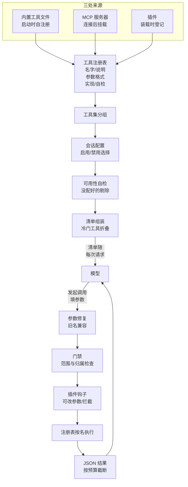

# 工具系统与 function calling

hermes 的工具子系统：工具从哪来、怎么组织、怎么进模型的请求、调用怎么路由到实现、结果怎么控制大小。
本篇以**内置工具**为主线——注册、组织、清单、路由、预算这套机制对所有来源一视同仁，但 MCP 和插件工具的挂载方式、量级、连接细节各自成篇（《MCP》篇、《插件体系》篇），正文只在机制需要处顺带提到。
《Agent 主循环与编排》篇 Q6 讲了**一批**工具调用的执行编排（校验、去重、落库、分段并发），
本篇接着往下讲：单个工具从定义到被调用的整条路。

## 重点地图

按面试出现频率分层，时间紧就先看三星：

- ⭐⭐⭐ **必考，要能脱口而出**：Q1 全景、Q2 清单组装、Q3 渐进式披露、Q4 调用路由
- ⭐⭐ **高频，要会讲**：Q5 结果预算
- ⭐ **了解思路即可**：Q6 收尾开放题

## Q1：工具系统是干什么的？核心机制主要流程是什么？ ⭐⭐⭐

> **一句话：** 一张进程级的工具注册表收拢全部工具——内置工具在启动时自注册（MCP、插件的工具也汇进同一张表，怎么挂归各自篇章），按工具集 (toolset) 分组、按会话配置筛出清单随每次请求发给模型；模型发来的调用经参数修复和钩子路由到实现执行，结果按预算截断、以 JSON 贴回历史。

**主答：**

工具系统解决的是 function calling 的后半段。模型只会「报出工具名、给出参数」，把这件事变成 agent 的手和脚——工具怎么定义、模型怎么知道有哪些、调用怎么落到实现、结果怎么回到对话——全是工具系统的活。

hermes 的答案是一条「注册—筛选—分发」的流水线，看图：

顺着图走一遍。**注册**：每个内置工具在自己的文件里写好登记，启动时汇入一张进程级的注册表，登记五样东西——名字、给模型看的说明、参数格式说明 (schema)、实现函数、可用性自检（MCP、插件的工具也汇进这张表，怎么挂上来的归《MCP》《插件体系》两篇，本篇不展开）；**筛选**：agent 初始化时，按这个会话开着的工具集（把一批工具打包成一个开关单位）选出工具、跑一遍自检、组装成清单（工具太多时冷门工具折叠成搜索入口，Q3 展开）；之后每个轮次开始，把当轮的变化折进这份清单——新工具加尾部、消失的剔除、顺序不动——一个轮次内的所有迭代用同一份（滚动机制在《Agent 主循环与编排》篇 Q2）；**分发**：模型看着清单发起调用，工具系统修复参数、过门禁和钩子、按名字查表执行，结果按预算截断后贴回历史，进下一圈循环。

### 追问：function calling 里，模型和 agent 各干什么？

模型只做两件事：从清单里挑一个工具、照参数格式填一段 JSON——它发出的是「想调用」的**请求**，从不执行任何东西；执行永远在 agent 本地：解析参数、跑实现、拿结果，全是 agent 的活。所以也不存在「模型调完工具」这种说法，主语别安错。这条分工决定了工具系统两侧的形状：清单侧要保证模型每次都看得见全部能力——模型是无状态的，这次不发清单它就不知道有这些工具，所以清单必须随每个请求发（《总体架构与设计思想》篇 Q5 展开过为什么）；路由侧要保证「模型说想调」到「agent 真的调」之间每一步都攥在 agent 手里——修复、门禁、钩子，全是 agent 在执行前做的主。循环侧怎么拿「有没有工具调用」分流循环，在《Agent 主循环与编排》篇 Q5。

### 追问：一个新工具从写出来到模型能调用，要过哪几关？

两关，漏一关模型都看不见它：

1. **进注册表**：工具文件加载时把名字、说明、参数格式、实现、自检注册进注册表。内置工具靠启动扫描自动发现——不用维护任何导入清单，文件放进去就会被找到；
2. **进调用清单**：只注册还不够，组装发给模型的清单时还要再筛一轮——工具要被会话开着的工具集包含、可用性自检要过关，没过的静默剔除，模型根本不知道有它。清单怎么筛，Q2 整问展开。

### 追问：为什么靠「文件加载时自注册」，而不是一份集中的清单文件？

两个理由：

1. **扩展方便**：加工具等于加一个文件——实现、说明、自检、注册调用在一个文件里写完，不用改任何原来的代码。集中清单恰恰相反，每加一个工具都要动那份所有人共改的文件，忘改了工具就永远没人发现，人多了还冲突高发；
2. **统一装载动作**：注册表收的不止内置工具——MCP 的工具是运行时从外部服务器拿的、插件的工具在各自的包里，这两类没有「清单」可写，只能在装载时注册进表。内置工具跟着走同一条路，三类来源汇进同一张表的动作是同一个。

启动扫描用语法分析只认「模块顶层有注册调用」的文件，避免无差别导入上百个辅助文件的装载开销；扫描结果按文件的时间戳和大小记进磁盘缓存，没变的文件下次启动直接用缓存。

### 追问：注册表里同名工具撞了怎么办？

注册时直接拒绝，不静默覆盖：同名且属于不同工具集的新注册会被打回，只有显式声明「有意替换」才放行；插件想替换内置工具还要再加一道——操作者在配置里明确允许，防止一个插件悄悄把「读文件」换成自己的实现。另外参数格式在注册时就校验——格式不对当场报，不让坏格式流进以后每一次请求。

## Q2：一次请求里，模型能看到哪些工具、由什么决定？ ⭐⭐⭐

> **一句话：** 三层过滤——工具集选择（会话配置决定启用/禁用哪些组，禁用最后减）、可用性自检（没配好的静默剔除）、说明加工（个别工具动态改写＋按服务商清洗）。

**主答：**

一次清单组装走三步：

1. **工具集选择**：把会话配置里启用/禁用的工具集展开成工具名单——启用的相加，禁用的**最后**减。减法放在末尾，保证被禁用的组里的工具，即使被某个组合集重新包含，也严格剔除。拿输入走一遍：某会话启用了调试集（它组合了终端、网络、文件三个组），又禁用了终端组——组装时终端工具先随调试集加进来，末尾的减法再把它剔掉；
2. **可用性自检**：每个工具的自检探一遍「我配好没有」——密钥在不在、服务配没配、依赖装没装。不过关的静默剔除，不是进了清单再报错；
3. **格式加工清洗**：按 function calling 的标准格式输出说明；个别工具的说明按当前会话的情况动态改写（下面追问讲）；最后按当前接入的服务商接口要求清洗一遍格式。

清单在 agent 初始化时算一次，顺序在整个会话里钉住、内容按轮次滚动——这是提示词缓存那条不变量在工具侧的落地。

### 追问：这套清单格式，跟 OpenAI 的 function calling 标准是什么关系？

就是那套标准，hermes 没有自造协议。清单的结构（每个工具一条：名字、说明、参数格式）和调用的结构（模型回一段「工具名＋JSON 参数」），都是 OpenAI function calling 定下的形状——它已经是事实标准，照着来，每家模型服务商的接口都认。各家真正的差异 hermes 收在两处：**组装侧**把外部来源（主要是 MCP）的说明清洗成各家都接受的形状（下面讲）；**调用侧**对模型填的参数做修复（Q4 讲）。再往下的「请求怎么按各家服务商的接口发出去」是模型接入层的活，归《Provider 抽象与流式》篇。

### 追问：工具集是怎么组织的？

一层套一层的组合，三种规模往上叠：

1. **类别集**：网络搜索、终端、文件、浏览器、技能……单一职责的小组，每个工具归属唯一；
2. **场景集**：按用途组合类别集——调试集是终端＋网络＋文件；「安全集」去掉终端和文件，只留搜索、看图、画图这类不动系统的组。更极端的不可信入口有自己的专门工具集：webhook 会话只拿四个不带文件和命令执行的工具，因为进来的载荷是第三方内容；
3. **平台捆绑包**：每个消息平台一份，等于「共享核心工具清单＋平台附加工具」。核心清单是所有平台共用的底座——一处增删、所有平台跟着变；桌面界面专用的工具刻意不进核心清单，按会话单独折入（能力是会话的属性，不是进程的）。

用户通过交互界面按平台开关工具集，配进配置文件。

### 追问：可用性自检怎么防止「探一下抖了，工具就没了」？

自检探的是外部状态——容器起没起、密钥在不在、依赖装没装，结果按 30 秒缓存。

两道防抖：一轮组装里同一个自检只跑一次；一分钟内刚成功过的自检失败了，当抖动处理——沿用上次成功的结果、但不缓存，下次重探。

防的事故很典型：探活类的自检要真去问一句「服务在不在」，这一问本身可能失败——目标服务正好在重启、网络抖了一下、机器卡了一下，失败的那一瞬自检就报「不可用」，工具从清单里消失。模型不知道工具只是被藏起来了，只会当 agent 没这个能力，换个笨办法绕路，甚至直接告诉用户「做不到」。反过来，持续失败就照实剔除——后端死了，不能一直挂着可用的牌子。

### 追问：清单一个轮次内不变，工具中途真挂了怎么办？

对，挂了的工具会在清单上留到下个轮次开始——这是清单轮次内稳定的直接代价。但不会「整轮反复调失败」：调挂掉的工具返回一条错误结果，模型看到失败原因就换路了（重试一次、换工具、绕路），不会反复撞同一堵墙；模型不长记性、反复发同一个调用的，有死循环检测兜底——同一个调用连发三次先提醒、再犯结束本轮（挂掉的工具每次错误结果一样，正好命中判定，《Agent 主循环与编排》篇 Q6）。工具真正从清单里摘掉要等轮次边界：下个轮次开始时刷新，注销的工具从尾部剔除。

这笔账算得过来：工具列表排在请求最前面，轮次内每改一次清单，后面的系统提示词加整段历史的缓存全部作废重算；工具中途挂掉是小概率事件，为它把「轮次内改清单」打开，每次都冒全前缀重算的险——宁可让模型多吃一次错误结果。

### 追问：清单组装时的工具说明中的「动态改写」和「清洗」各指什么？

**动态改写**处理工具说明里「提到别的工具」的地方。两个最常见的：**运行代码的工具** (execute_code)——说明里带一份「代码里可以直接调这些工具」的名单；**浏览器导航工具** (browser_navigate)——说明里附一句「可用的轻量网页抓取工具是哪几个」。这些内容不能写死——被提到的工具这一场可能不在（密钥没配、组被禁用）。所以组装清单时按当前会话实际在场的工具改写：运行代码工具的名单只列在场的那些；轻量抓取工具不在场，导航说明里那句就不出现。这样模型看到的每个工具名都真实可用，不会照着说明书去调一个不存在的工具。个别工具说明里的配置值（如子代理的并发上限）也在这步写进去。

**清洗**处理外部挂载工具带来的格式问题（MCP、插件给的参数格式没有保证，来源细节归《MCP》《插件体系》两篇）：各家模型服务商的接口校验有雷区——有的拒绝没有字段列表的空对象，有的限制参数键名的字符集，一个不合法的键名就能让整个请求被拒。清洗器把不合规的形状修成各家都能接受的：不合规的参数键名被确定性地重命名，调用时再映射回真名。脏格式的错要在组装时暴露，不能放到请求时炸。

## Q3：工具太多，说明书塞满上下文怎么办？ ⭐⭐⭐

> **一句话：** 渐进式披露 (progressive disclosure)——冷门工具不随请求发完整说明书，折叠成三个桥工具（搜目录、看说明、发起调用）；目录嵌在搜索工具的说明里，按预算逐档收缩，从「名字＋一句简介」一路缩到只报每组有几个工具，再放不下就只剩搜索入口。

**主答：**

塞不下就把一部分工具的完整说明书从清单里拿掉，折成三个桥工具，模型要用再展开——这就是渐进式披露。哪些工具会被折：

- **绝大多数内置工具不折**：完整说明书始终随请求发。会被折掉的内置工具只有少数几个——配置里有一份延迟名单，点名的都是冷门、事件触发才用得上的工具（如定时任务管理、桌面控制）；
- **外部挂载的工具都折**：MCP、插件的工具全在这类——大头也在这里，一个外部服务器动辄挂出上千个工具，折叠机制主要就是为这个量级设计的（挂载细节归《MCP》篇）。

只要存在要折的工具，就把它们折叠成三个桥工具——名单上的内置工具和外部工具走的是同一套机制：

1. **工具搜索** (tool_search)：给关键词，返回匹配的工具名加一句简介；工具说明中写着折叠的工具目录「名字＋首句简介」，模型看得见自己有哪些能力。
2. **工具说明** (tool_describe)：给名字，返回完整参数格式；
3. **工具调用** (tool_call)：发起真正的调用。

### 追问：为什么不等上下文快满了再折叠？

折叠的目的是省固定开销，不是救急。工具说明书随每个请求发，这笔钱每一轮都付、和对话长短无关——折叠是从第一个请求起就该开的常态开关；而上下文快满的原因是历史越堆越多，救急是压缩的活，清单占的固定前缀不会随对话变长（《上下文工程》篇）。

所以「等快满了再折」是把常态省钱当成了应急开关，等得越久白烧越多。何况中途换档也不划算：轮次之间允许的变化只有尾部增删，全量↔折叠换的是整批工具（直接在场换成桥），系统提示词加整段历史的缓存全部作废重算；按压力阈值触发还会来回抖——这轮超了折、下轮压缩完又不超了展开，每抖一次付一次全前缀重算。

### 追问：目录检索是怎么做的？拿「我要用 Gmail 发邮件」走一遍。

先补一步转化：用户的需求是中文句子，模型发起检索前要把它转成英文关键词——搜索工具的说明里教了怎么组词：「服务名＋动作＋对象，别用整句」（工具名和说明都是英文写的，用英文关键词查）。所以这个需求到了检索这一步是三个词：gmail、send、email。

检索在一份索引上做：每个可延迟的工具一条，条目带名字、简介和匹配文本，匹配文本由工具名拆词、所属服务名、说明、参数名拼成。匹配方法是词法打分（BM25）加英文词干归并——查 issues 能命中 create_issue 这样的复合名。拿 gmail、send、email 走一遍：

1. 分词归并后，「gmail」是三个词里最罕见的——它就是**入口词**：候选工具必须包含它。这道门防的是「只共享一个常见词」的污染——「send gmail email」这类查询曾返回五个只共享 email 的工单工具；
2. 查询再长一点的，还要求候选至少覆盖一半的可命中词。防的也真出过事：长查询里每个词都能在个别工具的匹配文本里找到、但没有工具同时命中多个，模型误以为要的能力就在目录里，对着目录重搜了两百多次；
3. 过了门的候选按相关性排序，返回名字＋简介；名字精确匹配的直接排第一。

空结果也不空手而归：附上「当前连着哪些服务、各有多少工具」的摘要和一句重试提示——别急着断定「没这个能力」。

### 追问：检索索引有缓存吗？

没有，每次桥被调用都重建一遍。原因是两次调用之间工具会变——外部服务器掉线、插件装载，缓存一份旧索引，新挂上的工具就搜不到，等于悄悄丢了能力。重建也贵不到哪去：索引条目就是名字加一句简介，分词、排序就完事。

注意跟嵌在搜索工具说明里的那份目录清单区分：那份名录是轮次开始组装清单时定好的、随请求发给模型，字节稳定；检索索引只在本地答搜索用，不进请求前缀——重建多少次都不影响缓存。

### 追问：模型用「工具调用」这个桥，怎么防它调到不该调的？

靠一份会话级的白名单：解包出真工具名后，先查它在不在**这个会话折叠前的完整工具名单**里——就是按会话的启用/禁用工具集组装、还没做折叠的那份全量名单，跟清单一样每个轮次开始时定、轮次内不变。不在名单里的名字直接回一条错误，让模型用工具搜索去找能用的。

所以折叠不等于禁用——工具被折进目录只是说明书不随请求发，会话本来有它，桥对照折叠前名单核对后就放行；调用照常走人工审批和钩子，桥不是绕过通道。

### 追问：如果高频使用的工具被折叠了，岂不是每次都要走桥调用？

是，被折的工具每次调用都走桥——但稳态开销没有「每次搜一遍」那么大：第一轮模型从目录看到名字，按需看一次说明（搜索结果里连必填参数的名字都带着，简单调用连说明都不用看），之后调用格式就在对话历史里，模型照着直接用工具调用桥发起——多的是一层包装，不是三步重来。

真正的防线在选什么折：延迟名单点名的都是冷门、事件触发的工具，高频工具本来就不该进名单——「向用户提问」试过折叠，结构化提问的使用率从 18 次里 18 次掉到 7 次，教训就是这类出口型工具必须常驻。名单是配置可改的：发现折掉的工具用得高频，把它移出名单就回到全量在场。

### 追问：业界处理「工具太多」的主流做法有哪些？hermes 这个折法特殊在哪？

主流三条路有个共同前提：高频核心工具直接在场，分歧只在一大堆低频工具的说明书怎么放、怎么找：

1. **服务商原生检索**：模型服务商在接口层直接提供工具搜索——应用把全量工具定义随请求交给服务商，但定义不进模型的上下文；模型看到的是一个服务商内置的搜索工具，要用时先搜，服务端把命中的工具定义直接注入模型上下文，之后就是原生调用。好处是检索、注入应用全都不用写——hermes 三个桥工具干的活它全包了；代价是绑死这家服务商，检索过程是个黑盒，应用调不了。注入以内容块的形式追加在检索发生时的对话末尾（下一轮看它在历史中间，但它是当时追加上去的），前缀到追加点之前全部有效，提示词缓存不受影响；
2. **动态选批**：每次任务开始先跑一轮检索（向量或关键词匹配），挑一批最相关的工具进本次清单，其余不发。好处是清单永远小；代价有两个——清单随任务变，前缀缓存每换一次任务作废一次；没挑中的工具这次彻底调不到，检索漏了能力就缺失；
3. **分层说明**：说明书分两层——先给一份目录（名字加一句简介），完整说明模型要用再取。hermes 走的就是这条。

hermes 的做法特殊在**全做在应用层**：折叠、目录、检索对模型来说就是三个普通工具，不依赖任何服务商特性——任何支持 function calling 的模型都能用同一套。和动态选批的关键差别：折叠不删能力——被折的工具经桥仍调得到，省的只是说明书；动态选批没选上的工具这次彻底调不到。纯检索还有一个通病：模型不知道自己不知道——它按任务里的想法去搜，措辞和工具说明对不上就以为没有这能力，直接说「做不到」；hermes 把目录清单嵌在搜索工具的说明里、空结果附上「当前连着哪些服务」的摘要，就是让模型看得见有什么、再搜，不纯靠盲搜。代价是模型要多走「搜→看→调」的回合，每个回合都是真实的调用轮次；原生检索把这些回合藏进了服务商那侧。

## Q4：模型发一个工具调用过来，是怎么路由到具体实现的？ ⭐⭐⭐

> **一句话：** 一条五站分发管线——参数修复→名字归一→门禁→插件钩子→注册表按名查表执行，执行完还有一道结果钩子；任何异常都包成一条错误 JSON 回给模型，绝不向上抛。

**主答：**

单个调用进工具系统之后，走五站：参数修复、名字归一、门禁、插件钩子、查表执行。这和《Agent 主循环与编排》篇 Q6 讲的「一批调用的编排」（校验、去重、落库、分段并发）是两回事，别混。五站各自干什么：

1. **参数修复**：模型给的参数常有小毛病，先照着参数格式修（下面追问讲修什么）；
2. **名字归一**：改过名的工具做兼容映射，旧会话里的旧名字照常能用；
3. **门禁**：折叠会话里桥的调用先解包成真工具（Q3 刚讲过三道锁）；
4. **插件钩子**：前置钩子可以改参数，也可以直接拦下这次调用——拦截原因作为一条工具结果返回给模型；
5. **查表执行**：注册表按名字查到实现函数执行。

有一个例外要知道：待办、记忆、会话检索、子代理委派这四个要读改 agent 自身状态的工具，正常路径下根本不进这条管线——主循环在编排一批调用时就把它们直接执行了（《Agent 主循环与编排》篇 Q6 的「循环侧拦截」）。工具系统这边留的是两道防绕过的兜底：注册表里有它们的占位条目，清单组装照常用；万一有代码绕过主循环直奔分发，入口处会回一条「该工具由主循环处理」的错误来兜底，轮不到钩子和查表。

执行完还有一道后置：钩子上报这次调用的结果和耗时，插件还有一次改写结果字符串的机会（审计、脱敏用）。

错误处理的原则一句话：**工具失败是观察，不是事故**。实现抛出的任何异常都在管线里被包成一条错误 JSON 回给模型——模型看到失败原因，自己换路子；错误文本有长度上限、还要清洗（追问讲），会话不会被一次工具报错打断。

### 追问：参数修复都修什么？

模型填 JSON 参数的四类高频错：

1. 数字写成字符串（"42" 该是 42）；
2. 布尔写成字符串（"true" 该是 true）；
3. 该给数组的给了一个值——包成单元素列表；
4. 数组或对象整体写成了 JSON 字符串——解析开，嵌套在里面的同类问题递归处理。

原则是保守：照着参数格式修，修不动的保留原值——宁可让工具自己报参数错误，不做有歧义的猜测。还有个隐蔽的配套动作：发给模型前，服务商不认的参数键名被重命名过（Q2 的清洗），修复前得先把键名映射回真名，不然修的是不存在的字段。

### 追问：异步的工具实现怎么接进同步循环？

《Agent 主循环与编排》篇 Q4 说过原则——主循环纯同步，异步圈在工具子系统里。具体是三层桥，按调用发生在哪而定：

1. 主线程配一个长活的事件循环：异步客户端绑在活循环上反复用，不会出现「循环已关闭」的报错；
2. 并发工具的工作线程各自带一个线程本地的循环，道理相同；
3. 已经跑在事件循环里的路径（网关），就地开一个一次性线程把协程跑完，带超时上限，超时能取消。

对调用方来说，异步工具和同步工具长得一模一样——一次阻塞调用，返回字符串。

### 追问：工具一直不返回怎么办？

各条路都有超时，不会无限等：终端命令前台执行默认三分钟，给再长的上限也有硬顶（超过硬顶的自动转后台跑，不阻塞这一轮）；MCP 工具每个调用默认五分钟；异步桥的一次性线程同样五分钟封顶。超时和取消不是异常抛出，而是变成一条错误结果回给模型——命令没跑完、原因是什么、后台还在不在跑，模型看到后自己决定重试、换路还是等后台通知。

### 追问：为什么允许插件在工具执行前后插手？

这些钩子是扩展点：审计（每次调用记一笔）、脱敏（参数或结果里的敏感信息打码）、限流、拦危险调用——这类横切需求不进工具实现本身，也不该改核心代码，挂在调用管线上是自然位置。钩子之外还有一层中间件，能力相仿：同样能改参数、能把执行整个包裹起来，同样出毛病不阻断工具执行。规矩两条：钩子和中间件改动的是参数和结果，换不掉路由本身；扩展坏了自己，不能连累主功能。

### 追问：错误结果还要「清洗」什么？

错误文本会原样进模型上下文。异常消息里可能带着角色标签、代码围栏这类结构性记号——工具结果里出现这种记号，模型就可能分不清哪句是工具输出、哪句是系统的话，提示注入就能借工具结果冒充系统发言。所以错误文本先剥掉这类记号、再截到长度上限，模型看到的是纯文本报错。上限本身防的是重试叠加：一段又长又脏的异常堆栈，重试三次每次都进历史，上下文很快被错误吃掉。

## Q5：工具吐出一个特别大的结果，会发生什么？ ⭐⭐

**主答：**

会遇到两道闸，防的是两种不同的病，按结果走的路排：

1. **生成时截断——防无限输出，超了就丢**：只有输出量不可控的工具需要它——跑任意命令的终端按字节封顶，读任意文件的读文件按行数和行宽封顶。不设这道闸，一个一直打印的命令就能把系统灌爆；超出的部分直接丢弃、哪里都不存；
2. **落盘预算——防合法但太大的结果塞爆历史，超了不丢、挪去盘上**：任何工具的结果贴回历史前都量这道闸——单个结果默认十万字符封顶，一轮所有工具的结果合计二十万；超出的完整内容写到磁盘，历史里只贴一小段预览加指引，模型要用就用读文件取回。两道闸经常只有一道起作用：终端的输出在第一道就被截到五万字符，够不到落盘阈值；真正落到盘上的，主要是没有自己截断的工具吐出的大结果（MCP 最典型，它的预算也单独收紧到五万）；
3. **按窗口缩放**：小上下文的模型按窗口比例收紧——单结果不超过窗口的一成半、单轮不超过三成，同时有下限保底，窗口再小也留得出一段可用的结果。

### 追问：为什么落盘留预览，不直接搞个摘要塞给模型？

原文两边都落盘、都能按需取回，这条退路是一样的——差别在贴回历史的那段东西是什么、成本差多少：

预览是**原文开头的确定性切片**：切下来就行，零额外成本，每次切出来一模一样；模型看到的是真实的数据样本，拿它判断值不值得取全文——判断的依据是原文，不是转述。

摘要是一次**额外的生成调用**：每个大结果都要多跑一遍摘要，钱和延迟都加在一次工具调用上；产出还不确定——同一段内容两次摘要不一样，而且摘要的取舍会带偏模型的判断：它觉得不重要的部分，可能恰是模型要找的。

所以贴预览：便宜、确定、是原文不是转述。「理解全文」这件事，交给模型取回全文自己做，不外包给摘要器。

## Q6：这套工具系统最大的代价是什么？让你改你会改哪？ ⭐

**主答：**

三个代价，按根本程度排：

1. **模型注意力的天花板**。工具塞得越多，模型挑对的概率越低——这是 function calling 的元问题，本篇的机制大半在跟它周旋：服务门控把用不了的工具挡在清单外、渐进披露把冷门的折进目录、动态改写不让模型看到不存在的名字。但都只是缓解：折进目录的工具要模型「想得起去搜」，措辞对不上就以为没这能力。工具系统的能力上限，一半在工具实现，一半在模型的注意力；
2. **「说明即提示词」的账单**。工具说明的每个字、每一轮请求都要付钱，还必须字节稳定——动态改写要确定性、目录排序要确定性、键名重命名要可逆，全篇的复杂度大半是这条约束的衍生品。说明还是人肉写的提示词工程：写得好不好直接决定模型用得对不对，工具作者得同时当好工程师和提示词工程师；
3. **进程级单例**。注册表全进程一份，多档案网关靠每层缓存都带档案键防串，漏一处就是 A 档案看见 B 档案的工具——这份小心是多路复用架构强加给工具子系统的。

要改我先动第 1 条：延迟名单现在是配置死的，哪个工具算冷门靠人判断——值得做一个按实际使用频率动态调整的闭环，低频的自动折进目录、被高频用到的自动升回清单（这和 hermes 自我改进的卖点一脉相承）。门槛要设得高：名单一动清单就变，要付一次前缀重算。第 3 条的单例在单用户前提下够用，真正逼着重做它的是多用户化，不必为架构审美提前动手。
